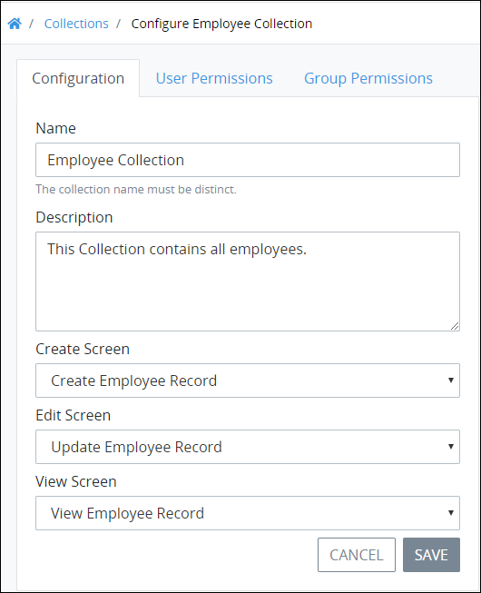

# Edit Screens for a Collection

## Overview

The records in a ProcessMaker Collection are composed from the [Screens](../designing-processes/design-forms/what-is-a-form.md) to [create, edit, and view those records](manage-collections/create-a-new-collection.md#create-a-new-processmaker-collection). These ProcessMaker Screens may be revised at any time as needs for the Collection change. When any ProcessMaker Screen used in a Collection changes, those changes automatically propagate to all records in any Collection that references that Screen.

For example, suppose that when the ProcessMaker Collection was [created](manage-collections/create-a-new-collection.md#create-a-new-processmaker-collection), the ProcessMaker Screens to create and edit a record in that Collection are identical. However, a need arises that when any record in that ProcessMaker Collection is edited or updated, the record revision date must be recorded in the Screen. To address this, change the ProcessMaker Screen used to edit records in that Collection by adding a new [Date Picker control](../designing-processes/design-forms/screens-builder/control-descriptions/date-picker-control-settings.md) from which authorized [users](../processmaker-administration/add-users/what-is-a-user.md)/[groups](../processmaker-administration/assign-groups-to-users/what-is-a-group.md) can select the record revision date. After the ProcessMaker Screen is saved with changes, this new Date Picker control automatically propagates to all records in that ProcessMaker Collection. There will be no selected date in this control; the appropriate ProcessMaker user\(s\) must then open each record and select the date each record was revised.


If your ProcessMaker user account or group membership does not have the appropriate permissions to edit a ProcessMaker Screen, consult with a person in your organization who can edit your ProcessMaker asset\(s\).


## Edit a ProcessMaker Screen for a Collection


### ProcessMaker Package Required

The [Collections package](../package-development-distribution/package-a-connector/collections.md) must be installed in your ProcessMaker instance. The Collections package is not available in the ProcessMaker open-source edition. Contact [ProcessMaker Sales](https://www.processmaker.com/contact/) or ask your ProcessMaker sales representative how the Collections package can be installed in your ProcessMaker instance.

### Permissions Required

Your ProcessMaker user account or group membership must have the following permissions to view configuration settings for a ProcessMaker Collection unless your user account has the **Make this user a Super Admin** setting selected:

* Collections: Create Collections
* Collections: View Collections

These permissions are different than record-level permissions in a ProcessMaker Collection that allow you to view or create records in that Collection.

Furthermore, your ProcessMaker user account or group membership must have the following permissions to edit a ProcessMaker Screen unless your user account has the **Make this user a Super Admin** setting selected:

* Screens: Edit Screens
* Screens: View Screens

See the ProcessMaker [Collections](../processmaker-administration/permission-descriptions-for-users-and-groups.md#collections)  and [Screens](../processmaker-administration/permission-descriptions-for-users-and-groups.md#screens) permissions or ask your ProcessMaker Administrator for assistance.


Follow these guidelines to edit any ProcessMaker Screen referenced from a Collection:

1. [View your ProcessMaker Collections](manage-collections/view-collections.md#view-all-collections). The **Collections** page displays.
2. Click the **Configure** iconfor your ProcessMaker Collection in which to edit one of its referenced Screens. The **Configuration** tab displays. 
3. Make note of the appropriate ProcessMaker Screen\(s\) to edit:
   * **Create Screen:** The **Create Screen** drop-down menu references the ProcessMaker Screen from which new records in this Collection are created.
   * **Edit Screen:** The **Edit Screen** drop-down menu references the ProcessMaker Screen from which records in this Collection are edited.
   * **View Screen:** The **View Screen** drop-down menu references the ProcessMaker Screen from which records in this Collection are viewed.
4. [View your ProcessMaker Screens](../designing-processes/design-forms/manage-forms/view-all-forms.md#view-all-scripts). The **Screens** page displays.
5. Edit the appropriate ProcessMaker Screen\(s\). Ensure to [save](../designing-processes/design-forms/screens-builder/save-a-screen.md#save-a-processmaker-screen) your changes.

After saving your ProcessMaker Screen changes, the records in that ProcessMaker Collection automatically update with the Screen changes.

## Related Topics









