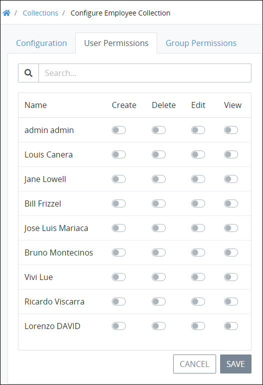
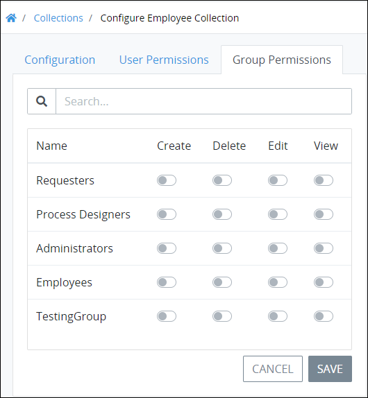

# Configure a Collection

## Configure a ProcessMaker Collection


### ProcessMaker Package Required

The [Collections package](../../package-development-distribution/package-a-connector/collections.md) must be installed in your ProcessMaker instance. The Collections package is not available in the ProcessMaker open-source edition. Contact [ProcessMaker Sales](mailto:sales@processmaker.com) or ask your ProcessMaker sales representative how the Collections package can be installed in your ProcessMaker instance.

### Permissions Required

Your ProcessMaker user account or group membership must have the following permissions to configure a ProcessMaker Collection unless your user account has the **Make this user a Super Admin** setting selected:

* Collections: View Collections
* Collections: Edit Collections

These permissions are different than record-level permissions in a ProcessMaker Collection that allow you to [view](../manage-records-in-a-collection/view-a-collection-record.md) or [edit](../manage-records-in-a-collection/edit-a-collection-record.md) records in that Collection. See the ProcessMaker [Collections](../../processmaker-administration/permission-descriptions-for-users-and-groups.md#collections) permissions or ask your ProcessMaker Administrator for assistance.


Follow these steps to configure a ProcessMaker Collection:

1. [View your ProcessMaker Collections](view-collections.md#view-all-collections). The **Collections** page displays.
2. Click the **Configure** icon for your ProcessMaker Collection. The **Configuration** tab displays.  
3. Refer to the following sections to configure your ProcessMaker Collection. These configuration sections may be configured independently of one another:
   * [Configure basic settings](configure-a-collection.md#configure-basic-settings)
   * [Configure record-level permissions for users](configure-a-collection.md#configure-record-level-permissions-for-users)
   * [Configure record-level permissions for groups](configure-a-collection.md#configure-record-level-permissions-for-groups)

### Configure Basic Settings

Follow these steps to configure basic settings for your ProcessMaker Collection:

1. [Select the ProcessMaker Collection to configure](configure-a-collection.md#configure-a-processmaker-collection). The **Configuration** tab displays. Use the **Configuration** tab to configure basic settings for your ProcessMaker Collection.  
2. Edit the following information in the **Configuration** tab about your ProcessMaker Collection as necessary:
   * **Name:** In the **Name** field, edit the name of your ProcessMaker Collection. Since this name displays in the left sidebar when the **Collections** top menu is selected, ensure that this is a descriptive name. This name is helpful for yourself and those with whom have access to this ProcessMaker Collection. This is a required field.
   * **Description:** In the **Description** field, edit the description of your ProcessMaker Collection. This is a required field.
   * From the **Create Screen** drop-down menu, select a different ProcessMaker Screen from which new records in this Collection are created. This must be a [form-type](../../designing-processes/design-forms/screens-builder/types-for-screens.md#form) ProcessMaker Screen. This is a required field.
   * From the **View Screen** drop-down menu, select a different ProcessMaker Screen from which to view records in this Collection. Use this ProcessMaker Screen to only display all or parts of a record in the Collection. For example, the ProcessMaker Screen selected from the **View Screen** drop-down menu may be designed to not display sensitive information that all Collection stakeholders should have access. This must be a [display-type](../../designing-processes/design-forms/screens-builder/types-for-screens.md#display) ProcessMaker Screen. This is a required field.
   * From the **Edit Screen** drop-down menu, select a different ProcessMaker Screen from which to edit or update records in this Collection. This can be the same or a different ProcessMaker Screen as selected from the **Create Screen** drop-down menu. This is a required field.
3. Click **Save**.

### Configure Record-Level Permissions for Users

Configure how ProcessMaker [users](../../processmaker-administration/add-users/what-is-a-user.md) have permission to access the records in your Collection. Permissions may be set differently for each ProcessMaker user. If a ProcessMaker user has the **Make this user a Super Admin** setting selected in his or her user account, then these settings have no effect on that user. ProcessMaker does not check permissions for ProcessMaker user accounts with this setting selected, allowing such users to administer and install [packages](../../package-development-distribution/first-topic.md) which might otherwise require permissions be granted to a ProcessMaker user account to perform.

By default all ProcessMaker users do not have any access to records in your Collection unless a user has the **Make this use a Super Admin** setting selected.

Following are descriptions of each record-level permission:

* **Create:** A ProcessMaker user granted the **Create** permission is allowed to create records in this Collection. If a ProcessMaker user does not have the **Create** toggle key enabled, the **+Record** button used to create a record is not visible for that user. When creating a record, the ProcessMaker Screen selected in the **Create Screen** drop-down menu of the [basic configuration settings](configure-a-collection.md#configure-basic-settings) is used.
* **Delete:** A ProcessMaker user granted the **Delete** permission is allowed to delete records in this Collection. If a ProcessMaker user does not have the **Delete** toggle key enabled, the **Delete** iconused to delete a record is not available in all records for that user.
* **Edit:** A ProcessMaker user granted the **Edit** permission is allowed to edit records in this Collection. If a ProcessMaker user does not have the **Edit** toggle key enabled, the **Edit** iconused to edit a record is not available in all records for that user. When editing a record, the ProcessMaker Screen selected in the **Edit Screen** drop-down menu of the basic configuration settings is used.
* **View:** A ProcessMaker user granted the **View** permission is allowed to view records in this Collection. If a ProcessMaker user does not have the **View** toggle key enabled, the **View** icon used to view a record is not available in all records for that user. When viewing a record, the ProcessMaker Screen selected in the **View Screen** drop-down menu of the basic configuration settings is used.

Follow these steps to configure how ProcessMaker users have access to your Collection:

1. [Select the ProcessMaker Collection to configure](configure-a-collection.md#configure-a-processmaker-collection). The **Configuration** tab displays.
2. Click the **User Permissions** tab.  
3. Enter in the **Search** field the text to filter ProcessMaker user accounts, if necessary.
4. Toggle any of the permission settings for applicable ProcessMaker users to allow each user appropriate access to records in this Collection. By default all ProcessMaker users do not have any access to records in your Collection unless a user has the **Make this use a Super Admin** setting selected. If necessary, ensure to grant your own ProcessMaker user permissions to access records in your Collection. Follow these guidelines:
   * **Create:** Toggle the **Create** setting to grant or restrict permission for that ProcessMaker user to create records in this Collection.
   * **Delete:** Toggle the **Delete** setting to grant or restrict permission for that ProcessMaker user to delete records in this Collection.
   * **Edit:** Toggle the **Edit** setting to grant or restrict permission for that ProcessMaker user to edit records in this Collection.
   * **View:** Toggle the **View** setting to grant or restrict permission for that ProcessMaker user to view records in this Collection.
5. Click **Save**.

### Configure Record-Level Permissions for Groups

Configure how ProcessMaker [groups](../../processmaker-administration/assign-groups-to-users/what-is-a-group.md) have permission to access the records in your Collection. Permissions may be set differently for each ProcessMaker group. ProcessMaker users have access to records in this Collection under the following circumstances:

* Record-level permissions are cumulative, in that permissions set for a specific ProcessMaker user apply regardless of whether that user is a member of a group with record-level permissions. If that ProcessMaker is granted permissions not granted to a group, regardless of whether that use is a group member, that user maintains that record-level permission.
* If a ProcessMaker user has the **Make this user a Super Admin** setting selected in his or her user account, then these settings have no effect on that user. ProcessMaker does not check permissions for ProcessMaker user accounts with this setting selected, allowing such users to administer and install [packages](../../package-development-distribution/first-topic.md) which might otherwise require permissions be granted to a ProcessMaker user account to perform.

By default all ProcessMaker groups do not have any access to records in your Collection.

Following are descriptions of each record-level permission:

* **Create:** A ProcessMaker group granted the **Create** permission allows its members to create records in this Collection. If a ProcessMaker group does not have the **Create** toggle key enabled, the **+Record** button used to create a record is not visible for its members. When creating a record, the ProcessMaker Screen selected in the **Create Screen** drop-down menu of the [basic configuration settings](configure-a-collection.md#configure-basic-settings) is used.
* **Delete:** A ProcessMaker group granted the **Delete** permission allows its members to delete records in this Collection. If a ProcessMaker group does not have the **Delete** toggle key enabled, the **Delete** iconused to delete a record is not available in all records for its members.
* **Edit:** A ProcessMaker group granted the **Edit** permission allows its members to edit records in this Collection. If a ProcessMaker group does not have the **Edit** toggle key enabled, the **Edit** iconused to edit a record is not available in all records for its members. When editing a record, the ProcessMaker Screen selected in the **Edit Screen** drop-down menu of the basic configuration settings is used.
* **View:** A ProcessMaker group granted the **View** permission allows its members to view records in this Collection. If a ProcessMaker group does not have the **View** toggle key enabled, the **View** iconused to view a record is not available in all records for its members. When viewing a record, the ProcessMaker Screen selected in the **View Screen** drop-down menu of the basic configuration settings is used.

Follow these steps to configure how ProcessMaker groups have access to your Collection:

1. [Select the ProcessMaker Collection to configure](configure-a-collection.md#configure-a-processmaker-collection). The **Configuration** tab displays.
2. Click the **Group Permissions** tab.  
3. Enter in the **Search** field the text to filter ProcessMaker groups, if necessary.
4. Toggle any of the permission settings for applicable ProcessMaker groups to allow its members appropriate access to records in this Collection. By default all ProcessMaker groups do not have any access to records in your Collection unless a group member has the **Make this use a Super Admin** setting selected for his or her user account. Follow these guidelines:
   * **Create:** Toggle the **Create** setting to grant or restrict permission for that ProcessMaker group to allow its members to create records in this Collection.
   * **Delete:** Toggle the **Delete** setting to grant or restrict permission for that ProcessMaker group to allow its members to delete records in this Collection.
   * **Edit:** Toggle the **Edit** setting to grant or restrict permission for that ProcessMaker group to allow its members to edit records in this Collection.
   * **View:** Toggle the **View** setting to grant or restrict permission for that ProcessMaker group to allow its members to view records in this Collection.
5. Click **Save**.

## Related Topics

