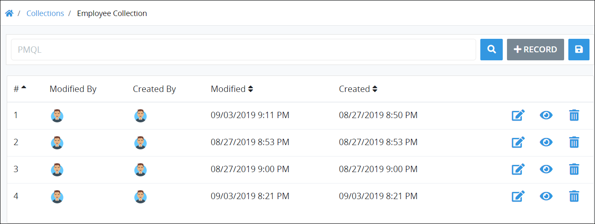

# View All Records in a Collection

## View All Records in a Collection

ProcessMaker displays all the records in a ProcessMaker [Collections](../what-is-a-collection.md) in one table.


### ProcessMaker Package Required

The [Collections package](../../package-development-distribution/package-a-connector/collections.md) must be installed in your ProcessMaker instance. The [Collections](../what-is-a-collection.md) package is not available in the ProcessMaker open-source edition. Contact [ProcessMaker Sales](mailto:sales@processmaker.com) or ask your ProcessMaker sales representative how the Collections package can be installed in your ProcessMaker instance.

### Permissions Required

Your ProcessMaker user account or group membership must have the "Collections: View Collections" permission to view the list of ProcessMaker Collections unless your user account has the **Make this user a Super Admin** setting selected. See the ProcessMaker [Collections](../../processmaker-administration/permission-descriptions-for-users-and-groups.md#collections) permissions or ask your ProcessMaker Administrator for assistance.

Furthermore, your ProcessMaker user account or group membership must have the **View** [record permission](../manage-collections/configure-a-collection.md#configure-record-permissions-for-processmaker-users) from a Collection's configuration to view that Collection's records. See [Configure a Collection](../manage-collections/configure-a-collection.md#configure-a-processmaker-collection) or ask the manager of that ProcessMaker Collection for assistance.


Follow these steps to view all records in a ProcessMaker Collection:

1. [View your ProcessMaker Collections](../manage-collections/view-collections.md#view-all-collections). The **Collections** page displays.
2. Do one of the following to view the list of records for a ProcessMaker Collection:
   * **View a ProcessMaker Collection from the left sidebar:**
     1. Click the ProcessMaker logo in the left sidebar to expand the sidebar. The name displays for each ProcessMaker Collection in which you have access.  
     2. Click the ProcessMaker Collection name to view its records.
   * **View a ProcessMaker Collection from the Collections page:** Click the **Records** iconfor the ProcessMaker Collection to view its records.

The list of records display for the selected ProcessMaker Collection.

The following information displays in tabular format about records in the ProcessMaker Collection:

* **\#:** The **\#** column displays the ID for the record. Use record IDs to [search for records in the ProcessMaker Collection](search-for-a-record-in-a-collection.md#search-records-in-a-processmaker-collection). ProcessMaker automatically generates the ID value when the record is created and represents a sequential number of how many total records in that Collection have been created to that time.
* **Modified By:** The **Modified By** column displays the ProcessMaker user who last modified the record. Hover your cursor over the user's avatar to view that person's full name.
* **Created By:** The **Created By** column displays the ProcessMaker user who created the record. Hover your cursor over the user's avatar to view that person's full name.
* **Modified:** The **Modified** column displays the date and time the record was last modified. The time zone setting to display the time is according to the ProcessMaker instance unless your [user profile's](../../using-processmaker/profile-settings.md#change-your-profile-settings) **Time zone** setting is specified.
* **Created:** The **Created** column displays the date and time the record was created. The time zone setting to display the time is according to the ProcessMaker instance unless your [user profile's](../../using-processmaker/profile-settings.md#change-your-profile-settings) **Time zone** setting is specified.


### Search for a Record in the ProcessMaker Collection

Use the [**PMQL**](search-for-a-record-in-a-collection.md#search-records-in-a-processmaker-collection) field to filter records that display in the ProcessMaker Collection.

### Create a New Record in the ProcessMaker Collection

Click the **+Record** button. See [Create a New Collection Record](create-a-collection-record.md#create-a-new-processmaker-collection-record).

### Edit a Record in the ProcessMaker Collection

Click the **Edit** icon. See [Edit a Collection Record](edit-a-collection-record.md#edit-a-processmaker-collection-record).

### View a Record in the ProcessMaker Collection

Click the **View** icon. See [View a Collection Record](view-a-collection-record.md#view-a-processmaker-collection-record).

### Delete a Record from the ProcessMaker Collection

Click the **Delete** icon. See [Delete a Collection Record](delete-a-collection-record.md#delete-a-processmaker-collection-record).

### No Records in this ProcessMaker Collection?

If no records exist in this ProcessMaker Collection, or you do not have [permission](../manage-collections/configure-a-collection.md#configure-record-permissions-for-processmaker-users) to view any, the following message displays: **No Data Available**.

### Display Information the Way You Want It

[Control how tabular information displays](../../using-processmaker/control-how-requests-display-in-a-tab.md), including how to sort columns or how many items display per page.


## Related Topics





















