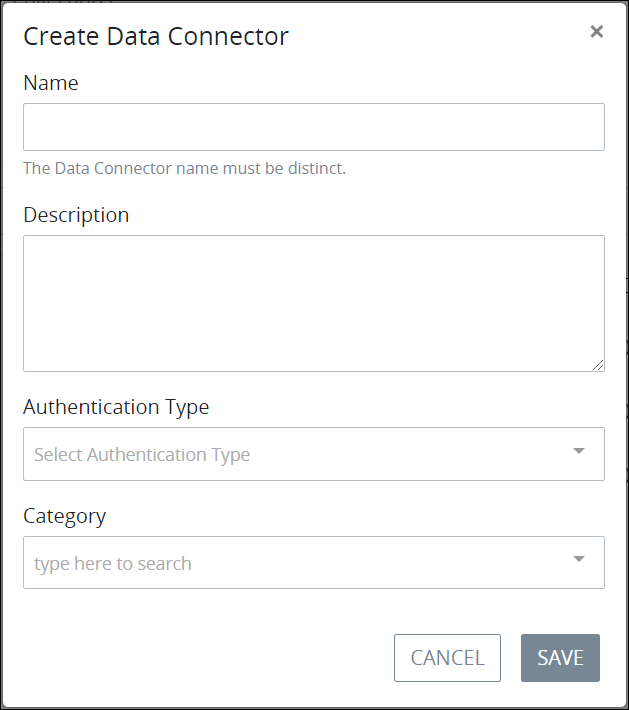

# Create a New Data Connector

## Create a New ProcessMaker Data Connector


### ProcessMaker Package Required

The [Data Connector package](../../package-development-distribution/package-a-connector/data-connector-package.md) must be installed in your ProcessMaker instance. The [Data Connector](what-is-a-data-connector.md) package is not available in the ProcessMaker open-source edition. Contact [ProcessMaker Sales](https://www.processmaker.com/contact/) or ask your ProcessMaker sales representative how the Data Connectors package can be installed in your ProcessMaker instance.

### Permissions Required

Your user account or group membership must have the following permissions to create a new Data Connector unless your user account has the **Make this user a Super Admin** setting selected:

* Data Connectors: Create Data Connectors
* Data Connectors: View Data Connectors

See the ProcessMaker [Data Connectors](../../processmaker-administration/permission-descriptions-for-users-and-groups.md#data-connectors) permissions or ask your ProcessMaker Administrator for assistance.


A [ProcessMaker Data Connector](what-is-a-data-connector.md) is created for each created [ProcessMaker Collection](../../collections/what-is-a-collection.md). Such ProcessMaker Data Connectors have the same name as the Collection to which they connect, and are assigned to the **Generated** [Category](manage-data-connectors/manage-data-connector-categories/what-is-a-data-connector-category.md) by default. Therefore, it is not necessary to create ProcessMaker Data Connectors for ProcessMaker Collections.

Follow these steps to create a new ProcessMaker Data Connector:

1. [View your ProcessMaker Data Connectors](view-data-connectors.md#view-all-scripts). The **Data Connectors** page displays.
2. Click the **+Data Connector** button. The **Create Data Connector** screen displays.  
3. In the **Name** setting, enter the name of the ProcessMaker Data Connector. ProcessMaker Data Connector names must be unique in your organization and can only use apostrophe characters \(`'`\) and spaces. This is a required setting.
4. In the **Description** setting, enter the description of the ProcessMaker Data Connector.
5. From the **Authentication Type** drop-down menu, select how the Data Connector authenticates with the data source:
   * **No Auth:** Select the **No Auth** option to not send authorization details when connecting to the data source. Note that there is no security using this option.
   * **Basic Auth:** Select the **Basic Auth** option to send only username and password credentials as authentication when connecting to the data source. Configure your credentials after the ProcessMaker Data Connector is created.
   * **Bearer Token:** Select the **Bearer Token** option to send an access token when connecting to the data source as authentication. The access token is an opaque string that represents the authorization that allows the ProcessMaker Data Connector to access the third-party data source. Get the access token after the ProcessMaker Data Connector is created. ProcessMaker Data Connectors that connect to ProcessMaker Collections use Bearer Token authorization method.
   * **Auth 2.0 Password:** Select the **Auth 2.0 Password** option to use Password grant type as part of the OAuth 2.0 authentication protocol to connect to the data source. In doing so, first get an access token from the data source host, and then use that token to authenticate future connections directly to that data source. Configure the OAuth 2.0 authentication credentials after the ProcessMaker Data Connector is created.
6. From the **Category** drop-down menu, select one or more Data Connector Categories to associate with this ProcessMaker Data Connector. In doing so, [Data Connector Categories](manage-data-connectors/manage-data-connector-categories/what-is-a-data-connector-category.md) may be sorted from the [**Data Connectors**](view-data-connectors.md#view-all-scripts) page. To remove a Data Connector Category that is currently selected, click theicon for that selection or press `Enter` when the drop-down is visible. This is a required setting.
7. Click **Save**. The following message displays: **The Data Connector was created**.

## Related Topics



















