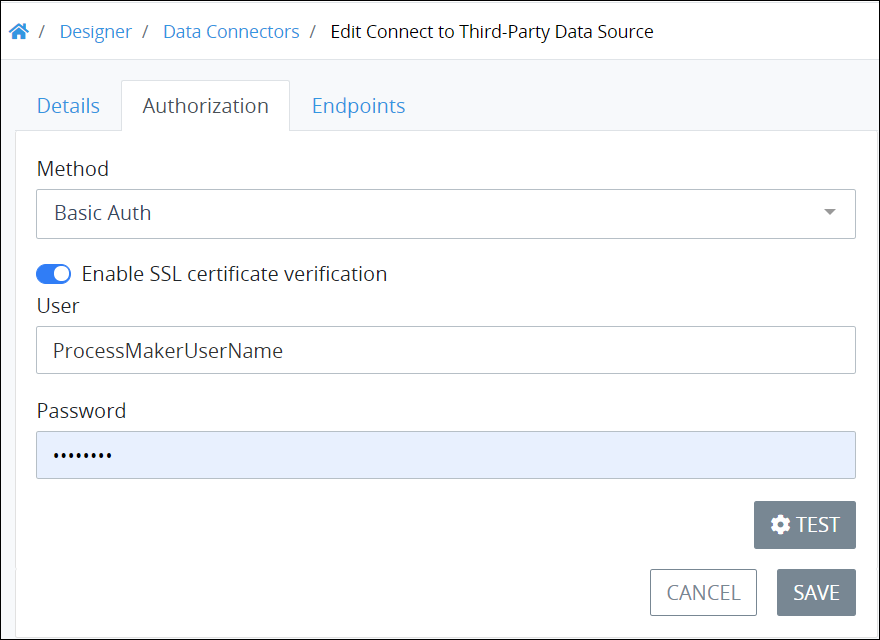
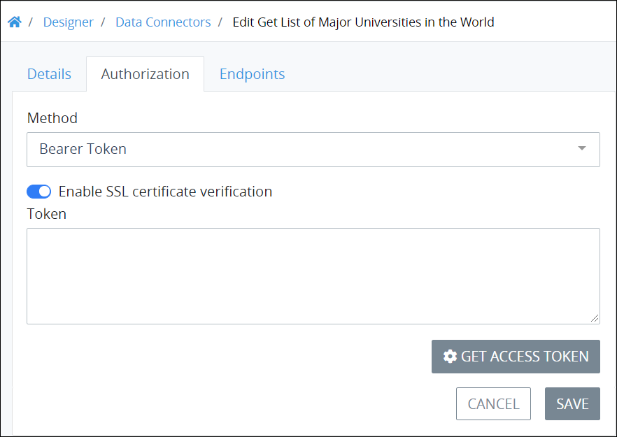

# Edit a Data Connector

## Edit Details for a ProcessMaker Data Connector


### ProcessMaker Package Required

The [Data Connector package](../../package-development-distribution/package-a-connector/data-connector-package.md) must be installed in your ProcessMaker instance. The [Data Connector](what-is-a-data-connector.md) package is not available in the ProcessMaker open-source edition. Contact [ProcessMaker Sales](https://www.processmaker.com/contact/) or ask your ProcessMaker sales representative how the Data Connectors package can be installed in your ProcessMaker instance.

### Permissions Required

Your user account or group membership must have the following permissions to edit details for a Data Connector unless your user account has the **Make this user a Super Admin** setting selected:

* Data Connectors: Edit Data Connectors
* Data Connectors: View Data Connectors

See the ProcessMaker [Data Connectors](../../processmaker-administration/permission-descriptions-for-users-and-groups.md#data-connectors) permissions or ask your ProcessMaker Administrator for assistance.


Follow these steps to edit the details for a ProcessMaker Data Connector:

1. [View your ProcessMaker Data Connectors](view-data-connectors.md#view-all-scripts). The **Data Connectors** page displays.
2. Click the **Edit** iconfor the ProcessMaker Data Connector to edit. The **Details** tab displays.
3. Edit the following information about the ProcessMaker Data Connector as necessary:
   * In the **Name** setting, edit the name of the ProcessMaker Data Connector. ProcessMaker Data Connector names must be unique in your organization and can only use apostrophe characters \(`'`\) and spaces. This is a required setting.
   * In the **Description** setting, edit the description of the ProcessMaker Data Connector.
   * From the **Category** drop-down menu, select one or more Data Connector Categories to associate with this ProcessMaker Data Connector. In doing so, [Data Connector Categories](manage-data-connectors/manage-data-connector-categories/what-is-a-data-connector-category.md) may be sorted from the [**Data Connectors**](view-data-connectors.md#view-all-scripts) page. To remove a Data Connector Category that is currently selected, click theicon for that selection or press `Enter` when the drop-down is visible. This is a required setting.
4. Click **Save**. The following message displays: **The Data Connector was saved**.

## Edit Authorization


### ProcessMaker Package Required

The [Data Connector package](../../package-development-distribution/package-a-connector/data-connector-package.md) must be installed in your ProcessMaker instance. The [Data Connector](what-is-a-data-connector.md) package is not available in the ProcessMaker open-source edition. Contact [ProcessMaker Sales](https://www.processmaker.com/contact/) or ask your ProcessMaker sales representative how the Data Connectors package can be installed in your ProcessMaker instance.

### Permissions Required

Your user account or group membership must have the following permissions to edit authorization for a Data Connector unless your user account has the **Make this user a Super Admin** setting selected:

* Data Connectors: Edit Data Connectors
* Data Connectors: View Data Connectors

See the ProcessMaker [Data Connectors](../../processmaker-administration/permission-descriptions-for-users-and-groups.md#data-connectors) permissions or ask your ProcessMaker Administrator for assistance.


Follow these steps to edit the details for a ProcessMaker Data Connector:

1. [View your ProcessMaker Data Connectors](view-data-connectors.md#view-all-scripts). The **Data Connectors** page displays.
2. Click the **Edit** iconfor the ProcessMaker Data Connector to edit. The **Details** tab displays.
3. Click the **Authorization** tab. The Authorization tab displays the authentication method selected for this ProcessMaker Data Connector when it was [created](create-a-new-data-connector.md#create-a-new-processmaker-data-connector).
4. From the **Method** drop-down menu, select how the Data Connector authenticates with the data source:
   * **No Auth:** Select the **No Auth** option to not send authorization details when connecting to the data source. Note that there is no security using this option. No further authentication configured is required.
   * **Basic Auth:** Select the **Basic Auth** option to send only username and password credentials as authentication when connecting to the data source. See [Edit Basic Auth Settings](edit-a-data-connector.md#edit-basic-auth-authorization).
   * **Bearer Token:** Select the **Bearer Token** option to send an access token when connecting to the data source as authentication. The access token is an opaque string that represents the authorization that allows the ProcessMaker Data Connector to access the third-party data source. ProcessMaker Data Connectors that connect to ProcessMaker Collections use Bearer Token authorization method. See [Edit Bearer Token Settings](edit-a-data-connector.md#edit-bearer-token-authorization).
   * **Auth 2.0 Password:** Select the **Auth 2.0 Password** option to use Password grant type as part of the OAuth 2.0 authentication protocol to connect to the data source. In doing so, first get an access token from the data source owner, and then use that token to authenticate future connections directly to that data source. See [Edit Auth 2.0 Password Settings](edit-a-data-connector.md#edit-auth-2-0-password-authorization).

### Edit Basic Auth Settings

Follow these steps to configure basic authentication settings after selecting the **Basic Auth** option from the [**Authorization** tab](edit-a-data-connector.md#edit-authorization):

1. Verify that this ProcessMaker Data Connector uses basic authentication to authenticate with the data source.  
2. Verify that this ProcessMaker Data Connector authenticates using SSL certification. If the **Enable SSL certificate verification** toggle key is enabled, the ProcessMaker Data Connector connects to the data source using HTTPS protocol for a secure connection. The **Enable SSL certificate verification** toggle key is enabled by default.
3. In the **User** setting, enter or edit the username that authenticates with the data source host.
4. In the **Password** setting, enter or edit the password that authenticates with the data source host.

### Edit Bearer Token Settings

Follow these steps to configure bearer token settings after selecting the **Bearer Token** option from the [**Authorization** tab](edit-a-data-connector.md#edit-authorization):

1. Verify that this ProcessMaker Data Connector uses a bearer token to authenticate with the data source.  
    

   If an access token has already been entered into this ProcessMaker Data Connector, it displays in the **Token** setting.

2. Verify that this ProcessMaker Data Connector authenticates using SSL certification. If the **Enable SSL certificate verification** toggle key is enabled, the ProcessMaker Data Connector connects to the data source using HTTPS protocol for a secure connection. The **Enable SSL certificate verification** toggle key is enabled by default.
3. If this ProcessMaker Data Connector requires a new access token, follow these steps:
   1. Click the **Get Access Token** button. The **Request token** screen displays.  
   2. In the **URL Token** setting, enter the URL to request the access token from the data source host to which the ProcessMaker Data Connector sends for authentication.
   3. In the **User** setting, enter or edit the username that authenticates with the data source host.
   4. In the **Password** setting, enter or edit the password that authenticates with the data source host.
   5. Click the **Get Access Token** button. If the URL entered in the **URL Token** setting is correct for that data source host, then the access token displays below the **Password** setting.
   6. Copy the access token, and then click **Close** to return to the **Authorization** tab.
4. In the **Token** setting, paste the access token.

### Edit Auth 2.0 Password Settings

Follow these steps to configure Auth 2.0 password settings after selecting the **Auth 2.0 Password** option from the [**Authorization** tab](edit-a-data-connector.md#edit-authorization):

## Endpoints


### ProcessMaker Package Required

The [Data Connector package](../../package-development-distribution/package-a-connector/data-connector-package.md) must be installed in your ProcessMaker instance. The [Data Connector](what-is-a-data-connector.md) package is not available in the ProcessMaker open-source edition. Contact [ProcessMaker Sales](https://www.processmaker.com/contact/) or ask your ProcessMaker sales representative how the Data Connectors package can be installed in your ProcessMaker instance.

### Permissions Required

Your user account or group membership must have the following permissions to edit Endpoints for a Data Connector unless your user account has the **Make this user a Super Admin** setting selected:

* Data Connectors: Edit Data Connectors
* Data Connectors: View Data Connectors

See the ProcessMaker [Data Connectors](../../processmaker-administration/permission-descriptions-for-users-and-groups.md#data-connectors) permissions or ask your ProcessMaker Administrator for assistance.


## Related Topics

















