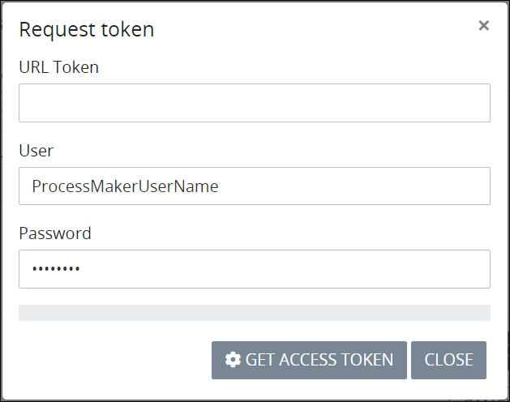
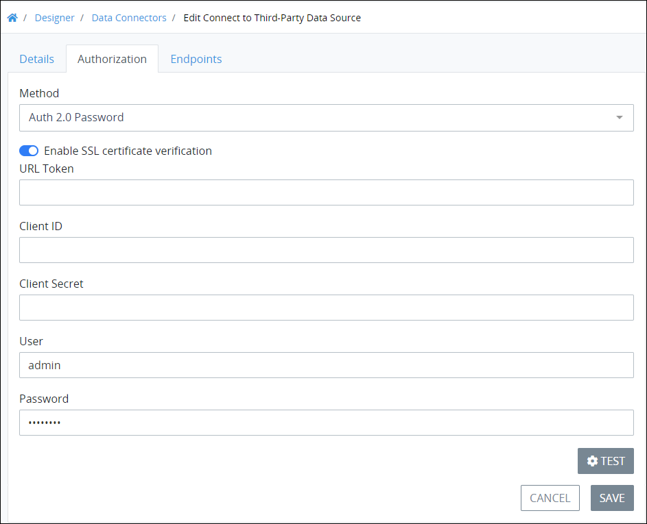
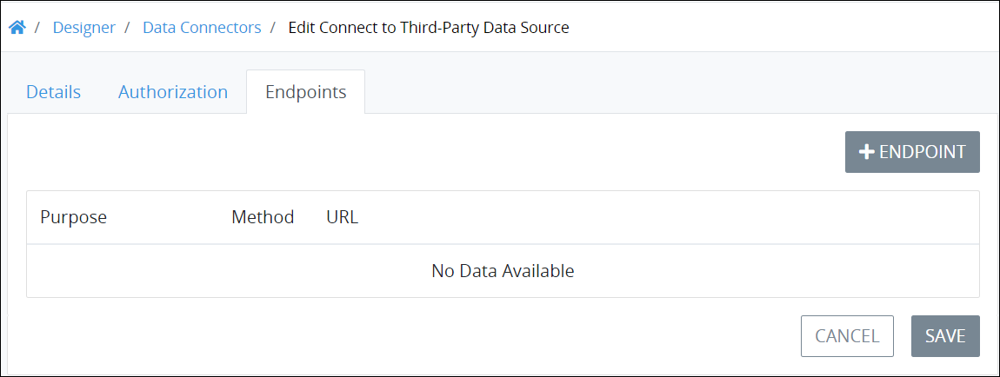
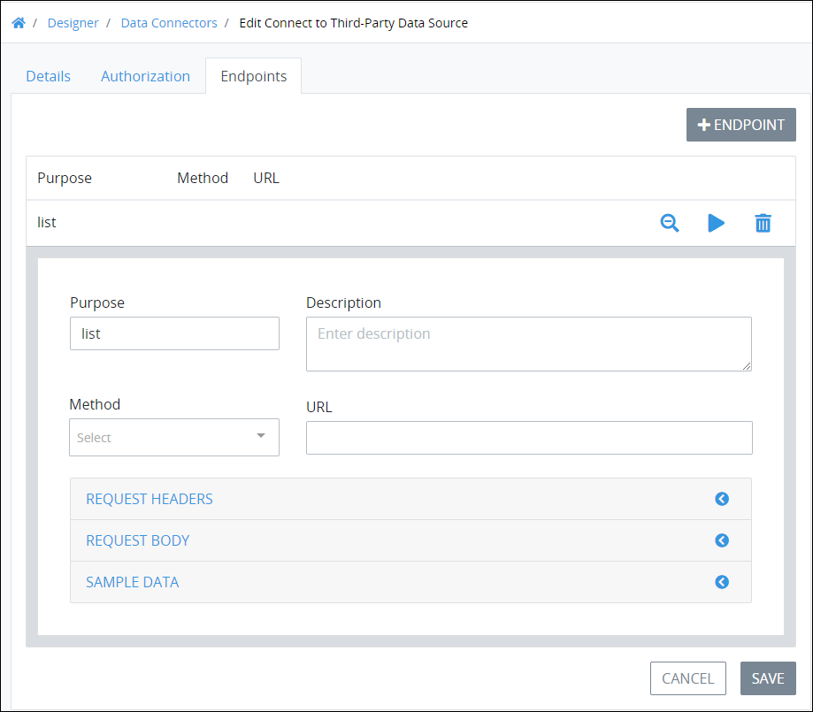
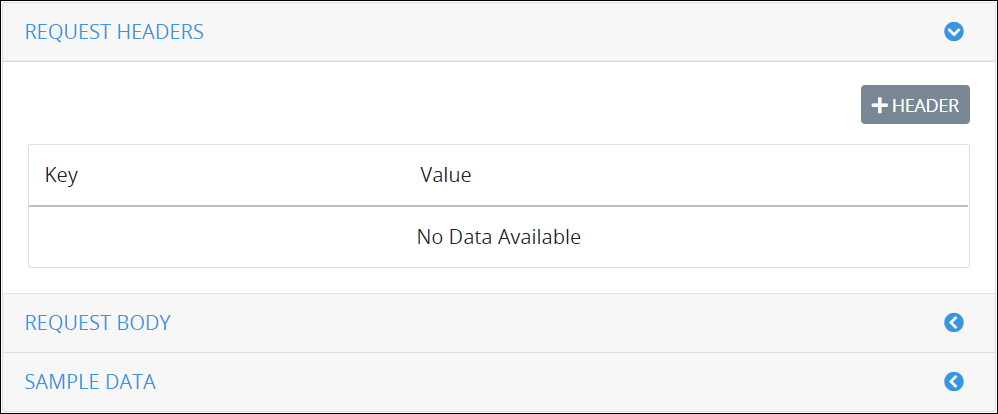
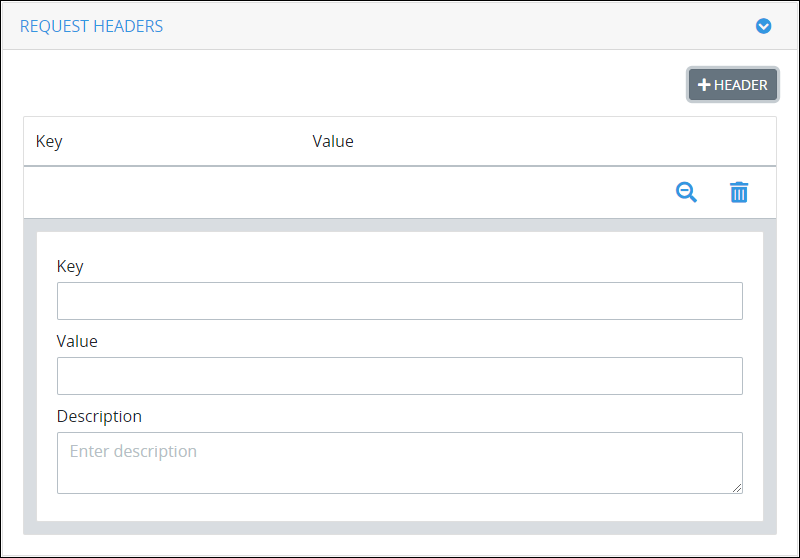

# Edit a Data Connector

## Edit Details for a ProcessMaker Data Connector


### ProcessMaker Package Required

The [Data Connector package](../../package-development-distribution/package-a-connector/data-connector-package.md) must be installed in your ProcessMaker instance. The [Data Connector](what-is-a-data-connector.md) package is not available in the ProcessMaker open-source edition. Contact [ProcessMaker Sales](https://www.processmaker.com/contact/) or ask your ProcessMaker sales representative how the Data Connectors package can be installed in your ProcessMaker instance.

### Permissions Required

Your user account or group membership must have the following permissions to edit details for a Data Connector unless your user account has the **Make this user a Super Admin** setting selected:

* Data Connectors: Edit Data Connectors
* Data Connectors: View Data Connectors

See the ProcessMaker [Data Connectors](../../processmaker-administration/permission-descriptions-for-users-and-groups.md#data-connectors) permissions or ask your ProcessMaker Administrator for assistance.


Follow these steps to edit the details for a [ProcessMaker Data Connector](what-is-a-data-connector.md):

1. [View your ProcessMaker Data Connectors](view-data-connectors.md#view-all-scripts). The **Data Connectors** page displays.
2. Click the **Edit** iconfor the ProcessMaker Data Connector to edit. The **Details** tab displays.
3. Edit the following information about the ProcessMaker Data Connector as necessary:
   * In the **Name** setting, edit the name of the ProcessMaker Data Connector. ProcessMaker Data Connector names must be unique in your organization and can only use apostrophe characters \(`'`\) and spaces. This is a required setting.
   * In the **Description** setting, edit the description of the ProcessMaker Data Connector.
   * From the **Category** drop-down menu, select one or more Data Connector Categories to associate with this ProcessMaker Data Connector. In doing so, [Data Connector Categories](manage-data-connectors/manage-data-connector-categories/what-is-a-data-connector-category.md) may be sorted from the [**Data Connectors**](view-data-connectors.md#view-all-scripts) page. To remove a Data Connector Category that is currently selected, click theicon for that selection or press `Enter` when the drop-down is visible. This is a required setting.
4. Click **Save**. The following message displays: **The Data Connector was saved**.

## Edit Authorization


### ProcessMaker Package Required

The [Data Connector package](../../package-development-distribution/package-a-connector/data-connector-package.md) must be installed in your ProcessMaker instance. The [Data Connector](what-is-a-data-connector.md) package is not available in the ProcessMaker open-source edition. Contact [ProcessMaker Sales](https://www.processmaker.com/contact/) or ask your ProcessMaker sales representative how the Data Connectors package can be installed in your ProcessMaker instance.

### Permissions Required

Your user account or group membership must have the following permissions to edit authorization for a Data Connector unless your user account has the **Make this user a Super Admin** setting selected:

* Data Connectors: Edit Data Connectors
* Data Connectors: View Data Connectors

See the ProcessMaker [Data Connectors](../../processmaker-administration/permission-descriptions-for-users-and-groups.md#data-connectors) permissions or ask your ProcessMaker Administrator for assistance.


Follow these steps to edit the details for a ProcessMaker Data Connector:

1. [View your ProcessMaker Data Connectors](view-data-connectors.md#view-all-scripts). The **Data Connectors** page displays.
2. Click the **Edit** iconfor the ProcessMaker Data Connector to edit. The **Details** tab displays.
3. Click the **Authorization** tab. The **Authorization** tab displays the authentication method selected for this ProcessMaker Data Connector when it was [created](create-a-new-data-connector.md#create-a-new-processmaker-data-connector).
4. From the **Method** drop-down menu, select how the Data Connector authenticates with the data source:
   * **No Auth:** Select the **No Auth** option to not send authorization details when connecting to the data source. Note that there is no security using this option. No further authentication configured is required.
   * **Basic Auth:** Select the **Basic Auth** option to send only username and password credentials as authentication when connecting to the data source. See [Edit Basic Auth Settings](edit-a-data-connector.md#edit-basic-auth-authorization).
   * **Bearer Token:** Select the **Bearer Token** option to send an access token when connecting to the data source as authentication. The access token is an opaque string that represents the authorization that allows the ProcessMaker Data Connector to access the third-party data source. ProcessMaker Data Connectors that connect to ProcessMaker Collections use Bearer Token authorization method. See [Edit Bearer Token Settings](edit-a-data-connector.md#edit-bearer-token-authorization).
   * **Auth 2.0 Password:** Select the **Auth 2.0 Password** option to use Password grant type as part of the OAuth 2.0 authentication protocol to connect to the data source. In doing so, first register this ProcessMaker Data Connector with the data source host. After registering, that host provides the redirect URI, Client ID, and Client Secret for this ProcessMaker Data Connector. See [Edit Auth 2.0 Password Settings](edit-a-data-connector.md#edit-auth-2-0-password-authorization).
5. If no other changes are necessary, click **Save**. The following message displays: **The Data Connector was saved**.

### Edit Basic Auth Settings

Follow these steps to configure basic authentication settings after selecting the **Basic Auth** option from the [**Authorization** tab](edit-a-data-connector.md#edit-authorization):

1. Verify that this ProcessMaker Data Connector uses basic authentication to authenticate with the data source.  
2. Verify that this ProcessMaker Data Connector authenticates using SSL certification. If the **Enable SSL certificate verification** toggle key is enabled, the ProcessMaker Data Connector connects to the data source host using HTTPS protocol for a secure connection. The **Enable SSL certificate verification** toggle key is enabled by default.
3. In the **User** setting, enter or edit the username that authenticates with the data source host.
4. In the **Password** setting, enter or edit the password that authenticates with the data source host.
5. If no other changes are necessary, click **Save**. The following message displays: **The Data Connector was saved**.

### Edit Bearer Token Settings


If you are configuring an Endpoint to make a request \(contact\) the ProcessMaker API associated with your ProcessMaker instance, first generate an API token for the ProcessMaker user account that contacts the ProcessMaker API before staring this procedure. See [Generate an API Token](../../processmaker-administration/add-users/manage-user-accounts/edit-a-user-account.md#generate-an-api-token). Note that your ProcessMaker user account must have appropriate permissions to generate a ProcessMaker API token.


Follow these steps to configure bearer token settings after selecting the **Bearer Token** option from the [**Authorization** tab](edit-a-data-connector.md#edit-authorization):

1. Verify that this ProcessMaker Data Connector uses a bearer token to authenticate with the data source.  
    

   If an access token has already been entered into this ProcessMaker Data Connector, it displays in the **Token** setting.

2. Verify that this ProcessMaker Data Connector authenticates using SSL certification. If the **Enable SSL certificate verification** toggle key is enabled, the ProcessMaker Data Connector connects to the data source host using HTTPS protocol for a secure connection. The **Enable SSL certificate verification** toggle key is enabled by default.
3. If this ProcessMaker Data Connector requires a new access token, follow these steps:
   1. Click the **Get Access Token** button. The **Request token** screen displays.  
   2. In the **URL Token** setting, enter the URL to request the access token from the data source host to which the ProcessMaker Data Connector sends for authentication.
   3. In the **User** setting, enter or edit the username that authenticates with the data source host.
   4. In the **Password** setting, enter or edit the password that authenticates with the data source host.
   5. Click the **Get Access Token** button. If the URL entered in the **URL Token** setting is correct for that data source host, then the access token displays below the **Password** setting.
   6. Copy the access token, and then click **Close** to return to the **Authorization** tab.
4. In the **Token** setting, paste the access token.
5. If no other changes are necessary, click **Save**. The following message displays: **The Data Connector was saved**.

### Edit Auth 2.0 Password Settings

Follow these steps to configure Auth 2.0 password settings after selecting the **Auth 2.0 Password** option from the [**Authorization** tab](edit-a-data-connector.md#edit-authorization):

1. Verify that this ProcessMaker Data Connector uses Auth 2.0 password grant type to authenticate with the data source.  
2. Verify that the **Enable SSL certificate verification** toggle key is enabled so that the ProcessMaker Data Connector connects to the data source host using HTTPS protocol for a secure connection. SSL certification is required using Password grant type as part of Auth 2.0 authentication protocol. The **Enable SSL certificate verification** toggle key is enabled by default.
3. In the **URL Token** setting, enter the redirect Universal Resource Identifier \(URI\) that the data host provides after you register this ProcessMaker Data Connector with that host. 
4. In the **Client ID** setting, enter the Client ID the data source host provides after you register this ProcessMaker Data Connector with that host.
5. In the **Client Secret** setting, enter the Client Secret the data source host provides after you register this ProcessMaker Data Connector with that host.
6. In the **User** setting, enter or edit the username that authenticates with the data source host.
7. In the **Password** setting, enter or edit the password that authenticates with the data source host.
8. If no other changes are necessary, click **Save**. The following message displays: **The Data Connector was saved**.

## Endpoints


### ProcessMaker Package Required

The [Data Connector package](../../package-development-distribution/package-a-connector/data-connector-package.md) must be installed in your ProcessMaker instance. The [Data Connector](what-is-a-data-connector.md) package is not available in the ProcessMaker open-source edition. Contact [ProcessMaker Sales](https://www.processmaker.com/contact/) or ask your ProcessMaker sales representative how the Data Connectors package can be installed in your ProcessMaker instance.

### Permissions Required

Your user account or group membership must have the following permissions to edit Endpoints for a Data Connector unless your user account has the **Make this user a Super Admin** setting selected:

* Data Connectors: Edit Data Connectors
* Data Connectors: View Data Connectors

See the ProcessMaker [Data Connectors](../../processmaker-administration/permission-descriptions-for-users-and-groups.md#data-connectors) permissions or ask your ProcessMaker Administrator for assistance.


### Add an Endpoint to a ProcessMaker Data Connector

Follow these steps to add an Endpoint to a ProcessMaker Data Connector:

1. [View your ProcessMaker Data Connectors](view-data-connectors.md#view-all-scripts). The **Data Connectors** page displays.
2. Click the **Edit** iconfor the ProcessMaker Data Connector to edit. The **Details** tab displays.
3. Click the **Endpoints** tab. The **Endpoints** tab displays Endpoints configured for this ProcessMaker Data Connector.  
4. Click the **+Endpoint** button. The Endpoint settings display.  
5. In the **Purpose** setting, optionally edit the purpose for this Endpoint and how it interacts with that data source's [resource](what-is-an-endpoint.md#what-is-a-resource). The value the **Purpose** setting contains displays from the ProcessMaker asset when configuring the data source from that ProcessMaker asset. For example, if a ProcessMaker designer configures a [Select List](../design-forms/screens-builder/control-descriptions/select-list-control-settings.md) control to use this Data Connector, this Endpoint would display the Endpoint's purpose entered into this setting. Therefore, provide a concise but relevant purpose for this Endpoint so other ProcessMaker designers understand its function. **List** is the default purpose for a new Endpoint.
6. In the **Description** setting, enter a description of this Endpoint.
7. From the **Method** drop-down menu, select the [method](what-is-an-endpoint.md#what-is-a-method) how this Endpoint interacts with the data source from one of the following options:
   * **GET:** The GET method retrieves a resource from the data source.
   * **POST:** The POST method creates a resource in the data source.
   * **PUT:** The PUT method does one of the following:
     * **Update:** The PUT method may update data an existing resource in the data source.
     * **Create:** The PUT method may create a resource in the data source.
   * **PATCH:** The PATCH method partially modifies an existing resource.
   * **DELETE:** The DELETE method removes an existing resource from the data source.
8. In the **URL** setting, enter the URL and any required/option parameters to interact with that data source's resource. If configuring this Endpoint to make a request \(contact\) the ProcessMaker API for your ProcessMaker instance understand how to [make a request with your ProcessMaker API instance](../../processmaker-api-documentation/access-processmaker-api-documentation.md), and then consult the [ProcessMaker API documentation](https://staging-pm4.processmaker.net/api/documentation) to understand any parameters for the resource to which this Endpoint interacts. To understand any required or optional parameters for a third-party data source's resource, consult that data source's documentation.
9. Optionally, add Request headers to this Endpoint. The Request header\(s\) are sent to the data source's resource when this Endpoint interacts with that resource. See [Add Endpoint Request Headers](edit-a-data-connector.md#add-endpoint-request-headers).
10. Optionally, add a Request body to this Endpoint. The Request body is sent to the data source's resource when this Endpoint interacts with that resource. See [Add an Endpoint Request Body](edit-a-data-connector.md#add-an-endpoint-request-body).
11. Optionally, add sample Request data that is sent to the data source's resource when this Endpoint interacts with that resource. See [Add Endpoint Sample Request Data](edit-a-data-connector.md#add-endpoint-sample-request-data).
12. Click **Save**. The following message displays: The **Data Connector was saved**.

#### Add Endpoint Request Headers

A request header is not be confused with a ProcessMaker [Request](../../using-processmaker/requests/what-is-a-request.md). An API request header is part of the ProcessMaker Data Connector Endpoint's interaction with a data source's resource that contains metadata regarding that interaction. A request header is included when an Endpoint makes a request to \(contacts\) the data source resource; likewise, the resource includes a response header that is included when that resource responds to that request. Headers are used to provide information to both the ProcessMaker Data Connector and the data source. Headers can be used for many purposes, including authentication and providing information about the body content of the request/response.

Headers are key-value pairs that are separated by a colon \(`:`\). For example, the `Content-Type` request header option below indicates to the data source to expect the Endpoint's content to be JSON.

```text
"Content-Type: application/json"
```


See this [list of header options](https://developer.mozilla.org/en-US/docs/Web/HTTP/Headers) that may be used in an Endpoint's request header.


Follow these steps add a request header to a ProcessMaker Data Connector's Endpoint:

1. [Add](edit-a-data-connector.md#add-an-endpoint-to-a-processmaker-data-connector) or [view](edit-a-data-connector.md#view-an-endpoint-in-a-processmaker-data-connector) the Endpoint for the ProcessMaker Data Connector to which to add a request header.
2. Expand the **Request Headers** panel.  
3. Click the **+Header** button. The request header settings display.  
4. In the **Key** setting, enter the key for the header request option.
5. In the **Value** setting, enter the value for that key.
6. In the **Description** setting, enter a description for this header request option.

#### Add an Endpoint Request Body

Follow these steps add a request body to a ProcessMaker Data Connector's Endpoint:

1. [Add](edit-a-data-connector.md#add-an-endpoint-to-a-processmaker-data-connector) or [view](edit-a-data-connector.md#view-an-endpoint-in-a-processmaker-data-connector) the Endpoint for the ProcessMaker Data Connector to which to add a request body.
2. 
#### Add Endpoint Sample Request Data

Follow these steps add sample Request data to a ProcessMaker Data Connector's Endpoint:

1. [Add](edit-a-data-connector.md#add-an-endpoint-to-a-processmaker-data-connector) or [view](edit-a-data-connector.md#view-an-endpoint-in-a-processmaker-data-connector) the Endpoint\(s\) for the ProcessMaker Data Connector to which to add sample Request data.
2. 
### View an Endpoint in a ProcessMaker Data Connector


### Test an Endpoint in a ProcessMaker Data Connector


### Delete an Endpoint from a ProcessMaker Data Connector


## Related Topics

















