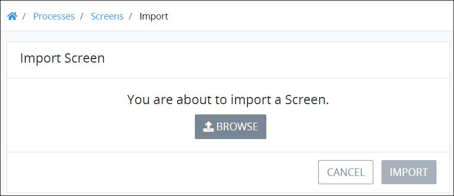
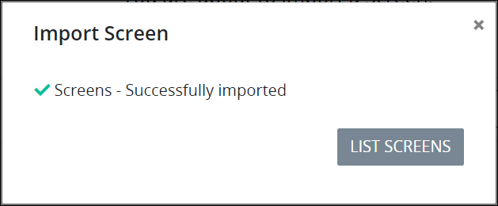
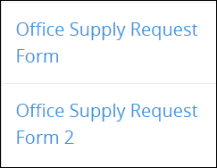

# Import a Screen

## Overview

Import a ProcessMaker Screen that has been [exported](export-a-screen.md) from the same [ProcessMaker version](../../../using-processmaker/application-version-details.md#view-processmaker-version-information). The imported ProcessMaker Screen contains the [configured controls](../screens-builder/control-descriptions/) from the exported Screen. Exported ProcessMaker Screens have the `.json` file extension. The imported ProcessMaker Screen can then be referenced in Processes.


If your ProcessMaker Screen contains either of the [Collections controls](../screens-builder/control-descriptions/processmaker-collection-controls/) that are part of the ProcessMaker [Collections package](../../../package-development-distribution/package-a-connector/collections.md), a ProcessMaker instance that does not have the Collections package can import a validated Screen but Collections controls do not import. The ProcessMaker Collections controls on a Screen only import successfully if the ProcessMaker Collections package is installed in that ProcessMaker instance.


## Import a ProcessMaker Screen


Your ProcessMaker user account or group membership must have the following permissions to import a ProcessMaker Screen unless your user account has the **Make this user a Super Admin** setting selected:

* Screens: View Screens
* Screens: Import Screens

See the ProcessMaker [Screens](../../../processmaker-administration/permission-descriptions-for-users-and-groups.md#screens) permissions or ask your ProcessMaker Administrator for assistance.


Follow these steps to import a ProcessMaker Screen:

1. [View your ProcessMaker Screens.](view-all-forms.md) The **Screens** page displays.
2. Click the **Import** button. The **Import Screen** displays.  

   

3. Click **Browse** to locate the ProcessMaker Screen to import. ProcessMaker Screens have the `.json` file extension.
4. Click **Import**. The **Import Screen** screen displays to indicate that the ProcessMaker Screen imported correctly.  

   

5. Click **List Screens**. The **Screens** page displays the imported ProcessMaker Screen with the same name as the original ProcessMaker Screen except with a number "2" suffix.  

   


If the original ProcessMaker Screen cannot import successfully, the following message displays: **Unable to import the screen.** Ensure the following:

* The `.json` file you tried to import is a ProcessMaker Screen and not a ProcessMaker Process. An [exported ProcessMaker Process](../../viewing-processes/view-the-list-of-processes/export-a-bpmn-compliant-process.md) also uses the `.json` file extension.
* The exported ProcessMaker Screen was exported from the same [ProcessMaker version](../../../using-processmaker/application-version-details.md#view-processmaker-version-information).


## Related Topics























