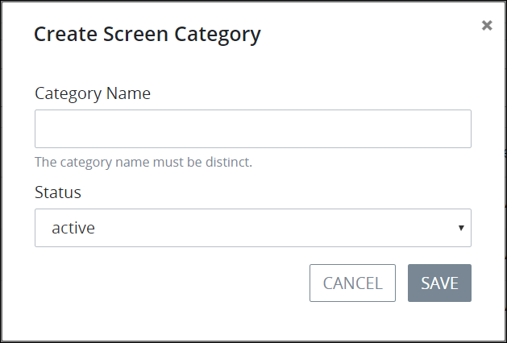

# Create a New Screen Category

## Create a New Screen Category


Your user account or group membership must have the following permissions to create a new Screen Category unless your user account has the **Make this user a Super Admin** setting selected:

* Screens: Create Screen Categories
* Screens: View Screen Categories
* Screens: View Screens

See the ProcessMaker [Screens](../../../../processmaker-administration/permission-descriptions-for-users-and-groups.md#screens) permissions or ask your ProcessMaker Administrator for assistance.


Follow these steps to create a new [Screen Category](what-is-a-screen-category.md):

1. [View your Screen Categories](view-screen-categories.md#view-screen-categories).
2. Click the **+Category** button. The **Create Screen Category** screen displays.  
3. In the **Category Name** setting, enter the name of the new Screen Category. The Screen Category name must be unique from all other Screen Category names in your organization and can only use apostrophe characters \(`'`\) and spaces. This is a required setting.
4. From the **Status** drop-down menu, select one of the following options for the Screen Category's status:

   * **Active:** Active Screen Categories can have ProcessMaker Screens assigned to them.
   * **Inactive:** Inactive Screen Categories cannot have ProcessMaker Screens assigned to them.

   This is a required setting.

5. Click **Save**.

## Related Topics













