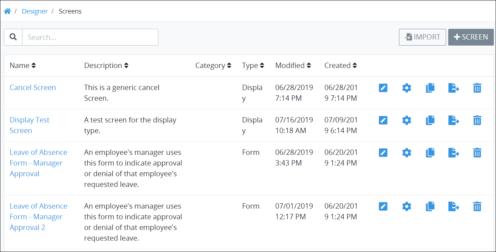

# View Screens

## View All ProcessMaker Screens 

ProcessMaker displays all Screens in one location. Any ProcessMaker Screen developed by any Process Owner can be used in any Process. This makes it easy to manage ProcessMaker Screens.


Your ProcessMaker user account or group membership must have the "Screens: View Screens" permission to view the list of ProcessMaker Screens unless your user account has the **Make this user a Super Admin** setting selected.

See the ProcessMaker [Screens](../../../processmaker-administration/permission-descriptions-for-users-and-groups.md#screens) permissions or ask your ProcessMaker Administrator for assistance.


Follow these steps to view all ProcessMaker Screens in your organization:

1. ​[Log on](https://processmaker.gitbook.io/processmaker-4-community/-LPblkrcFWowWJ6HZdhC/using-processmaker/log-in#log-in) to ProcessMaker.
2. Click the **Designer** option from the top menu. The **Processes** page displays.
3. Click the **Screens** icon. The **Screens** page displays all ProcessMaker Screens.

The **Screens** page displays the following information in tabular format about ProcessMaker Screens:

* **Name:** The **Name** column displays the name of the ProcessMaker Screen. Click the name to edit the ProcessMaker Screen in [Screens Builder](../screens-builder/).
* **Description:** The **Description** column displays the description of the ProcessMaker Screen. See [Edit Script Configuration](../../scripts/manage-scripts/edit-script-configuration.md#edit-configuration-information-about-a-processmaker-script) for more information.
* **Category:** The **Category** column displays to which Screen Category the ProcessMaker Screen is assigned.
* **Type:** The **Type** column displays which type the ProcessMaker Screen is. See [Screen Types](../screens-builder/types-for-screens.md).
* **Modified:** The **Modified** column displays the date and time the ProcessMaker Screen was last modified. The time zone setting to display the time is according to the ProcessMaker instance unless your [user profile's](../../../using-processmaker/profile-settings.md#change-your-profile-settings) **Time zone** setting is specified.
* **Created:** The **Created** column displays the date and time the ProcessMaker Screen was created. The time zone setting to display the time is according to the ProcessMaker instance unless your [user profile's](../../../using-processmaker/profile-settings.md#change-your-profile-settings) **Time zone** setting is specified.


### Search for a ProcessMaker Screen

Use the [Search](search-for-a-screen.md#search-for-a-processmaker-screen) field to filter ProcessMaker Screens that display.

### Create a ProcessMaker Screen

Click the **+Screen** button. See [Create a New Script](../../scripts/manage-scripts/create-a-new-script.md#create-a-new-processmaker-script).

### Import a ProcessMaker Screen

Click the **Import** button. See [Import a Screen](import-a-screen.md).

### Edit a ProcessMaker Screen

Click the **Open Editor** icon. See [Screens Builder](../screens-builder/) for topics.

### Configure a ProcessMaker Screen

Click the **Configure** icon. See [Edit Screen Configuration](edit-a-screen.md#edit-configuration-information-about-a-processmaker-screen).

### Duplicate a ProcessMaker Screen

Click the **Duplicate** icon. See [Duplicate a Screen](duplicate-a-screen.md#duplicate-a-processmaker-screen).

### Export a ProcessMaker Screen

Click the **Export** icon. See [Export a Screen](export-a-screen.md).

### Delete a ProcessMaker Screen

Click the **Remove** icon. See [Delete a Screen](remove-a-screen.md#delete-a-processmaker-screen).

### No ProcessMaker Screens?

If no ProcessMaker Screens exist, the following message displays: **No Data Available**.

### Display Information the Way You Want It

[Control how tabular information displays](../../../using-processmaker/control-how-requests-display-in-a-tab.md), including how to sort columns or how many items display per page.


## Related Topics





















