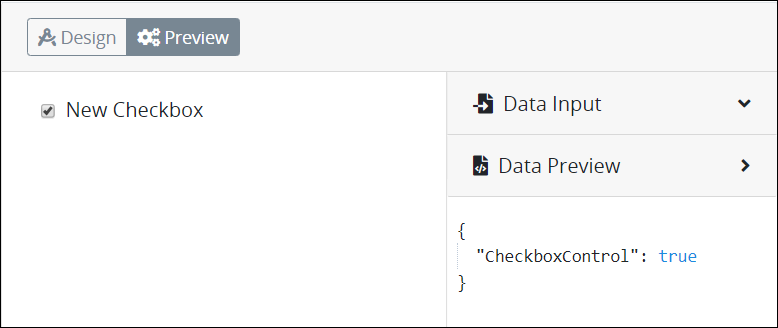

# Checkbox Control Settings

## Control Description

The Checkbox control adds a checkbox from which the [Request](../../../../using-processmaker/requests/what-is-a-request.md) participant can select or deselect an option. Multiple Checkbox controls can be grouped together to function as one set of options whereby separate Checkbox controls with the same name maintain the same selected or deselected state.


This control is not available for [Display](../types-for-screens.md#display)-type ProcessMaker Screens. See [Screen Types](../types-for-screens.md).


## Add the Control to a ProcessMaker Screen


Your ProcessMaker user account or group membership must have the following permissions to add a control to a ProcessMaker Screen unless your user account has the **Make this user a Super Admin** setting selected:

* Screens: View Screens
* Screens: Edit Screens

See the ProcessMaker [Screens](../../../../processmaker-administration/permission-descriptions-for-users-and-groups.md#screens) permissions or ask your ProcessMaker Administrator for assistance.


Follow these steps to add this control to the ProcessMaker Screen:

1. [Create a new ProcessMaker Screen](../../manage-forms/create-a-new-form.md) or click the **Edit** iconto edit the selected Screen. The ProcessMaker Screen is in [Design mode](../screens-builder-modes.md#editor-mode).
2. View the ProcessMaker Screen page to which to add the control.
3. Locate the **Checkbox** iconin the panel to the left of the Screens Builder canvas.
4. Drag the **Checkbox** icon into the Screens Builder canvas. Existing controls on the Screens Builder canvas adjust positioning based on where you drag the control.
5. Place into the Screens Builder canvas where you want the control to display on the ProcessMaker Screen.  

   

6. Configure the Checkbox control. See [Settings](checkbox-control-settings.md#inspector-settings).
7. Validate that the control is configured correctly. See [Validate Your Screen](../validate-your-screen.md#validate-a-processmaker-screen).

Below are two Checkbox controls in [Preview mode](../screens-builder-modes.md#preview-mode).

## Delete the Control from a ProcessMaker Screen


Deleting a control also deletes configuration for that control. If you add another control, it will have default settings.


Click the **Delete** iconfor the control to delete it.

## Settings 


Your user account or group membership must have the following permissions to edit a ProcessMaker Screen control:

* Screens: View Screens
* Screens: Edit Screens

See the ProcessMaker [Screens](../../../../processmaker-administration/permission-descriptions-for-users-and-groups.md#screens) permissions or ask your ProcessMaker Administrator for assistance.


The Checkbox control has the following panels that contain settings:

* \*\*\*\*[**Variable** panel](checkbox-control-settings.md#variable-panel-settings)
* \*\*\*\*[**Design** panel](checkbox-control-settings.md#design-panel-settings)

### Variable Panel Settings

Click the control to view its settings in the **Variable** panel that is on the right-side of the Screens Builder canvas. Below are settings for the Checkbox control in the **Variable** panel:

* **Key Name:** Enter a unique name that represents this control's value. Use the **Key Name** value in the following ways:

  * Reference this control by its **Variable Name** setting's value. The **Data Preview** panel in [Preview mode](../screens-builder-modes.md#preview-mode) represents the state of the Checkbox control using its **Key Name** value in the Request's JSON data model in the following ways:
    * **The Checkbox control is selected:** The key's value is `true` \(shown below\).
    * **The Checkbox control is deselected:** They key's value is `false`.  
  * Reference this control's value in a different Screens Builder control. To do so, use mustache syntax and reference this control's **Variable Name** value in the target control. Example: `{{ CheckboxControl }}`.
  * Reference this value in [**Visibility Rule** setting expressions](expression-syntax-components-for-show-if-control-settings.md).

  This is a required setting.

### Design Panel Settings

Click the control to view its settings in the **Design** panel that is on the right-side of the Screens Builder canvas. Below are settings for the Checkbox control in the **Design** panel:

* **Field Label:** Enter the field label text that displays. **New Checkbox** is the default value.
* **Help Text:** Enter text that provides additional guidance on the field's use. This setting has no default value.
* **Toggle Style?:** Select to display a toggle key control instead of a checkbox control for each checkbox option.
* **Initially Checked?:** Select to indicate that the Checkbox control is checked \(selected\) by default. Otherwise, deselect to indicate that the Checkbox control is not checked by default. This setting is not selected by default.
* **Element Background Color:** Select to specify the background color of this control.
* **Text Color:** Select to specify the text color that displays in this control.
* **Visibility Rule:** Enter an expression that indicates the condition\(s\) under which this control displays. See [Expression Syntax Components for "Visibility Rule" Control Settings](expression-syntax-components-for-show-if-control-settings.md#expression-syntax-components-for-show-if-control-settings). If this setting does not have an expression, then this control displays by default.
* **CSS Selector Name:** Enter the value to represent this control in custom CSS syntax when in [Custom CSS](../add-custom-css-to-a-screen.md#add-custom-css-to-a-processmaker-screen) mode. As a best practice, use the same **CSS Selector Name** value on different controls of the same type to apply the same custom CSS style to all those controls.

## Related Topics 







































