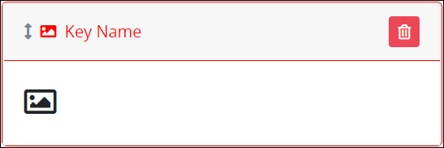

# Image Control Settings

## Control Description

The Image control displays an image that is PNG, GIF, or JPG file types.

## Add the Control to a ProcessMaker Screen


Your user account or group membership must have the following permissions to add a control to a ProcessMaker Screen:

* Screens: View Screens
* Screens: Edit Screens

See the ProcessMaker [Screens](../../../../processmaker-administration/permission-descriptions-for-users-and-groups.md#screens) permissions or ask your ProcessMaker Administrator for assistance.


Follow these steps to add this control to the ProcessMaker Screen:

1. [Create](../../manage-forms/create-a-new-form.md) or [open](../../manage-forms/view-all-forms.md) the ProcessMaker Screen. The ProcessMaker Screen is in [Design mode](../screens-builder-modes.md#editor-mode).
2. View the ProcessMaker Screen page to which to add the control.
3. Go to the **Controls** panel on the left side of the ProcessMaker Screen.
4. Drag the **Image** iconfrom the **Controls** panel anywhere within the ProcessMaker Screen canvas. Existing controls on the ProcessMaker Screen canvas adjust positioning based on where you drag the control.
5. Place into the ProcessMaker Screen canvas where you want the control to display on the page.  

   

6. Configure the Image control. See [Inspector Settings](image-control-settings.md#inspector-settings).

Below is an Image control in Preview mode.

## Delete the Control from a ProcessMaker Screen


Deleting a control also deletes configuration for that control. If you add another control, it will have default settings.


Click the **Delete** iconfor the control to delete it.

## Inspector Settings


### Don't Know What the Inspector Panel Is?

See [View the Inspector Panel](../view-the-inspector-pane.md).

### Permissions Required

Your user account or group membership must have the following permissions to edit a ProcessMaker Screen control:

* Screens: View Screens
* Screens: Edit Screens

See the ProcessMaker [Screens](../../../../processmaker-administration/permission-descriptions-for-users-and-groups.md#screens) permissions or ask your ProcessMaker Administrator for assistance.


Below are Inspector settings for the Image control:

* **Id:** Enter the unique internal image identification.
* **Variable Name:** Enter a unique name that represents this control's value. Use the **Variable Name** value in the following ways:

  * Reference this control by its **Variable Name** setting's value.
  * Reference this control's value in a different Screens Builder control. To do so, use mustache syntax and reference this control's **Variable Name** value in the target control. Example: `My full name is {{FullName}}`.
  * Reference this value to in [**Visibility Rule** setting expressions](expression-syntax-components-for-show-if-control-settings.md).

  This is a required setting.

* **Upload Image:** Click the **Upload Image** button to browse for the PNG, GIF, or JPG file type image to upload to the Image control.
* **Preview:** This setting displays a preview of the uploaded image.
* **Width:** Specify the width of the uploaded image in pixels. If the **Height** setting has no value, the Image control adjust the uploaded image to the **Width** setting value.
* **Height:** Specify the width of the uploaded image in pixels. If the **Width** setting has no value, the Image control adjust the uploaded image to the **Height** setting value.
* **Visibility Rule:** Enter an expression that dictates the condition\(s\) under which this control displays. See [Expression Syntax Components for "Visibility Rule" Control Settings](expression-syntax-components-for-show-if-control-settings.md#expression-syntax-components-for-show-if-control-settings). If this setting does not have an expression, then this control displays by default.
* **CSS Selector Name:** Enter the value to represent this control in custom CSS syntax when in [Custom CSS](../add-custom-css-to-a-screen.md#add-custom-css-to-a-processmaker-screen) mode. As a best practice, use the same **CSS Selector Name** value on different controls of the same type to apply the same custom CSS style to all those controls.

## Related Topics 







































