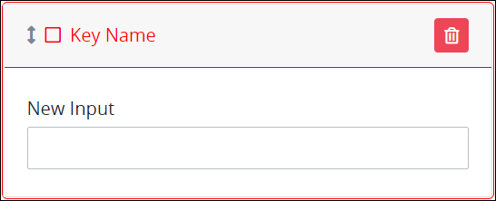
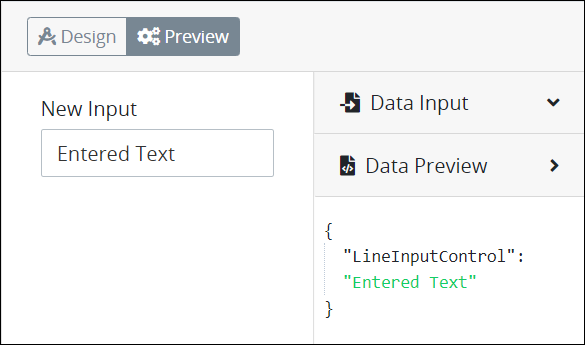

# Line Input Control Settings

## Control Description


This topic is updated for ProcessMaker version 4.0.1. See the [Release Notes](https://processmaker.gitbook.io/processmaker-release-notes/processmaker-4.0.x/processmaker-4.0.1-release-notes#screen-builder-1).


The Line Input control is a text field that the [Request](../../../../using-processmaker/requests/what-is-a-request.md) participant can enter information. Configure the Line Input control to accept one of the following data types:

* **Text:** The control only accepts alphanumeric characters.
* **Integer:** The control only accepts integers. 
* **Currency:** The control only accepts a currency value.
* **Decimal:** The control accepts any number, both positive and negative.
* **Datetime:** The control accepts a datetime, which is includes both date and time components.
* **Date:** The control accepts a date.


This control is not available for [Display](../types-for-screens.md#display)-type ProcessMaker Screens. See [Screen Types](../types-for-screens.md).


## Add the Control to a ProcessMaker Screen


Your ProcessMaker user account or group membership must have the following permissions to add a control to a ProcessMaker Screen unless your user account has the **Make this user a Super Admin** setting selected:

* Screens: View Screens
* Screens: Edit Screens

See the ProcessMaker [Screens](../../../../processmaker-administration/permission-descriptions-for-users-and-groups.md#screens) permissions or ask your ProcessMaker Administrator for assistance.


Follow these steps to add this control to the ProcessMaker Screen:

1. [Create a new ProcessMaker Screen](../../manage-forms/create-a-new-form.md) or click the **Edit** iconto edit the selected Screen. The ProcessMaker Screen is in [Design mode](../screens-builder-modes.md#editor-mode).
2. View the ProcessMaker Screen page to which to add the control.
3. Locate the **Line Input** iconin the panel to the left of the Screen Builder canvas.
4. Drag the **Line Input** icon into the Screen Builder canvas. Existing controls on the Screen Builder canvas adjust positioning based on where you drag the control.
5. Place into the Screen Builder canvas where you want the control to display on the ProcessMaker Screen.  

   

6. Configure the Line Input control. See [Settings](line-input-control-settings.md#settings).
7. Validate that the control is configured correctly. See [Validate Your Screen](../validate-your-screen.md#validate-a-processmaker-screen).

Below is a Line Input control in [Preview mode](../screens-builder-modes.md#preview-mode).

## Delete the Control from a ProcessMaker Screen


Deleting a control also deletes configuration for that control. If you add another control, it will have default settings.


Click the **Delete** iconfor the control to delete it.

## Settings


### Permissions Required

Your user account or group membership must have the following permissions to edit a ProcessMaker Screen control:

* Screens: View Screens
* Screens: Edit Screens

See the ProcessMaker [Screens](../../../../processmaker-administration/permission-descriptions-for-users-and-groups.md#screens) permissions or ask your ProcessMaker Administrator for assistance.

### Topic Update

This topic is updated for ProcessMaker version 4.0.1. See the [Release Notes](https://processmaker.gitbook.io/processmaker-release-notes/processmaker-4.0.x/processmaker-4.0.1-release-notes#screen-builder-1).


The Line Input control has the following panels that contain settings:

* [**Variable** panel](line-input-control-settings.md#variable-panel-settings)
* \*\*\*\*[**Configuration** panel](line-input-control-settings.md#configuration-panel-settings)
* \*\*\*\*[**Design** panel](line-input-control-settings.md#design-panel-settings)
* \*\*\*\*[**Advanced** panel](line-input-control-settings.md#advanced-panel-settings)

### Variable Panel Settings

Click the control while in [Design](../screens-builder-modes.md#design-mode) mode, and then click the **Variable** panel that is on the right-side of the Screen Builder canvas.

Below are settings for the Line Input control in the **Variable** panel:

* **Variable Name:** Edit the default variable name for this control if necessary. Ensure that the control's name is unique name from other controls in this ProcessMaker Screen and contains at least one letter. Use the **Variable Name** value in the following ways:

  * Reference this control by its **Variable Name** setting's value. The **Data Preview** panel in [Preview mode](../screens-builder-modes.md#preview-mode) corresponds the Line Input control's textual content with that Line Input control's **Variable Name** value. In the example below, `LineInputControl` is the **Variable Name** setting's value.  
  * Reference this control's value in a different Screen Builder control. To do so, use [mustache syntax](https://mustache.github.io/mustache.5.html) and reference this control's **Variable Name** value in the target control. Example: `{{ LineInputControl }}`.
  * Reference this value in [**Visibility Rule** setting expressions](expression-syntax-components-for-show-if-control-settings.md).

  This is a required setting.

* **Label:** Edit the default label that displays for this control if necessary.
* **Data Type:** Select one of the following data type options this control accepts when the form user enters content into this control:

  * **Text:** This control accepts alphanumeric characters.
  * **Integer:** This control accepts integers.
  * **Decimal:** This control accepts any number, both positive and negative.
  * **Datetime:** This control accepts a datetime, which is includes both date and time components.
  * **Date:** The control accepts a date.

  This is a required setting. The following message displays below the control if the Request participant enters content that does not comply with this control's data type: **The format is invalid.**.

* **Validation Rules:** Enter the validation rules the Request participant must comply with to properly enter a valid value into this control. This setting has no default value. See [Validation Rules for "Validation" Control Settings](validation-rules-for-validation-control-settings.md).
* **Read Only:** Select to indicate that this control cannot be edited. This option is not selected by default.

### Configuration Panel Settings

Click the control while in [Design](../screens-builder-modes.md#design-mode) mode, and then click the **Configuration** panel that is on the right-side of the Screen Builder canvas.

Below are settings for the Line Input control in the **Configuration** panel:

* **Label:** Enter the text label that displays for this control. **New Input** is the default value.
* **Type:** Select one of the following type options how this control displays entered content:
  * **Text:** This control displays the entered characters. This is the default setting.
  * **Password:** This control hides the entered characters as is customary when entering a password.
* **Placeholder Text:** Enter the placeholder text that displays in this control when no value has been provided. This setting has no default value.
* **Helper Text:** Enter text that provides additional guidance on this control's use. This setting has no default value.

### Design Panel Settings

Click the control while in [Design](../screens-builder-modes.md#design-mode) mode, and then click the **Design** panel that is on the right-side of the Screen Builder canvas.

Below are settings for the Line Input control in the **Design** panel:

* **Text Color:** Select to specify the text color that displays in this control.
* **Background Color:** Select to specify the background color of this control.

### Advanced Panel Settings

Click the control while in [Design](../screens-builder-modes.md#design-mode) mode, and then click the **Advanced** panel that is on the right-side of the Screen Builder canvas.

Below are settings for the Select List control in the **Advanced** panel:

* **Visibility Rule:** Specify an expression that indicates the condition\(s\) under which this control displays. See [Expression Syntax Components for "Visibility Rule" Control Settings](expression-syntax-components-for-show-if-control-settings.md#expression-syntax-components-for-show-if-control-settings). If this setting does not have an expression, then this control displays by default.
* **CSS Selector Name:** Enter the value to represent this control in custom CSS syntax when in [Custom CSS](../add-custom-css-to-a-screen.md#add-custom-css-to-a-processmaker-screen) mode. As a best practice, use the same **CSS Selector Name** value on different controls of the same type to apply the same custom CSS style to all those controls.


Do you need to export this ProcessMaker Screen? Click the **Export Screen** button. See [Export a Screen](../../manage-forms/export-a-screen.md#overview) for more information.


## Related Topics



































