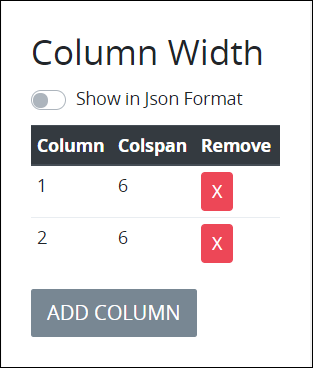

# Multicolumn / Table Control Settings

## Control Description 

The Multicolumn / Table control adds a layout element with two or more columns. Drop other controls into any of the columns to display them to the width of the Multicolumn / Table control column.

## Add the Control to a ProcessMaker Screen 


Your ProcessMaker user account or group membership must have the following permissions to add a control to a ProcessMaker Screen unless your user account has the **Make this user a Super Admin** setting selected:

* Screens: View Screens
* Screens: Edit Screens

See the ProcessMaker [Screens](../../../../processmaker-administration/permission-descriptions-for-users-and-groups.md#screens) permissions or ask your ProcessMaker Administrator for assistance.


Follow these steps to add this control to the ProcessMaker Screen:

1. [Create a new ProcessMaker Screen](../../manage-forms/create-a-new-form.md) or click the **Edit** iconto edit the selected Screen. The ProcessMaker Screen is in [Design mode](../screens-builder-modes.md#editor-mode).
2. View the ProcessMaker Screen page to which to add the control.
3. Go to the **Controls** panel on the left side of the ProcessMaker Screen.
4. Drag the **Multicolumn / Table** iconfrom the **Controls** panel anywhere within the ProcessMaker Screen canvas. Existing controls on the ProcessMaker Screen canvas adjust positioning based on where you drag the control.
5. Configure the Multicolumn / Table control. See [Design Settings](multi-column-button-control-settings.md#inspector-settings).
6. Place into the ProcessMaker Screen canvas where you want the control to display on the page.​
7. Drag and place others controls into a column. Configure each control's settings.  

Below is a Multicolumn / Table control in [Preview mode](../screens-builder-modes.md#preview-mode).

## Delete the Control from a ProcessMaker Screen


Deleting a control deletes configuration for that control as well as any controls placed into the Multicolumn / Table control. If you add another control, it will have default settings.


Click the **Delete** iconfor the control to delete it.

## Settings 


Your user account or group membership must have the following permissions to edit a ProcessMaker Screen control:

* Screens: View Screens
* Screens: Edit Screens

See the ProcessMaker [Screens](../../../../processmaker-administration/permission-descriptions-for-users-and-groups.md#screens) permissions or ask your ProcessMaker Administrator for assistance.


The Multicolumn / Table control has the following panels that contain settings:

* \*\*\*\*[**Variable** panel](multi-column-button-control-settings.md#variable-panel-settings)
* \*\*\*\*[**Design** panel](multi-column-button-control-settings.md#design-panel-settings)

### Variable Panel Settings

Click the control to view its settings in the **Variable** panel that is on the right-side of the Screens Builder canvas. Below are settings for the Multicolumn / Table control in the **Variable** panel:

* **Column Widths:** Specify the column width for each column in the control. Add each column and its width specification in the order they are to display from left to right in the control. Specify the width of each column in `colspan` [HTML attribute](https://www.w3schools.com/tags/att_colspan.asp) settings. The total of all `colspan` attribute settings must be divisible by 12. The control contains two columns of six \(6\) `colspan` HTML attribute setting each by default.

  Use the **Show in Json Format** toggle to display these settings in JSON.  

  

  Each option has the following settings:

  * **Column:** **Column** is the internal designation for the column that only the form designer views at design time.
  * **Colspan:** **Colspan** is the width of the column in `colspan` HTML attribute settings.
  * **Remove:** Click the Removeicon to remove the column.

  Follow these steps to add a column and specify its width: 

  1. Click **Add Column** from below the **Column Widths** setting. The **Add New Column** screen displays.   

     

  2. In the **Column Width** field, enter the width of the column \(as described above\).
  3. Click **OK**. The column displays below the existing columns in **Column Widths**.

### Design Panel Settings

Click the control to view its settings in the **Design** panel that is on the right-side of the Screens Builder canvas. Below are settings for the Multicolumn / Table control in the **Design** panel:

* **Element Background Color:** Select to specify the background color of this control.
* **Text Color:** Select to specify the text color that displays in this control.
* **Visibility Rule:** Specify an expression that indicates the condition\(s\) under which this control displays. See [Expression Syntax Components for "Visibility Rule" Control Settings](expression-syntax-components-for-show-if-control-settings.md#expression-syntax-components-for-show-if-control-settings). If this setting does not have an expression, then this control displays by default.
* **CSS Selector Name:** Enter the value to represent this control in custom CSS syntax when in [Custom CSS](../add-custom-css-to-a-screen.md#add-custom-css-to-a-processmaker-screen) mode. As a best practice, use the same **CSS Selector Name** value on different controls of the same type to apply the same custom CSS style to all those controls.

## Related Topics 







































