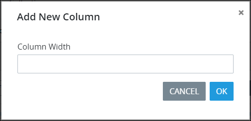
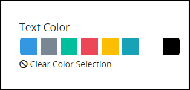
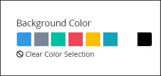
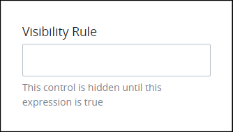
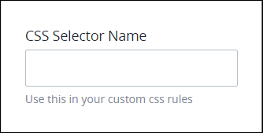

# Multicolumn / Table Control Settings

## Control Description 

The Multicolumn / Table control adds a layout element with two or more columns. Drag and place other controls into any of the columns to display them to the width of the Multicolumn / Table control column.

Specify the width of each column in `colspan` [HTML attribute](https://www.w3schools.com/tags/att_colspan.asp) settings. The total of all `colspan` attribute settings must be divisible by 12. The control contains two columns of six \(6\) `colspan` HTML attribute setting each by default.

## Add the Control to a ProcessMaker Screen 


Your ProcessMaker user account or group membership must have the following permissions to add a control to a ProcessMaker Screen unless your user account has the **Make this user a Super Admin** setting selected:

* Screens: Edit Screens
* Screens: View Screens

See the ProcessMaker [Screens](../../../../processmaker-administration/permission-descriptions-for-users-and-groups.md#screens) permissions or ask your ProcessMaker Administrator for assistance.


Follow these steps to add this control to the [ProcessMaker Screen](../../what-is-a-form.md):

1. [Create a new ProcessMaker Screen](../../manage-forms/create-a-new-form.md) or click the **Edit** iconto edit the selected Screen. The ProcessMaker Screen is in [Design mode](../screens-builder-modes.md#editor-mode).
2. View the ProcessMaker Screen page to which to add the control.
3. Locate the **Multicolumn / Table** iconin the panel to the left of the Screen Builder canvas.
4. Drag the **Multicolumn / Table** icon into the Screen Builder canvas. Existing controls on the Screens Builder canvas adjust positioning based on where you drag the control.
5. Place into the Screen Builder canvas where you want the control to display on the ProcessMaker Screen.
6. Configure the Multicolumn / Table control. See [Settings](multi-column-button-control-settings.md#inspector-settings).
7. Drag and place others controls into a column. Configure and validate each control's settings.  

Below is a Multicolumn / Table control in [Preview mode](../screens-builder-modes.md#preview-mode).

## Move the Control on the Page


Your ProcessMaker user account or group membership must have the following permissions to move a control in a ProcessMaker Screen page unless your user account has the **Make this user a Super Admin** setting selected:

* Screens: Edit Screens
* Screens: View Screens

See the ProcessMaker [Screens](../../../../processmaker-administration/permission-descriptions-for-users-and-groups.md#screens) permissions or ask your ProcessMaker Administrator for assistance.


After [adding a control to a ProcessMaker Screen page](multi-column-button-control-settings.md#add-the-control-to-a-processmaker-screen), you may move it to another location on that page such that it is above or below other controls placed on that page. Consider when moving this control that it contains other controls. A control cannot be moved to another [ProcessMaker Screen](../../what-is-a-form.md) page.

Follow these steps to move a control to another location on that ProcessMaker Screen page:

1. Place your cursor anywhere on the control not displaying the **Duplicate Control**or **Delete Control**buttons.
2. Hold your cursor, then drag the control above or below other controls on that ProcessMaker Screen page. Screen Builder previews where the control would display on the page based on how you position the control above or below other controls. If the control cannot be placed in a location because your cursor is above an existing control or too far to the left or right of the page, theicon displays in the preview.
3. Place the control at the location on the page you want it. The other control\(s\) on the page automatically adjust position.

## Copy the Control with its Settings


Your ProcessMaker user account or group membership must have the following permissions to copy a control in a ProcessMaker Screen unless your user account has the **Make this user a Super Admin** setting selected:

* Screens: Edit Screens
* Screens: View Screens

See the ProcessMaker [Screens](../../../../processmaker-administration/permission-descriptions-for-users-and-groups.md#screens) permissions or ask your ProcessMaker Administrator for assistance.


Copying a control also copies the current settings of that control. The copied control displays below other controls placed on that [ProcessMaker Screen](../../what-is-a-form.md) page.

Follow these steps to copy a control:

1. Select the control to be copied.
2. Click the **Duplicate Control** button. The control copies with its current settings, and then displays below other controls placed on that page.

## Delete the Control from a ProcessMaker Screen


Your ProcessMaker user account or group membership must have the following permissions to delete a control from a ProcessMaker Screen unless your user account has the **Make this user a Super Admin** setting selected:

* Screens: Edit Screens
* Screens: View Screens

See the ProcessMaker [Screens](../../../../processmaker-administration/permission-descriptions-for-users-and-groups.md#screens) permissions or ask your ProcessMaker Administrator for assistance.



Deleting a control deletes configuration for that control as well as any controls placed into the Multicolumn / Table control. If you add another control, it will have default settings.


Follow these steps to delete a control from a [ProcessMaker Screen](../../what-is-a-form.md) page:

1. Select the control to be deleted.
2. Click the **Delete** button. The control deletes. Other controls on that ProcessMaker Screen page adjust their locations automatically.

## Settings 


Your user account or group membership must have the following permissions to edit a ProcessMaker Screen control:

* Screens: Edit Screens
* Screens: View Screens

See the ProcessMaker [Screens](../../../../processmaker-administration/permission-descriptions-for-users-and-groups.md#screens) permissions or ask your ProcessMaker Administrator for assistance.


The Multicolumn / Table control has the following panels that contain settings:

* \*\*\*\*[**Configuration** panel](multi-column-button-control-settings.md#configuration-panel-settings)
* \*\*\*\*[**Design** panel](multi-column-button-control-settings.md#design-panel-settings)
* \*\*\*\*[**Advanced** panel](multi-column-button-control-settings.md#advanced-panel-settings)

### Configuration Panel Settings

Click the control while in [Design](../screens-builder-modes.md#design-mode) mode, and then click the **Configuration** panel that is on the right-side of the Screen Builder canvas.

Below is the setting for the Multicolumn / Table control in the **Configuration** panel:

* [Column Width](multi-column-button-control-settings.md#column-width)

#### Column Width

Specify the column width for each column in the control. Add each column and its width specification in the order they are to display from left to right in the control. Specify the width of each column in `colspan` [HTML attribute](https://www.w3schools.com/tags/att_colspan.asp) settings. The total of all `colspan` attribute settings must be divisible by 12. The control contains two columns of six \(6\) `colspan` HTML attribute setting each by default.

Use the **Show in Json Format** toggle to display these settings in JSON.  
 

Each option has the following settings:

* **Column:** **Column** is the internal designation for the column that only the form designer views at design time.
* **Colspan:** **Colspan** is the width of the column in `colspan` HTML attribute settings.
* **Remove:** Click the Removeicon to remove the column.

Follow these steps to add a column and specify its width: 

1. Click **Add Column** from below the **Column Width** setting. The **Add New Column** screen displays.   

   

2. In the **Column Width** setting, enter the width of the column \(as described above\).
3. Click **OK**. The column displays below the existing columns in **Column Width**.

### Design Panel Settings

Click the control while in [Design](../screens-builder-modes.md#design-mode) mode, and then click the **Design** panel that is on the right-side of the Screen Builder canvas.

Below are settings for the Multicolumn / Table control in the **Design** panel:

* [Text Color](multi-column-button-control-settings.md#text-color)
* [Background Color](multi-column-button-control-settings.md#background-color)

#### Text Color

Select the text color that displays for this control. Optionally, click the **Clear Color Selection** option to remove the selected color.  
 

#### Background Color

Select the background color that displays for this control. Optionally, click the **Clear Color Selection** option to remove the selected color.  
 

### Advanced Panel Settings

Click the control while in [Design](../screens-builder-modes.md#design-mode) mode, and then click the **Advanced** panel that is on the right-side of the Screen Builder canvas.

Below are settings for the Multicolumn / Table control in the **Advanced** panel:

* [Visibility Rule](multi-column-button-control-settings.md#visibility-rule)
* [CSS Selector Name](multi-column-button-control-settings.md#css-selector-name)

#### Visibility Rule

Specify an expression that indicates the condition\(s\) under which this control displays. See [Expression Syntax Components for "Visibility Rule" Control Settings](expression-syntax-components-for-show-if-control-settings.md#expression-syntax-components-for-show-if-control-settings). If this setting does not have an expression, then this control displays by default.  
 


To make this control hidden until another control contains a value, enter the **Variable Name** setting value of that control to this control's **Visibility Rule** setting.


#### CSS Selector Name

Enter the value to represent this control in custom CSS syntax when in [Custom CSS](../add-custom-css-to-a-screen.md#add-custom-css-to-a-processmaker-screen) mode. As a best practice, use the same **CSS Selector Name** value on different controls of the same type to apply the same custom CSS style to all those controls.  
 

## Related Topics 











































