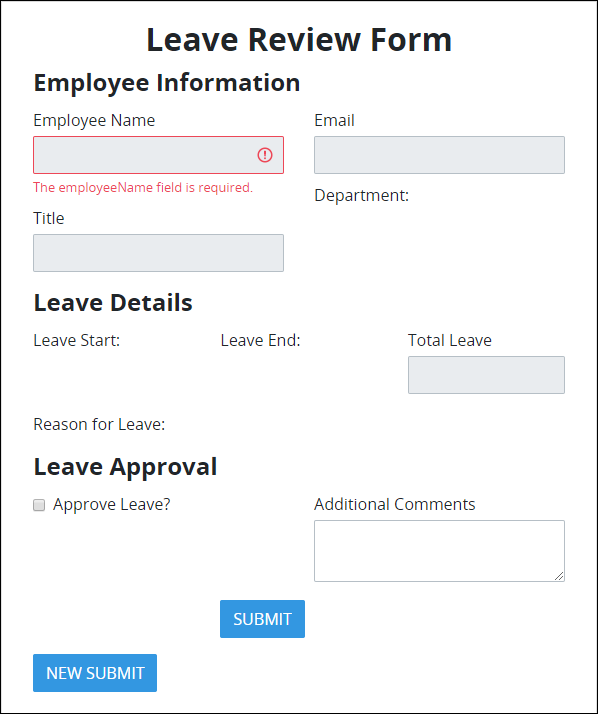
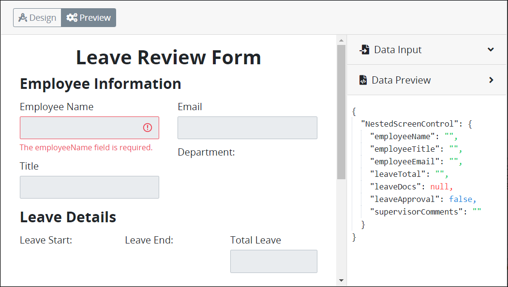

# Nested Screen Control Settings

## Control Description


### New Topic

This topic is new for ProcessMaker version 4.0.1. See the [Release Notes](https://processmaker.gitbook.io/processmaker-release-notes/processmaker-4.0.x/processmaker-4.0.1-release-notes#screen-builder).


Use the Nested Screen control to nest a separate [ProcessMaker Screen](../../what-is-a-form.md) into that control. In doing so, the separate ProcessMaker Screen embeds into the Nested Screen control. The Nested Screen control is a placeholder for the embedded ProcessMaker Screen such that the [Request](../../../../using-processmaker/requests/what-is-a-request.md) participant experiences the nested Screen as designed. The nested ProcessMaker Screen must be in the same ProcessMaker instance as that using the Nested Screen control. When the [Task](../../../../using-processmaker/task-management/what-is-a-task.md) loads the ProcessMaker Screen using a Nested Screen control, the Nested Screen loads the latest version of the referenced Screen.

Any CSS in the ProcessMaker Screen as designed in [Custom CSS mode](../screens-builder-modes.md#custom-css-mode) takes precedent over any CSS designed in nested Screens so that the Request participant has a unified visual experience that does not have a variety of design styles.

Any ProcessMaker Screen [type](../types-for-screens.md) may be selected for nesting into a Nested Screen control. However, only [Form](../types-for-screens.md#form)- and [Display](../types-for-screens.md#display)-type ProcessMaker Screens preview in either [Design](../screens-builder-modes.md#design-mode) or [Preview](../screens-builder-modes.md#preview-mode) modes.

ProcessMaker Screen designers can easily build a Screen by placing modular components into one Screen. For example, in a ProcessMaker Screen designed for a purchase request, use Nested Screen controls as placeholders for the following components that are designed in separate Screens. Each of these ProcessMaker Screens are nested into its own Nested Screen control.

* Nested Screen control for Screen 1: Personal information
* Nested Screen control for Screen 2: Payment information
* Nested Screen control for Screen 3: Billing information
* Nested Screen control for Screen 4: Shipping information


This control is not available for [Display](../types-for-screens.md#display)-type ProcessMaker Screens. See [Screen Types](../types-for-screens.md).


## Add the Control to a ProcessMaker Screen 


Your ProcessMaker user account or group membership must have the following permissions to add a control to a ProcessMaker Screen unless your user account has the **Make this user a Super Admin** setting selected:

* Screens: Edit Screens
* Screens: View Screens

See the ProcessMaker [Screens](../../../../processmaker-administration/permission-descriptions-for-users-and-groups.md#screens) permissions or ask your ProcessMaker Administrator for assistance.


Follow these steps to add this control to the ProcessMaker Screen:

1. [Create a new ProcessMaker Screen](../../manage-forms/create-a-new-form.md) or click the **Edit** iconto edit the selected Screen. The ProcessMaker Screen is in [Design mode](../screens-builder-modes.md#editor-mode).
2. View the ProcessMaker Screen page to which to add the control.
3. Locate the **Nested Screen** iconin the panel to the left of the Screen Builder canvas.
4. Drag the **Nested Screen** icon into the Screen Builder canvas. Existing controls on the Screens Builder canvas adjust positioning based on where you drag the control.
5. Place into the Screen Builder canvas where you want the control to display on the ProcessMaker Screen. Ensure that the control's placement accounts for the ProcessMaker Screen you intend to nest into this control.  
6. Configure the Nested Screen control. See [Settings](nested-screen-control-settings.md#inspector-settings).
7. Validate that the control is configured correctly. See [Validate Your Screen](../validate-your-screen.md#validate-a-processmaker-screen).

Below is a Nested Screen control in [Preview mode](../screens-builder-modes.md#preview-mode).

## Delete the Control from a ProcessMaker Screen


Consider the following when deleting a configured Nested Screen control:

* Deleting a Nested Screen control also deletes the nested ProcessMaker Screen.
* Deleting a control also deletes configuration for that control. If you add another control, it will have default settings.


Click the **Delete** iconfor the control to delete it.

## Settings 


### Permissions Required

Your user account or group membership must have the following permissions to edit a ProcessMaker Screen control:

* Screens: Edit Screens
* Screens: View Screens

See the ProcessMaker [Screens](../../../../processmaker-administration/permission-descriptions-for-users-and-groups.md#screens) permissions or ask your ProcessMaker Administrator for assistance.

### New Topic

This topic is new for ProcessMaker version 4.0.1. See the [Release Notes](https://processmaker.gitbook.io/processmaker-release-notes/processmaker-4.0.x/processmaker-4.0.1-release-notes#screen-builder-1).


The Nested Screen control has the following panels that contain settings:

* \*\*\*\*[**Variable** panel](nested-screen-control-settings.md#variable-panel-settings)
* \*\*\*\*[**Advanced** panel](nested-screen-control-settings.md#advanced-panel-settings)

### Variable Panel Settings

Click the control while in [Design](../screens-builder-modes.md#design-mode) mode, and then click the **Variable** panel that is on the right-side of the Screen Builder canvas.

Below is the setting for the Nested Screen control in the **Variable** panel:

* [Variable Name](nested-screen-control-settings.md#variable-name)

#### Variable Name

Edit the default **Variable Name** setting value for this control if necessary. The **Variable Name** setting value represents data in this control during [Requests](../../../../using-processmaker/requests/what-is-a-request.md). Ensure that the **Variable Name** setting value is a unique name from other controls in this [ProcessMaker Screen](../../what-is-a-form.md) and contains at least one letter. Use the **Variable Name** setting value in the following ways:

* Reference this control by its **Variable Name** setting's value. The **Data Preview** panel in [Preview mode](../screens-builder-modes.md#preview-mode) corresponds the Submit Button control's **Variable Name** value. In the example below, `NestedScreenControl` is the **Variable Name** setting's value when the button is clicked.  
* Reference this control's value in a different Screen Builder control. To do so, use [mustache syntax](https://mustache.github.io/mustache.5.html) and reference this control's **Variable Name** value in the target control. Example: `{{ NestedScreenControl }}`.
* Reference this value in [**Visibility Rule** setting expressions](expression-syntax-components-for-show-if-control-settings.md).

This is a required setting.

### Advanced Panel Settings

Click the control while in [Design](../screens-builder-modes.md#design-mode) mode, and then click the **Advanced** panel that is on the right-side of the Screen Builder canvas.

Below are settings for the Nested Screen control in the **Advanced** panel:

* [Visibility Rule](nested-screen-control-settings.md#visibility-rule)
* [CSS Selector Name](nested-screen-control-settings.md#css-selector-name)

#### Visibility Rule

Specify an expression that indicates the condition\(s\) under which this control displays. See [Expression Syntax Components for "Visibility Rule" Control Settings](expression-syntax-components-for-show-if-control-settings.md#expression-syntax-components-for-show-if-control-settings). If this setting does not have an expression, then this control displays by default.

#### CSS Selector Name

Enter the value to represent this control in custom CSS syntax when in [Custom CSS](../add-custom-css-to-a-screen.md#add-custom-css-to-a-processmaker-screen) mode. As a best practice, use the same **CSS Selector Name** value on different controls of the same type to apply the same custom CSS style to all those controls.

## Related Topics







































