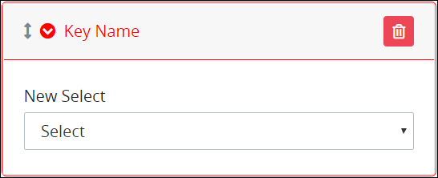

# Select Control Settings

## Control Description

The Select control provides a drop-down menu from which the form user selects a single option.


This control is not available for [Display](../types-for-screens.md#display)-type ProcessMaker Screens. See [Screen Types](../types-for-screens.md).


## Add the Control to a ProcessMaker Screen


Your user account or group membership must have the following permissions to add a control to a ProcessMaker Screen:

* Screens: View Screens
* Screens: Edit Screens

See the ProcessMaker [Screens](../../../../processmaker-administration/permission-descriptions-for-users-and-groups.md#screens) permissions or ask your ProcessMaker Administrator for assistance.


Follow these steps to add this control to the ProcessMaker Screen:

1. [Create](../../manage-forms/create-a-new-form.md) or [open](../../manage-forms/view-all-forms.md) the ProcessMaker Screen. The ProcessMaker Screen is in [Editor mode](../screens-builder-modes.md#editor-mode).
2. View the ProcessMaker Screen page to which to add the control.
3. Go to the **Controls** panel on the left side of the ProcessMaker Screen.
4. Drag the **Select** icon  from the **Controls** panel anywhere within the ProcessMaker Screen canvas. Existing controls on the ProcessMaker Screen canvas adjust positioning based on where you drag the control.
5. Place into the ProcessMaker Screen canvas where you want the control to display on the page.  

   

6. Configure the Select control. See [Inspector Settings](select-control-settings.md#inspector-settings).

Below is a Select control in Preview mode.

## Delete the Control from a ProcessMaker Screen


Deleting a control also deletes configuration for that control. If you add another control, it will have default settings.


Click the **Delete** iconfor the control to delete it.

## Inspector Settings 


### Don't Know What the Inspector Panel Is?

See [View the Inspector Panel](../view-the-inspector-pane.md).

### Permissions Required

Your user account or group membership must have the following permissions to edit a ProcessMaker Screen control:

* Screens: View Screens
* Screens: Edit Screens

See the ProcessMaker [Screens](../../../../processmaker-administration/permission-descriptions-for-users-and-groups.md#screens) permissions or ask your ProcessMaker Administrator for assistance.


Below are Inspector settings for the Line Input control:

* **Variable Name:** Enter a unique name that represents this control's value. Use the **Variable Name** value in the following ways:

  * Reference this control by its **Variable Name** setting's value.
  * Reference this control's value in a different Screens Builder control. To do so, use mustache syntax and reference this control's **Variable Name** value in the target control. Example: `My full name is {{FullName}}`.
  * Reference this value to in [**Visibility Rule** setting expressions](expression-syntax-components-for-show-if-control-settings.md).

  This is a required setting.

* **Field Label:** Enter the field label text that displays. **New Select** is the default value.
* **Validation:** Enter the validation rules the form user must comply with to properly enter a valid value into this field. This setting has no default value. See [Validation Rules for "Validation" Control Settings](validation-rules-for-validation-control-settings.md).
* **Help Text:** Enter text that provides additional guidance on the field's use. This setting has no default value.
* **Options List:** Enter the list of options available in the select box. Add options in the order they are to display from top to bottom in the drop-down menu. The default option is called **new** with the content **New Option**. Use the **Show in Json Format** toggle to display these settings in JSON.  

  

  Each option has the following settings:

  * **Value:** **Value** is the internal data name for the option that only the Process Owner views at design time.
  * **Content:** **Content** is the option label displayed to the form user. 
  * **Actions:** Click the **Remove**icon to remove the option.

  Follow these steps to add an option: 

  1. Click **Add Option** from below the **Options List** setting. The **Add New Option** screen displays.  

     

  2. In the **Option Value** field, enter the **Value** option value \(as described above\).
  3. In the **Content** field, enter the **Content** option value \(as described above\).
  4. Click **OK**. The option displays below the existing options in **Options List**.

* **Element Background Color:** Select to specify the background color of this control.
* **Text Color:** Select to specify the text color that displays in this control.
* **Visibility Rule:** Specify an expression that dictates the condition\(s\) under which this control displays. See [Expression Syntax Components for "Visibility Rule" Control Settings](expression-syntax-components-for-show-if-control-settings.md#expression-syntax-components-for-show-if-control-settings). If this setting does not have an expression, then this control displays by default.
* **CSS Selector Name:** Enter the value to represent this control in custom CSS syntax when in [Custom CSS](../add-custom-css-to-a-screen.md#add-custom-css-to-a-processmaker-screen) mode. As a best practice, use the same **CSS Selector Name** value on different controls to have the same custom CSS applied.

## ​Related Topics





































