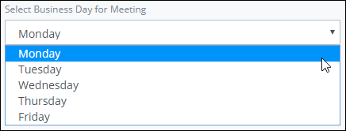

# Select Control Settings

## Control Description

The Select control provides a drop-down menu from which the form user selects a single option.


This control is not available for [Display](../types-for-screens.md#display)-type ProcessMaker Screens. See [Screen Types](../types-for-screens.md).


## Add the Control to a ProcessMaker Screen

Follow these steps to add this control to the ProcessMaker Screen:

1. View the ProcessMaker Screen page to which to add the control.
2. Go to the **Controls** panel on the left side of the ProcessMaker Screen.
3. Drag the **Select** icon  from the **Controls** panel anywhere within the ProcessMaker Screen canvas represented by the dotted-lined box. Existing controls on the ProcessMaker Screen canvas adjust positioning based on where you drag the control.
4. Drop into the ProcessMaker Screen where you want the control to display on the page.  

   

Below is a Select control in Preview mode.

## Inspector Settings 


See [View the Inspector Panel](../view-the-inspector-pane.md) for information how to view the **Inspector** panel.


Below are Inspector settings for the Line Input control:

* **Field Name:** Specify the internal data name of the control that only the Process Owner views at design time. This is a required setting.
* **Field Label:** Specify the field label text that displays. **New Select** is the default value.
* **Validation:** Specify the validation rules the form user must comply with to properly enter a valid value into this field. This setting has no default value.
* **Help Text:** Specify text that provides additional guidance on the field's use. This setting has no default value.
* **Options List:** Specify the list of options available in the select box. Add options in the order they are to display from top to bottom in the drop-down. The default option is called **new** with the content **New Option**.  

  

  Each option has the following settings:

  * **Value:** **Value** is the internal data name for the option that only the Process Owner views at design time.
  * **Content:** **Content** is the option label displayed to the form user. 
  * **Actions:** Click the Removeicon to remove the option.

  Follow these steps to add an option: 

  1. Click **Add Option** from below the **Options List** setting. The **Add New Option** screen displays.  

     

  2. In the **Option Value** field, enter the **Value** option value \(as described above\).
  3. In the **Option Label** field, enter the **Content** option value \(as described above\).
  4. Click **OK**. The option displays below the existing options in **Options List**.

​

## Related Topics







