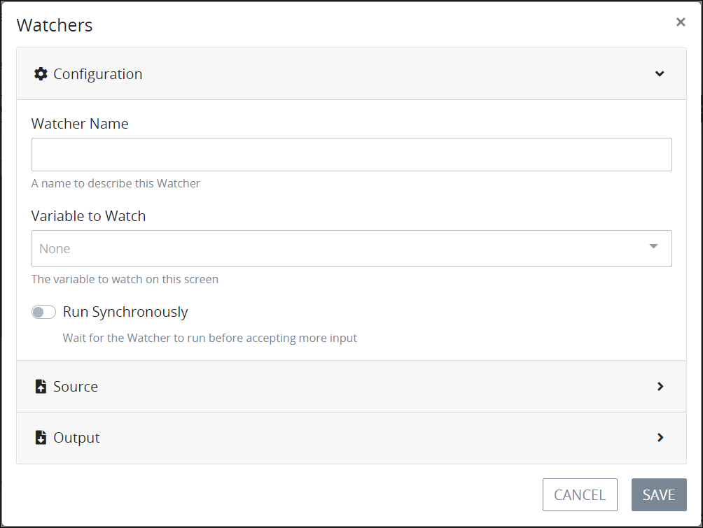
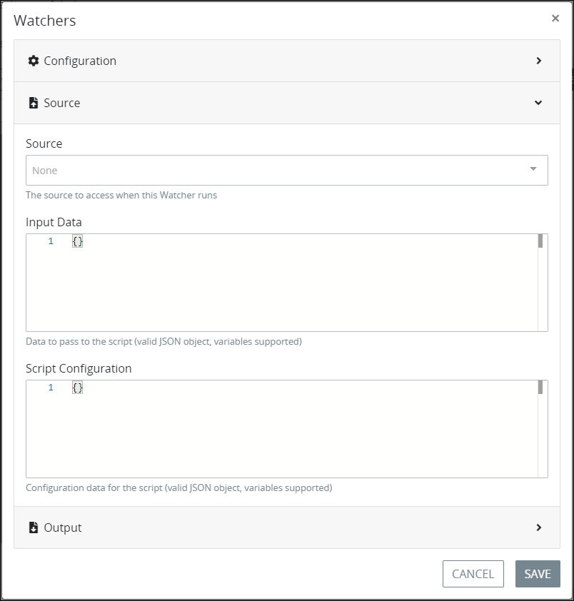
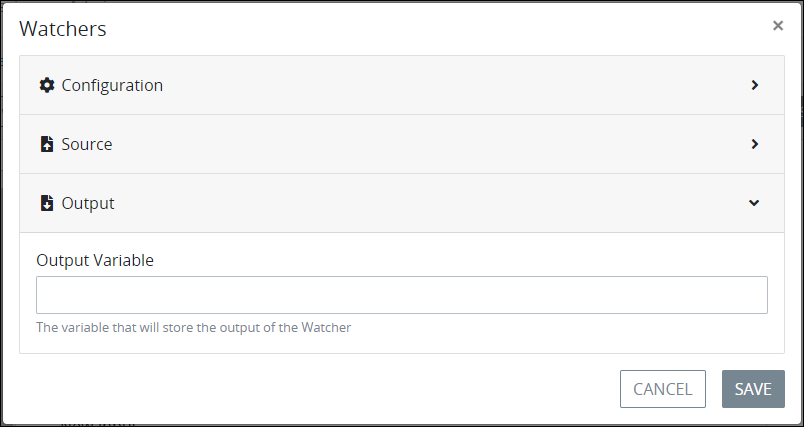

# Add a Watcher to a Screen

## Add a Watcher to a ProcessMaker Screen


### Permissions Required

Your ProcessMaker user account or group membership must have the following permissions to add a Watcher to a ProcessMaker Screen unless your user account has the **Make this user a Super Admin** setting selected:

* Screens: View Screens
* Screens: Edit Screens

See the ProcessMaker [Screens](../../../../processmaker-administration/permission-descriptions-for-users-and-groups.md#screens) permissions or ask your ProcessMaker Administrator for assistance.

### Topic Update

This topic has been updated for the ProcessMaker 4.0.1 release.


Follow these steps to add a Watcher to a ProcessMaker Screen:

1. [Open](../../manage-forms/view-all-forms.md) the ProcessMaker Screen in which to add a Watcher. The ProcessMaker Screen is in [Design mode](../screens-builder-modes.md#editor-mode).
2. Click the **Watchers** button. The **Watchers** screen displays all Watchers configured for this ProcessMaker Screen. 
3. Click the **+Watcher** button. The **Watchers** screen displays with the **Configuration** panel expanded. 
4. From the **Configuration** panel, configure how the Watcher monitors for a control's value to change. Follow these guidelines:
   * In the **Watcher Name** setting, enter the name of the Watcher. This is a required setting.
   * From the **Variable to Watch** drop-down menu, select which ProcessMaker Screen control by its **Variable Name** setting value the Watcher monitors for its value to change. This is a required setting.
   * Select the **Run Synchronously** checkbox to perform the Watcher's action synchronously while the ProcessMaker Screen remains functional to the Screen user. If the **Run Synchronously** checkbox is not selected when the Watcher runs, the ProcessMaker Screen locks until the Watcher's action completes.
5. Select the **Source** panel.  
6. From the **Source** panel, select whether the Watcher acts upon a [ProcessMaker Data Connector](../../../data-connector-management/what-is-a-data-connector.md) or runs a [ProcessMaker Script](../../../scripts/what-is-a-script.md) when the monitored control's value changes. Follow these guidelines:
   * **Use a ProcessMaker Data Connector as the source:**
     1. From the **Source** drop-down menu, select a ProcessMaker Data Connector from the **Data Connector** section upon which to act when the monitored control's value changes. The **Endpoint** setting displays below the **Source** drop-down menu.
     2. From the **Endpoint** drop-down menu, select which endpoint to act upon in the selected ProcessMaker Data Connector. These endpoints are configured from the ProcessMaker Data Connector itself. Depending on the ProcessMaker Data Connector selected from the **Data Connector** section of the **Source** drop-down menu, these endpoints may reference API endpoints or ProcessMaker Collection records.
     3. Optionally, in the **Input Data** setting, enter a valid JSON object the Watcher passes to the ProcessMaker Data Connector prior to acting upon the selected endpoint. The ProcessMaker Data Connector may reference ProcessMaker Screen control values by referencing their **Variable Name** setting values when placed within [mustache syntax](https://mustache.github.io/mustache.5.html). In the example below, `FullName` is the **Variable Name** setting value for a control to store a Request participant's full name:

        `{`

          `"Name": "{{ FullName }}"`

        `}`
   * **Use a ProcessMaker Script as the source:**
     1. From the **Source** drop-down menu, select a ProcessMaker Script from the **Script** section to run when the monitored control's value changes.
     2. Optionally, in the **Input Data** setting, enter a valid JSON object the Watcher passes to the ProcessMaker Script prior to running as input data for the Script. The ProcessMaker Script may reference ProcessMaker Screen control values by referencing their **Variable Name** setting values when placed within [mustache syntax](https://mustache.github.io/mustache.5.html). In the example below, `FullName` is the **Variable Name** setting value for a control to store a Request participant's full name:

        `{`

          `"Name": "{{ FullName }}"`

        `}`

     3. Optionally, in the **Script Configuration** setting, include JSON configuration settings your ProcessMaker Script uses when it runs.
7. Select the **Output** panel.  
8. From the **Output** panel, specify to which control that the Watcher outputs its value by referencing its **Variable Name** setting after the Watcher performs the action configured from the **Source** panel. The control that the Watcher outputs its value does not need to be in this ProcessMaker Screen. The output control may be in a different ProcessMaker Screen referenced elsewhere in this Request. Follow these guidelines:
   * **A ProcessMaker Data Connector is the source:**
     1. In the **Output Variable** setting, enter the control by its **Variable Name** setting that the Watcher outputs the value of its result.
     2. From the **Output Variable Property Mapping** section, specify how the Watcher maps values from the Data Connector to the output control specified in the **Output Variable** setting. In doing so, the Watcher maps the Data Connector output as a set of properties in JSON format to the output control. Follow these guidelines to map each property:
        1. Click the **+Property** button. The **Key** and **Value** settings display to specify the key name and its value as part of the JSON object for that property.
        2. In the **Key** setting, enter the key name for that property's JSON object.
        3. In the **Value** setting, enter the value for that property's JSON object.
        4. Optionally, click the **Delete** iconto delete an added property.
        5. Repeat steps 1 through 4 for each property to add to the output control.
   * **A ProcessMaker Script is a source:**
     1. In the **Output Variable** setting, enter the control by its **Variable Name** setting that the Watcher outputs the value of its result.
9. Click **Save**. The Watcher displays in the **Watchers** screen. The following message displays: **Watcher saved**.


Ensure to [save your ProcessMaker Screen](../save-a-screen.md#save-a-processmaker-screen). The Watcher is not added to your ProcessMaker Screen until you save it. Doing so will save your work if that your [session expires](../../../../using-processmaker/session-timeout-warning.md#session-timeout-warning).


## Related Topics



































