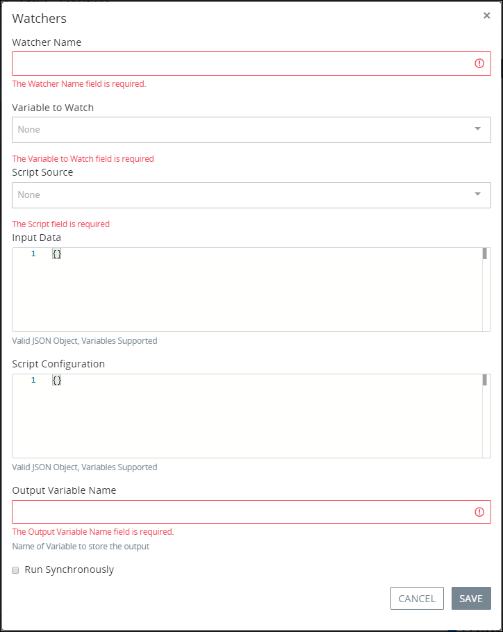

# Edit a Watcher for a Screen

## Edit a Watcher for a ProcessMaker Screen


Your ProcessMaker user account or group membership must have the following permissions to edit a Watcher in a ProcessMaker Screen unless your user account has the **Make this user a Super Admin** setting selected:

* Screens: View Screens
* Screens: Edit Screens

See the ProcessMaker [Screens](../../../../processmaker-administration/permission-descriptions-for-users-and-groups.md#screens) permissions or ask your ProcessMaker Administrator for assistance.


Follow these steps to edit a Watcher in a ProcessMaker Screen:

1. [Open](../../manage-forms/view-all-forms.md) the ProcessMaker Screen in which to edit a Watcher. The ProcessMaker Screen is in [Design mode](../screens-builder-modes.md#editor-mode).
2. Click the **Watchers** button. The **Watchers** screen displays all Watchers configured for this ProcessMaker Screen.  
    

   The following information displays about each Watcher:

   * **Name:** The **Name** column displays the name of the Watcher.
   * **Watching:** The **Watching** column displays the **Variable Name** setting value for the control that the Watcher monitors for value changes.
   * **Variable:** The **Variable** column displays the **Variable Name** setting for the control that the Watcher posts its output value after that Watcher performs its action.
   * **Script:** The **Script** column displays the name of the Data Source or ProcessMaker Script that the Watcher acts upon to determine its output value.

3. Click the **Edit** iconfor the Watch to edit. The **Watchers** screen displays that Watcher's settings.  
4. Edit the following settings about the Watcher as necessary:
   * In the **Watcher Name** setting, edit the name of the Watcher. This is a required setting.
   * From the **Variable to Watch** drop-down menu, select which ProcessMaker Screen control by its **Variable Name** setting value the Watcher monitors for its value to change.
   * From the **Source** setting, select whether the Watcher acts upon a Data Connector or runs a ProcessMaker Script when the monitored control's value changes. Follow these guidelines:
     * **Data Connector:**
       1. From the **Source** drop-down menu, select a Data Connector from the **Data Connector** section upon which to act when the monitored control's value changes. The **Endpoint** setting displays below the **Source** drop-down menu.
       2. From the **Endpoint** drop-down menu, select which endpoint to act upon in the selected Data Connector. These endpoints are configured from the Data Connector itself. Depending on the Data Connector selected from the **Data Connector** section of the **Source** drop-down menu, these endpoints may reference API endpoints, ProcessMaker Collection records, or other data source endpoints.
       3. Optionally, in the **Input Data** setting, enter a valid JSON object the Watcher passes to the Data Connector prior to acting upon the selected endpoint. The Data Connector may reference ProcessMaker Screen control values by referencing their **Variable Name** setting values when placed within [mustache syntax](https://mustache.github.io/mustache.5.html). In the example below, `FullName` is the **Variable Name** setting value for a control to store a Request participant's full name:

          `{`

            `"Name": "{{ FullName }}"`

          `}`

       4. In the **Form Data** section, specify JSON object key-value pairs that map data from the Data Connector to the JSON data array you will specify in the **Output Variable Name** setting below.

          Follow these guidelines to add a JSON data object to map data from the Data Connector:

          1. From the **Form Data** section, click the **+Data** button. A new row displays settings to add a new JSON data object's key name and value.  
          2. In the **key** setting, enter the key name for that JSON data object.
          3. In the **value** setting, enter the value for that JSON data object.
          4. Optionally, to delete the JSON data object, click its **Delete** icon.
          5. Repeat these guidelines as necessary for each JSON data object necessary to map to data from the Data Connector.

       5. In the **Output Variable Name** setting, enter the control by its **Variable Name** setting that the Watcher outputs the value of its result. When this Watcher triggers during a Request, the **Output Variable Name** setting value becomes a JSON data array in the Request data that contains the mapped JSON data objects specified in the **Form Data** section.
     * **ProcessMaker Script:**
       1. From the **Source** drop-down menu, select a ProcessMaker Script from the **Script** section to run when the monitored control's value changes.
       2. Optionally, in the **Input Data** setting, enter a valid JSON object the Watcher passes to the ProcessMaker Script prior to running as input data for the Script. The ProcessMaker Script may reference ProcessMaker Screen control values by referencing their **Variable Name** setting values when placed within [mustache syntax](https://mustache.github.io/mustache.5.html). In the example below, `FullName` is the **Variable Name** setting value for a control to store a Request participant's full name:

          `{`

            `"Name": "{{ FullName }}"`

          `}`

       3. Optionally, in the **Script Configuration** setting, include JSON configuration settings your ProcessMaker Script uses when it runs.
       4. In the **Output Variable** name setting, enter the control by its **Variable Name** setting value that the Watcher outputs the value of its result.
5. Select the **Run Synchronously** checkbox to perform the Watcher's action synchronously while the ProcessMaker Screen remains functional to the Screen user. If the **Run Synchronously** checkbox is not selected when the Watcher runs, the ProcessMaker Screen locks until the Watcher's action completes.
6. Click **Save**. The following message displays: **Watcher updated**.


Ensure to [save your ProcessMaker Screen](../save-a-screen.md#save-a-processmaker-screen). The Watcher is note edited until you save it. Doing so will save your work if that your [session expires](../../../../using-processmaker/session-timeout-warning.md#session-timeout-warning).


## Related Topics

































