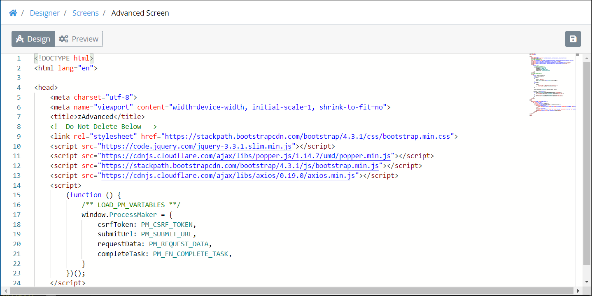
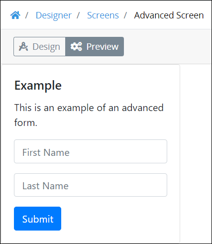

# Screen Types

## Overview

ProcessMaker provides the following ProcessMaker Screen types. Note that not all of these ProcessMaker Screen types are available in the ProcessMaker open-source edition.

### Form

Use the Form type to design interactive and complex forms. Below are a few ways that Request participants might interact with a digital form:

* Enter information, such as name and email address, to apply for a loan.
* Approve the department budget.
* Upload or download documents.

All ProcessMaker Screen [controls](control-descriptions/) in Screen Builder are available for the Form type.

### Display

Use the Display type to display information or allow [Request](../../../using-processmaker/requests/what-is-a-request.md) participants to download files. The Display type has limited functionality compared the Form type. The Display type provides the following controls in Screen Builder:

* [Rich Text](control-descriptions/rich-text-control-settings.md)
* [Multicolumn / Table](control-descriptions/multi-column-button-control-settings.md)
* [Record List](control-descriptions/record-list-control-settings.md)
* [Image](control-descriptions/image-control-settings.md)
* [File Download](control-descriptions/file-download-control-settings.md)

### Email


The Email package must be installed in your ProcessMaker instance to use the Email type of ProcessMaker Screen. The Email package is not available in the ProcessMaker open-source edition. See [Email Package](../../../package-development-distribution/package-a-connector/email.md).


Use the Email type to compose the email body for email messages to be used with the Email connector. The Email type provides the following controls in Screen Builder:

* [Rich Text](control-descriptions/rich-text-control-settings.md)
* [Multicolumn / Table](control-descriptions/multi-column-button-control-settings.md)
* [Image](control-descriptions/image-control-settings.md)
* [Record List](control-descriptions/record-list-control-settings.md)


Do not use a ProcessMaker Screen type other than the Email type when using the [Send Email](../../process-design/model-processes-using-connectors/available-connectors-from-processmaker/email-connector.md) connector. Otherwise, you will not be able to reference any ProcessMaker Screens from the Email control in Process Modeler to specify which Screen to use for the email body content.


### Advanced


The Advanced Screen [package](../../../package-development-distribution/first-topic.md) is not available in the ProcessMaker open-source edition. Contact [ProcessMaker Sales](mailto:sales@processmaker.com) or ask your ProcessMaker sales representative how the Advanced Screen package can be installed in your ProcessMaker instance.


Use the Advanced Screen package to design your own advanced forms using HTML syntax and JavaScript. This is an ideal solution for highly technical designers to create their own form designs and functionality.

When the Advanced Screen package is installed in your ProcessMaker instance, create a new ProcessMaker Screen using the [Advanced](types-for-screens.md#advanced) Screen type. Screen Builder displays a template that contains a sample Advanced-type ProcessMaker Screen.

Use this template to study how to design your custom form. Click the **Preview** button to view your custom form in [Preview](screens-builder-modes.md#preview-mode) mode.

## Related Topics













