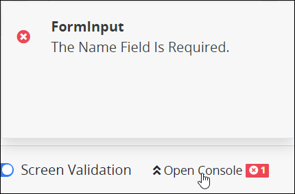

# Validate Your Screen

## Overview

Before you deploy your ProcessMaker Screen to production, validate that it is ready for use in Processes for the following reasons:

* Minimize problems when [previewing](preview-a-screen.md) your ProcessMaker Screen.
* ProcessMaker represents ProcessMaker Screens as JSON data models. You can view any JSON data model in Preview mode to test how a [Process's](../../viewing-processes/what-is-a-process.md) JSON data model or another ProcessMaker Screen's data model interacts with your Screen. When testing a JSON data model, the Screen Validation feature indicates when that data model is not valid.
* Minimize problems when Process Owners test your ProcessMaker Screen in their Processes. Since your ProcessMaker Screen may be used in multiple Processes in your organization, ensure that your Screen won't cause production problems later.
* If a Process Owner [exports](../../viewing-processes/view-the-list-of-processes/export-a-bpmn-compliant-process.md) a Process that references your ProcessMaker Screen, your Screen is also exported and referenced in all [Task](../../process-design/model-your-process/process-modeling-element-descriptions.md#task) elements that use it. Therefore, by validating your ProcessMaker Screen, those Processes that reference your Screen can successfully be [imported](../../viewing-processes/view-the-list-of-processes/import-a-bpmn-compliant-process.md) later.

## Validate a ProcessMaker Screen


Your ProcessMaker user account or group membership must have the following permissions to validate a ProcessMaker Screen unless your user account has the **Make this user a Super Admin** setting selected:

* Screens: View Screens
* Screens: Edit Screens

See the ProcessMaker [Screens](../../../processmaker-administration/permission-descriptions-for-users-and-groups.md#screens) permissions or ask your ProcessMaker Administrator for assistance.


Follow these steps to validate a ProcessMaker Screen:

1. [Create a new ProcessMaker Screen](../manage-forms/create-a-new-form.md) or click the **Edit** iconto edit the selected Screen. The ProcessMaker Screen is in [Design mode](screens-builder-modes.md#editor-mode). Though you can enable Screen Validation in [Preview mode](screens-builder-modes.md#preview-mode), you may only fix validation errors in Design mode.
2. Screen Validation is enabled by default. If the **Screen Validation** toggle key is disabled, enable the **Screen Validation** toggle key so that Screens Builder automatically validates your ProcessMaker Screen as you work.  

   

3. Work on your ProcessMaker Screen. Screens Builder indicates any validation issues as you work. The following indicators may occur:
   * **No errors found:** If no errors are found, the following text displays to the right of the **Open Console** button: **0**. The green check mark displays. Your ProcessMaker Screen is valid.
   * **Errors are found:** If errors are found, Screens Builder displays how any errors are found to the right of the **Open Console** button. The error icon displays with the number of current errors. Click the **Open Console** button to display a summary of the errors. Below is an example.  

     

     Furthermore, controls that are associated with errors display a red-colored highlight.  

     
4. If errors are found, click the **Open Console** button again to hide the error summary. Make changes to your ProcessMaker Screen or JSON data model and then repeat steps 3 and 4 again until Screens Builder finds no validation errors.

## Related Topics























