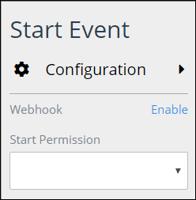
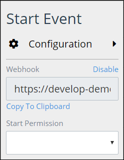
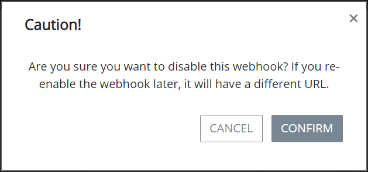
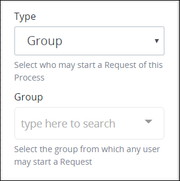

# Add and Configure Start Event Elements

## Add a Start Event Element


### Don't Know What a Start Event Element Is?

See [Process Modeling Element Descriptions](process-modeling-element-descriptions.md) for a description of the [Start Event](process-modeling-element-descriptions.md#start-event) element.

### Permissions Required to Do This Task

Your user account or group membership must have the following permissions to add a Start Event element to the Process model:

* Processes: View Processes
* Processes: Edit Processes

See the [Process](../../../processmaker-administration/permission-descriptions-for-users-and-groups.md#processes) permissions or ask your ProcessMaker Administrator for assistance.


Follow these steps to add a Start Event element to the Process model:

1. [View your Processes](https://processmaker.gitbook.io/processmaker-4-community/-LPblkrcFWowWJ6HZdhC/~/drafts/-LRhVZm0ddxDcGGdN5ZN/primary/designing-processes/viewing-processes/view-the-list-of-processes/view-your-processes#view-all-processes). The **Processes** page displays.
2. [Create a new Process](../../viewing-processes/view-the-list-of-processes/create-a-process.md) or click the **Open Modeler** iconto edit the selected Process model. Process Modeler displays.
3. Locate the **Start Event** element in the **BPMN** panel.  

   

4. Drag the element to where in the Process model you want to place it. If a Pool element is in your Process model, the Start Event element cannot be placed outside of the Pool element.

After the element is placed into the Process model, you may move it by dragging it to the new location.


Moving a Start Event element has the following limitations in regards to the following Process model elements:

* **Pool element:** If the Start Event element is inside of a [Pool](process-modeling-element-descriptions.md#pool) element, it cannot be moved outside of the Pool element. If you attempt to do so, Process Modeler places the Start Event element inside the Pool element closest to where you attempted to move it.
* **Lane element:** If the Start Event element is inside of a Lane element, it can be moved to another Lane element in the same Pool element. However, the Start Event element cannot be move outside of the Pool element.


## Configure a Start Event Element


Your user account or group membership must have the following permissions to configure a Start Event element:

* Processes: View Processes
* Processes: Edit Processes

See the [Process](../../../processmaker-administration/permission-descriptions-for-users-and-groups.md#processes) permissions or ask your ProcessMaker Administrator for assistance.


### Edit the Identifier Value

Process Modeler automatically assigns a unique value to each Process element added to a Process model. However, an element's identifier value can be changed if it is unique.


All identifier values for all elements in the Process model must be unique.


Follow these steps to edit the identifier value for a Start Event element:

1. Select the Start Event element from the Process model in which to edit its identifier value.
2. Expand the **Configuration** setting section if it is not presently expanded. The **Identifier** field displays. This is a required field.  

   

3. In the **Identifier** field, edit the Start Event element's identifier to a unique value from all elements in the Process model and then press **Enter**. The element's identifier value is changed.

### Edit the Element Name

An element name is a human-readable reference for a Process element. Process Modeler automatically assigns the name of a Process element with its element type. However, an element's name can be changed.

Follow these steps to edit the name for a Start Event element:

1. Select the Start Event element from the Process model in which to edit its name.
2. Expand the **Configuration** setting section if it is not presently expanded. The **Name** field displays.  

   

3. In the **Name** field, edit the selected element's name and then press **Enter**. The element's name is changed.

## Set How a Request Starts Via a Start Event Element


Your user account or group membership must have the following permissions to set how a Request can start fpr that Process via a Start Event element:

* Processes: View Processes
* Processes: Edit Processes

See the [Process](../../../processmaker-administration/permission-descriptions-for-users-and-groups.md#processes) permissions or ask your ProcessMaker Administrator for assistance.


### Allow a Secure Webhook to Start Requests

#### Enable a Secure Webhook

Enable a Webhook in a Start Event element to allow anyone to start a ProcessMaker Request for that Process by using a unique URL. When a Start Event element receives a programmatic call via its unique URL, it starts a [Request](../../../using-processmaker/requests/what-is-a-request.md) for that Process.

Each time a Webhook is enabled for a Start Event element, it generates a unique URL. Therefore, do not disable a Webhook if you do want to use the same URL to receive calls to start a Request. If you enable a Webhook again for the same Start Event element, it generates a new unique URL.

After the Webhook is enabled, copy the generated URL from the Start Event element to use in a script, REST API call, or application that will call the Webhook to start a new Request for that Process. Share the Webhook's unique URL only with those allowed to start a new Request.

Follow these steps to enable a Webhook in a Start Event element:

1. Select the Start Event element from the Process model in which to enable a Webhook.
2. The **Webhook** setting displays below the **Configuration** setting section.  

   

3. Click **Enable** beside the **Webhook** setting. The Start Event element generates the unique URL to access the Webhook.  

   

4. Click **Copy To Clipboard** below the unique Webhook URL and then use or share the URL to make calls that start a Request for that Process via the Start Event element.

#### Disable an Enabled Webhook

Disable an enabled Webhook in a Start Event element so that Start Event element can no longer receive programmatic calls via its unique URL to start [Requests](../../../using-processmaker/requests/what-is-a-request.md) for that Process.


Each time a Webhook is enabled for a Start Event element, it generates a unique URL. Therefore, do not disable a Webhook if you do want to use the same URL to receive calls to start a Request. If you enable a Webhook again for the same Start Event element, it generates a new unique URL.


Follow these steps to disable an enabled Webhook in a Start Event element:

1. Select the Start Event element from the Process model in which to disable its Webhook.
2. The **Webhook** setting displays below the **Configuration** setting section.  

   

3. Click **Disable** beside the **Webhook** setting. The **Caution** screen displays to confirm disabling the Start Event element's Webhook.  

   

4. Click **Confirm**.

### Select the ProcessMaker User or Group That Can Start Requests

#### Select the ProcessMaker User That Can Start a Request

Follow these steps to select which ProcessMaker [user](../../../processmaker-administration/add-users/what-is-a-user.md) can start a Request for this Process:

1. Select the Start Event element from the Process model in which to select the user may start a Request.
2. The **Start Permission** drop-down displays below the **Configuration** setting section.  

   

3. From the **Start Permission** drop-down, select the **User** option. The **User** drop-down displays below the **Start Permission** drop-down.  

   

4. From the **User** drop-down, select which ProcessMaker user can start a Request via the Start Event element. That ProcessMaker user may start a Request.

#### Select the ProcessMaker Group That Can Start a Request

Follow these steps to select which ProcessMaker [group](../../../processmaker-administration/assign-groups-to-users/what-is-a-group.md) members can start a Request for this Process:

1. Select the Start Event element from the Process model in which to select the user may start a Request.
2. The **Start Permission** drop-down displays below the **Configuration** setting section.  

   

3. From the **Start Permission** drop-down, select the **Group** option. The **Group** drop-down displays below the **Start Permission** drop-down.  

   

4. From the **Group** drop-down, select which ProcessMaker group can start a Request via the Start Event element. All members of that ProcessMaker group may start a Request.

## Related Topics















