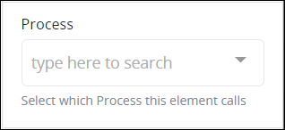
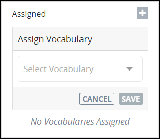
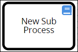

# Add and Configure Call Activity Elements

## Add a Call Activity Element


### Don't Know What a Call Activity Element Is?

See [Process Modeling Element Descriptions](process-modeling-element-descriptions.md) for a description of the [Call Activity](process-modeling-element-descriptions.md#call-activity) element.

### Permissions Required

Your ProcessMaker user account or group membership must have the following permissions to add a Call Activity element to the Process model unless your user account has the **Make this user a Super Admin** setting selected:

* Processes: View Processes
* Processes: Edit Processes

See the [Process](../../../processmaker-administration/permission-descriptions-for-users-and-groups.md#processes) permissions or ask your ProcessMaker Administrator for assistance.


Follow these steps to add a Call Activity element to the Process model:

1. [View your Processes](https://processmaker.gitbook.io/processmaker-4-community/-LPblkrcFWowWJ6HZdhC/~/drafts/-LRhVZm0ddxDcGGdN5ZN/primary/designing-processes/viewing-processes/view-the-list-of-processes/view-your-processes#view-all-processes). The **Processes** page displays.
2. [Create a new Process](../../viewing-processes/view-the-list-of-processes/create-a-process.md) or click the **Open Modeler** iconto edit the selected Process model. Process Modeler displays.
3. Locate the **Call Activity** element in the panel to the left of the Process Modeler canvas.  

   

4. Drag the element into the Process model canvas where you want to place it. If a Pool element is in your Process model, the Call Activity element cannot be placed outside of the Pool element.

After the element is placed into the Process model, you may move it by dragging it to the new location.


Moving a Call Activity element has the following limitations in regards to the following Process model elements:

* **Pool element:** If the Call Activity element is inside of a [Pool](process-modeling-element-descriptions.md#pool) element, it cannot be moved outside of the Pool element. If you attempt to do so, Process Modeler places the Call Activity element inside the Pool element closest to where you attempted to move it.
* **Lane element:** If the Call Activity element is inside of a Lane element, it can be moved to another Lane element in the same Pool element. However, the Call Activity element cannot be moved outside of the Pool element.


## Settings


Your ProcessMaker user account or group membership must have the following permissions to configure a Call Activity element unless your user account has the **Make this user a Super Admin** setting selected:

* Processes: View Processes
* Processes: Edit Processes

See the [Process](../../../processmaker-administration/permission-descriptions-for-users-and-groups.md#processes) permissions or ask your ProcessMaker Administrator for assistance.


The Call Activity element has the following panels that contain settings:

* **Configuration** panel
  * Edit the element name
* **Advanced** panel
  * Edit the element's identifier value

### Edit the Element's Identifier Value

Process Modeler automatically assigns a unique value to each Process element added to a Process model. However, an element's identifier value can be changed if it is unique to all other elements in the Process model, including the Process model's identifier value.


All identifier values for all elements in the Process model must be unique.


Follow these steps to edit the identifier value for a Call Activity element:

1. Select the Call Activity element from the Process model in which to edit its identifier value. The **Configuration** setting section displays.
2. Expand the **Configuration** setting section if it is not presently expanded. The **Identifier** field displays. This is a required field.  

   

3. In the **Identifier** field, edit the Call Activity element's identifier to a unique value from all elements in the Process model and then press **Enter**. The element's identifier value is changed.

### Edit the Element Name

An element name is a human-readable reference for a Process element. Process Modeler automatically assigns the name of a Process element with its element type. However, an element's name can be changed.

Follow these steps to edit the name for a Call Activity element:

1. Select the Call Activity element from the Process model in which to edit its name. The **Configuration** setting section displays.
2. Expand the **Configuration** setting section if it is not presently expanded. The **Name** field displays.  

   

3. In the **Name** field, edit the selected element's name and then press **Enter**. The element's name is changed.

### Select the Called Process

The Call Activity element calls an external Process when it triggers. The external Process is referred to as a "child" Process, while the calling Process is referred to as the "parent" Process. The child Process must in the same ProcessMaker instance as the parent Process and not [archived](../../viewing-processes/view-the-list-of-processes/remove-a-process.md).

The child Process has its own [Request](../../../using-processmaker/requests/what-is-a-request.md). The Request for the parent Process waits until the child Process's Request completes before its workflow continues. When the child Process's Request completes, the parent Process's Request continues from the Call Activity element.

Follow these steps to select the child Process the Call Activity element calls when it triggers:

1. Select the Call Activity element from the Process model in which to select the called child Process. The **Configuration** setting section displays.
2. Expand the **Configuration** setting section if it is not presently expanded. The **Process** drop-down menu displays.  

   

3. From the **Process** drop-down menu, select which Process the Call Activity element calls when it triggers.

## Assign ProcessMaker Vocabularies That Validate Request Data from This Element


### ProcessMaker Package Required

Your ProcessMaker instance must have the [Vocabularies package](../../../package-development-distribution/package-a-connector/vocabularies.md) installed to assign which ProcessMaker Vocabularies validate Request data at a Call Activity element. Use the Vocabularies package to maintain uniform JSON schemas across all assets in your organization. These assets include [Processes](../../viewing-processes/what-is-a-process.md), [ProcessMaker Screens](../../design-forms/what-is-a-form.md), and [ProcessMaker Scripts](../../scripts/what-is-a-script.md).

A ProcessMaker Vocabulary is a JSON schema. The JSON schema describes the data objects, types, and structure that you want in both a machine and human readable format. Apply one or more ProcessMaker Vocabularies to your Processes and/or specific BPMN 2.0 elements in your Process models to ensure the JSON data model in Request data complies with the data structure outlined in the JSON schema that you need to meet regulatory specifications or ensure Request data contains required information.

The Vocabularies package is not available in the ProcessMaker open-source edition. Contact [ProcessMaker Sales](mailto:sales@processmaker.com) or ask your ProcessMaker sales representative how the Vocabularies package can be installed in your ProcessMaker instance.

### Permissions Required

Your ProcessMaker user account or group membership must have the following permissions to set which ProcessMaker user or group can start a Request for a Process unless your user account has the **Make this user a Super Admin** setting selected:

* Processes: View Processes
* Processes: Edit Processes

See the [Process](../../../processmaker-administration/permission-descriptions-for-users-and-groups.md#processes) permissions or ask your ProcessMaker Administrator for assistance.


Assign [ProcessMaker Vocabularies](../../vocabularies-management/what-is-a-vocabulary.md) that validate Request data complies with a specific JSON schema. This is often mandatory for many types of business sectors including banking and healthcare. Ensure the quality and compliance of Request data. For example, during a Loan Application process, ensure that personal information has been included in the Request to that moment in that in-progress Request. The Vocabularies package must be installed in your ProcessMaker instance to make this configuration.

Use a ProcessMaker Vocabulary on a Call Activity element to validate Request data complies with the Vocabulary's JSON schema after the workflow returns from the child Request to the parent Request, but prior to when the Request continues workflow for the parent Request. See [What is a Vocabulary?](../../vocabularies-management/what-is-a-vocabulary.md) for more information.

Each moment ProcessMaker evaluates workflow routing for an in-progress Request, ProcessMaker also evaluates the Request data's conformity to the ProcessMaker Vocabularies applied to the Process and/or a specific BPMN 2.0 element in the Process model. The Request's JSON data model must conform to the ProcessMaker Vocabulary's JSON schema.

During an in-progress Request, if ProcessMaker evaluates that the Request data no longer complies with all ProcessMaker Vocabularies to that moment, the Request status changes from In Progress to Error. The error displays in the [Request summary](../../../using-processmaker/requests/request-details/summary-for-requests-with-errors.md). ProcessMaker Vocabularies are cumulative in an in-progress Request: as the Request progresses, if Request data does not conform with any Vocabulary's JSON schema to that moment in the Request, the Request errors.

If no ProcessMaker Vocabularies are assigned, ProcessMaker does not validate Request data complies with a specific JSON schema prior to continuing workflow for that Request.

One or more ProcessMaker Vocabularies must be created to your ProcessMaker instance before assigning a Vocabulary. See [Create a New Vocabulary](../../vocabularies-management/manage-your-vocabularies/create-a-new-vocabulary.md#create-a-new-processmaker-vocabulary). Multiple ProcessMaker Vocabularies can be assigned to a Start Event element.

Follow these steps to assign ProcessMaker Vocabularies that validate Request data from a Call Activity element:

1. Select the Call Activity element from the Process model in which to assign ProcessMaker Vocabularies that validate Request data prior to when this element completes. The **Configuration** setting section displays.
2. Expand the **Vocabularies** setting section. The **Assigned** setting displays.
3. Click theicon to add a ProcessMaker Vocabulary. The **Assign Vocabulary** option displays.  
4. From the **Select Vocabulary** drop-down menu, select a ProcessMaker Vocabulary from which to validate Request data complies with its JSON schema.

   To remove a ProcessMaker Vocabulary that is currently selected, select the Vocabulary again or press `Enter` when the drop-down is visible.

   If no ProcessMaker Vocabularies are configured in your ProcessMaker instance, then the following message displays: **List is empty.** Create at least one ProcessMaker Vocabulary. See [Create a New Vocabulary](../../vocabularies-management/manage-your-vocabularies/create-a-new-vocabulary.md#create-a-new-processmaker-vocabulary).

5. Click **Save**.
6. Repeat Steps 3 through 5 as necessary for each ProcessMaker Vocabulary required to validate Request data complies with its JSON schema.


Click the **Remove** iconfrom the **Vocabularies** setting to remove a ProcessMaker Vocabulary from assignment to this element.


After one or more ProcessMaker Vocabularies are assigned to a Call Activity element, the Vocabulary icon displays above that element.

## Related Topics

















