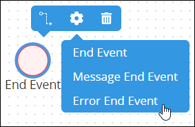
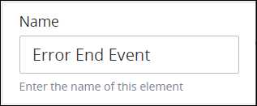
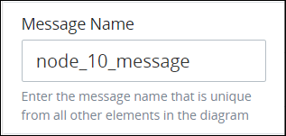
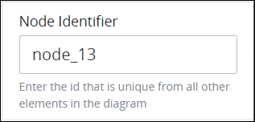

# Add and Configure Error End Event Elements

## Add an Error End Event Element


### Don't Know What an Error End Event Is?

See [Process Modeling Element Descriptions](process-modeling-element-descriptions.md) for a description of the [Error End Event](process-modeling-element-descriptions.md#error-end-event) element.

### Permissions Required

Your ProcessMaker user account or group membership must have the following permissions to add an End Event element to the Process model unless your user account has the **Make this user a Super Admin** setting selected:

* Processes: View Processes
* Processes: Edit Processes

See the [Process](../../../processmaker-administration/permission-descriptions-for-users-and-groups.md#processes) permissions or ask your ProcessMaker Administrator for assistance.


Follow these steps to add an Error End Event element to the Process model:

1. [View your Processes](../../viewing-processes/view-the-list-of-processes/view-your-processes.md#view-all-active-processes). The **Processes** page displays.
2. [Create a new Process](../../viewing-processes/view-the-list-of-processes/create-a-process.md) or click the **Open Modeler** iconto edit the selected Process model. Process Modeler displays.
3. Locate the **End Event** control in the **Controls** palette that is to the left of the Process Modeler canvas. If the **Hide Menus** buttonis enabled, the **Controls** palette displays the **End Event** control's icon.

   

4. Drag the control into the Process model canvas where you want to place it. If a Pool element is in your Process model, the Error End Event element cannot be placed outside of the Pool element.
5. Select the **Error End Event** option from the **Elements** drop-down menu. The Error End Event element displays.  

After the element is placed into the Process model, you may move it by dragging it to the new location.


Moving an Error End Event element has the following limitations in regards to the following Process model elements:

* **Pool element:** If the Error End Event element is inside of a [Pool](process-modeling-element-descriptions.md#pool) element, it cannot be moved outside of the Pool element. If you attempt to do so, Process Modeler places the Error End Event element inside the Pool element closest to where you attempted to move it.
* **Lane element:** If the Error End Event element is inside of a Lane element, it can be moved to another Lane element in the same Pool element. However, the Error End Event element cannot be moved outside of the Pool element.


## Settings


Your ProcessMaker user account or group membership must have the following permissions to configure a Message End Event element unless your user account has the **Make this user a Super Admin** setting selected:

* Processes: View Processes
* Processes: Edit Processes

See the [Process](../../../processmaker-administration/permission-descriptions-for-users-and-groups.md#processes) permissions or ask your ProcessMaker Administrator for assistance.


The Error End Event element has the following panels that contain settings:

* **Configuration** panel
  * [Edit the element name](add-and-configure-error-end-event-elements.md#edit-the-element-name)
  * [Edit the error name](add-and-configure-error-end-event-elements.md#edit-the-error-name)
* **Advanced** panel
  * [Edit the element's identifier value](add-and-configure-error-end-event-elements.md#edit-the-elements-identifier-value)

### Configuration Panel Settings

#### Edit the Element Name

An element name is a human-readable reference for a Process element. Process Modeler automatically assigns the name of a Process element with its element type. However, an element's name can be changed.

Follow these steps to edit the name for an Error End Event element:

1. Ensure that the **Hide Menus** buttonis not enabled. See [Maximize the Process Modeler Canvas View](../navigate-around-your-process-model.md#maximize-the-process-modeler-canvas-view).
2. Select the Error End Event element from the Process model in which to edit its name. Panels to configure this element display.
3. Expand the **Configuration** panel if it is not presently expanded. The **Name** setting displays.  
4. In the **Name** setting, edit the selected element's name and then press **Enter**.

#### Edit the Error Name

The Error End Event element uses an error name as a placeholder to record the Request error if an error occurs during the Request.

Follow these steps to edit the error name for an Error End Event element:

1. Ensure that the **Hide Menus** buttonis not enabled. See [Maximize the Process Modeler Canvas View](../navigate-around-your-process-model.md#maximize-the-process-modeler-canvas-view).
2. Select the Error End Event element from the Process model in which to configure its error name. Panels to configure this element display.
3. Expand the **Configuration** panel if it is not presently expanded, and then locate the **Error Name** setting.  
4. In the **Error Name** setting, edit the error name that the Error End Event element uses to record a Request error if one occurs during the Request.

### Advanced Panel Settings

#### Edit the Element's Identifier Value

Process Modeler automatically assigns a unique value to each Process element added to a Process model. However, an element's identifier value can be changed if it is unique to all other elements in the Process model, including the Process model's identifier value.


All identifier values for all elements in the Process model must be unique.


Follow these steps to edit the identifier value for an Error End Event element:

1. Ensure that the **Hide Menus** buttonis not enabled. See [Maximize the Process Modeler Canvas View](../navigate-around-your-process-model.md#maximize-the-process-modeler-canvas-view).
2. Select the Error End Event element from the Process model in which to edit its identifier value. Panels to configure this element display.
3. Expand the **Advanced** panel if it is not presently expanded. The **Node Identifier** setting displays. This is a required setting.  
4. In the **Node Identifier** setting, edit the Error End Event element's identifier to a unique value from all elements in the Process model and then press **Enter**.

## Related Topics

