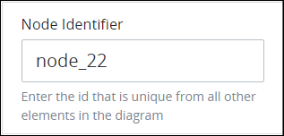

# Add and Configure Event-Based Gateway Elements

## Add an Event-Based Gateway Element


### Don't Know What an Event-Based Gateway Element Is?

See [Process Modeling Element Descriptions](process-modeling-element-descriptions.md) for a description of the [Event-Based Gateway](process-modeling-element-descriptions.md#event-based-gateway) element.

### Permissions Required

Your ProcessMaker user account or group membership must have the following permissions to add an Event-Based Gateway element to the Process model unless your user account has the **Make this user a Super Admin** setting selected:

* Processes: View Processes
* Processes: Edit Processes

See the [Process](../../../processmaker-administration/permission-descriptions-for-users-and-groups.md#processes) permissions or ask your ProcessMaker Administrator for assistance.


Follow these steps to add an Event-Based Gateway element to the Process model:

1. [View your Processes](https://processmaker.gitbook.io/processmaker-4-community/-LPblkrcFWowWJ6HZdhC/~/drafts/-LRhVZm0ddxDcGGdN5ZN/primary/designing-processes/viewing-processes/view-the-list-of-processes/view-your-processes#view-all-processes). The **Processes** page displays.
2. [Create a new Process](../../viewing-processes/view-the-list-of-processes/create-a-process.md) or click the **Open Modeler** iconto edit the selected Process model. Process Modeler displays.
3. Locate the **Event-Based Gateway** element in the panel to the left of the Process Modeler canvas.  

   

4. Drag the element into the Process model canvas where you want to place it. If a Pool element is in your Process model, the Event-Based Gateway element cannot be placed outside of the Pool element.

After the element is placed into the Process model, you may move it by dragging it to the new location.


Moving an Event-Based Gateway element has the following limitations in regards to the following Process model elements:

* **Pool element:** If the Event-Based Gateway element is inside of a [Pool](process-modeling-element-descriptions.md#pool) element, it cannot be moved outside of the Pool element. If you attempt to do so, Process Modeler places the Event-Based Gateway element inside the Pool element closest to where you attempted to move it.
* **Lane element:** If the Event-Based Gateway element is inside of a Lane element, it can be moved to another Lane element in the same Pool element. However, the Event-Based Gateway element cannot be moved outside of the Pool element.


## Settings


Your ProcessMaker user account or group membership must have the following permissions to configure an Event-Based Gateway element unless your user account has the **Make this user a Super Admin** setting selected:

* Processes: View Processes
* Processes: Edit Processes

See the [Process](../../../processmaker-administration/permission-descriptions-for-users-and-groups.md#processes) permissions or ask your ProcessMaker Administrator for assistance.


The Event-Based Gateway element has the following panels that contain settings:

* **Configuration** panel
  * Edit the element name
* **Advanced** panel
  * Edit the element's identifier value

### Edit the Element's Identifier Value

Process Modeler automatically assigns a unique value to each Process element added to a Process model. However, an element's identifier value can be changed if it is unique to all other elements in the Process model, including the Process model's identifier value.


All identifier values for all elements in the Process model must be unique.


Follow these steps to edit the identifier value for an Event-Based Gateway element:

1. Select the Event-Based Gateway element from the Process model in which to edit its identifier value. The **Configuration** setting section.
2. Expand the **Configuration** setting section if it is not presently expanded. The **Identifier** field displays. This is a required field.  

   

3. In the **Identifier** field, edit the Event-Based Gateway element's identifier to a unique value from all elements in the Process model and then press **Enter**. The element's identifier value is changed.

### Edit the Element Name

An element name is a human-readable reference for a Process element. Process Modeler automatically assigns the name of a Process element with its element type. However, an element's name can be changed.

Follow these steps to edit the name for an Event-Based Gateway element:

1. Select the Event-Based Gateway element from the Process model in which to edit its name. The **Configuration** setting section.
2. Expand the **Configuration** setting section if it is not presently expanded. The **Name** field displays.  

   

3. In the **Name** field, edit the selected element's name and then press **Enter**. The element's name is changed.

## Related Topics









