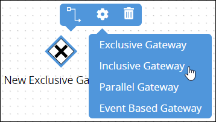
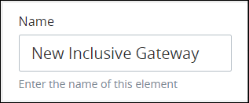
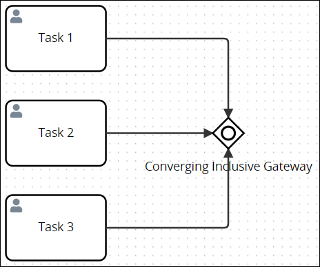
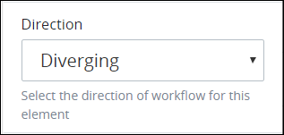
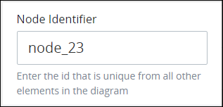

# Add and Configure Inclusive Gateway Elements

## Add an Inclusive Gateway Element


### Don't Know What an Inclusive Gateway Element Is?

See [Process Modeling Element Descriptions](process-modeling-element-descriptions.md) for a description of the [Inclusive Gateway](process-modeling-element-descriptions.md#inclusive-gateway) element.

### Permissions Required

Your ProcessMaker user account or group membership must have the following permissions to add an Inclusive Gateway element to the Process model unless your user account has the **Make this user a Super Admin** setting selected:

* Processes: View Processes
* Processes: Edit Processes

See the [Process](../../../processmaker-administration/permission-descriptions-for-users-and-groups.md#processes) permissions or ask your ProcessMaker Administrator for assistance.


Follow these steps to add an Inclusive Gateway element to the Process model:

1. [View your Processes](../../viewing-processes/view-the-list-of-processes/view-your-processes.md#view-all-active-processes). The **Processes** page displays.
2. [Create a new Process](../../viewing-processes/view-the-list-of-processes/create-a-process.md) or click the **Open Modeler** iconto edit the selected Process model. Process Modeler displays.
3. Locate the **Gateway** control in the **Controls** palette that is to the left of the Process Modeler canvas. If the [**Hide Menus** button](../navigate-around-your-process-model.md#maximize-the-process-modeler-canvas-view)is enabled, the **Controls** palette displays the **Gateway** control's icon.  
4. Drag the control into the Process model canvas where you want to place it. If a Pool element is in your Process model, the Inclusive Gateway element cannot be placed outside of the Pool element.
5. From the **Elements** drop-down menu, select the **Inclusive Gateway** option. The Inclusive Gateway element displays.  

After the element is placed into the Process model, you may move it by dragging it to the new location.


Moving an Inclusive Gateway element has the following limitations in regards to the following Process model elements:

* **Pool element:** If the Inclusive Gateway element is inside of a [Pool](process-modeling-element-descriptions.md#pool) element, it cannot be moved outside of the Pool element. If you attempt to do so, Process Modeler places the Inclusive Gateway element inside the Pool element closest to where you attempted to move it.
* **Lane element:** If the Inclusive Gateway element is inside of a Lane element, it can be moved to another Lane element in the same Pool element. However, the Inclusive Gateway element cannot be moved outside of the Pool element.


## Settings


### Looking for Information How to Configure Inclusive Gateway Conditions?

See [Configure an Outgoing Sequence Flow Element from an Exclusive Gateway or Inclusive Gateway Element](the-quick-toolbar.md#configure-an-outgoing-sequence-flow-element-from-an-exclusive-gateway-or-inclusive-gateway-element).

### Permissions Required to Do This Task

Your ProcessMaker user account or group membership must have the following permissions to configure an Inclusive Gateway element unless your user account has the **Make this user a Super Admin** setting selected:

* Processes: View Processes
* Processes: Edit Processes

See the [Process](../../../processmaker-administration/permission-descriptions-for-users-and-groups.md#processes) permissions or ask your ProcessMaker Administrator for assistance.


The Inclusive Gateway element has the following panels that contain settings:

* **Configuration** panel
  * [Edit the element name](add-and-configure-inclusive-gateway-elements.md#edit-the-element-name)
  * [Indicate workflow direction](add-and-configure-inclusive-gateway-elements.md#indicate-workflow-direction)
* **Advanced** panel
  * [Edit the element's identifier value](add-and-configure-inclusive-gateway-elements.md#edit-the-elements-identifier-value)

### Configuration Panel Settings

#### Edit the Element Name

An element name is a human-readable reference for a Process element. Process Modeler automatically assigns the name of a Process element with its element type. However, an element's name can be changed.

Follow these steps to edit the name for an Inclusive Gateway element:

1. Ensure that the **Hide Menus** buttonis not enabled. See [Maximize the Process Modeler Canvas View](../navigate-around-your-process-model.md#maximize-the-process-modeler-canvas-view).
2. Select the Inclusive Gateway element from the Process model in which to edit its name. Panels to configure this element display.
3. Expand the **Configuration** panel if it is not presently expanded. The **Name** setting displays. 
4. In the **Name** setting, edit the selected element's name and then press **Enter**.

#### Indicate Workflow Direction

Indicate if the workflow direction for the Inclusive Gateway is converging or diverging:

* **Converging workflow \(synchronize workflow\):** An Inclusive Gateway element may synchronize [Request](../../../using-processmaker/requests/what-is-a-request.md) workflow from two or more incoming [Sequence Flow](process-modeling-element-descriptions.md#sequence-flow) elements to the Inclusive Gateway element. All incoming Sequence Flow elements converging to the Inclusive Gateway element must trigger before the Inclusive Gateway element triggers, thereby synchronizing a Request's workflow. Use this coordinate workflow.  
* **Diverging workflow \(evaluate routing conditions\):** An Inclusive Gateway element may also evaluate a Request's workflow routing conditions for a Process. These routing conditions are configured on each outgoing [Sequence Flow](process-modeling-element-descriptions.md#sequence-flow) element from the Inclusive Gateway element. When a Request is in progress and the Inclusive Gateway element triggers, each of its outgoing Sequence Flow elements' conditions are evaluated to determine which Sequence Flow element\(s\) continue routing for that Request. Unlike the [Exclusive Gateway](process-modeling-element-descriptions.md#exclusive-gateway) element, multiple Sequence Flow elements can trigger from the Inclusive Gateway element, thereby causing multiple workflow routes simultaneously for the same Request that stem from that Inclusive Gateway element. Use an Inclusive Gateway element when you potentially want multiple workflow routes to occur simultaneously in that Request. Otherwise, consider using an Exclusive Gateway element to allow only one Sequence Flow element's condition\(s\) to continue workflow route for that Request.  

One Inclusive Gateway element can only converge or diverge workflow, but not both. Use two Inclusive Gateway elements to both converge and diverge workflow.

Follow these steps to indicate the workflow direction for an Inclusive Gateway element:

1. Ensure that the **Hide Menus** buttonis not enabled. See [Maximize the Process Modeler Canvas View](../navigate-around-your-process-model.md#maximize-the-process-modeler-canvas-view).
2. Select the Inclusive Gateway element from the Process model in which indicate the workflow direction. Panels to configure this element display.
3. Expand the **Configuration** panel if it is not presently expanded, and then locate the **Direction** setting.  
4. From the **Direction** drop-down menu, select from one of the following options:
   * **Diverging:** Select the **Diverging** option to indicate that the workflow direction is for outgoing Sequence Flow elements. When this option is selected, all outgoing [Sequence Flow elements are evaluated to determine which trigger based on their specified condition\(s\)](the-quick-toolbar.md#configure-an-outgoing-sequence-flow-element-from-an-exclusive-gateway-or-inclusive-gateway-element). Multiple Sequence Flow elements may be triggered. This is the default option.
   * **Converging:** Select the **Converging** option to indicate the workflow direction is for incoming Sequence Flow elements. All incoming Sequence Flow elements to the Inclusive Gateway element must trigger before the Inclusive Gateway element triggers.

### Advanced Panel Settings

#### Edit the Element's Identifier Value

Process Modeler automatically assigns a unique value to each Process element added to a Process model. However, an element's identifier value can be changed if it is unique to all other elements in the Process model, including the Process model's identifier value.


All identifier values for all elements in the Process model must be unique.


Follow these steps to edit the identifier value for an Inclusive Gateway element:

1. Ensure that the **Hide Menus** buttonis not enabled. See [Maximize the Process Modeler Canvas View](../navigate-around-your-process-model.md#maximize-the-process-modeler-canvas-view).
2. Select the Inclusive Gateway element from the Process model in which to edit its identifier value. Panels to configure this element display.
3. Expand the **Advanced** panel if it is not presently expanded. The **Node Identifier** setting displays. This is a required field. 
4. In the **Node Identifier** field, edit the Inclusive Gateway element's identifier to a unique value from all elements in the Process model and then press **Enter**.

## Related Topics









