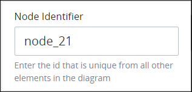
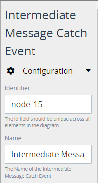
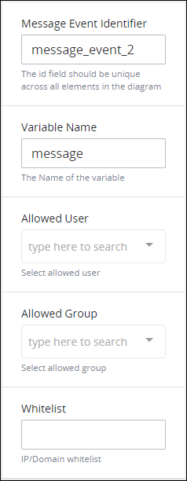

# Add and Configure Intermediate Message Catch Event Elements

## Add an Intermediate Message Catch Event Element


### Don't Know What an End Event Is?

See [Process Modeling Element Descriptions](process-modeling-element-descriptions.md) for a description of the [Intermediate Message Catch Event](process-modeling-element-descriptions.md#intermediate-message-catch-event) element.

### Permissions Required

Your user account or group membership must have the following permissions to add an Intermediate Message Catch Event element to the Process model:

* Processes: View Processes
* Processes: Edit Processes

See the [Process](../../../processmaker-administration/permission-descriptions-for-users-and-groups.md#processes) permissions or ask your ProcessMaker Administrator for assistance.


Follow these steps to add an Intermediate Message Catch Event element to the Process model:

1. [View your Processes](https://processmaker.gitbook.io/processmaker-4-community/-LPblkrcFWowWJ6HZdhC/~/drafts/-LRhVZm0ddxDcGGdN5ZN/primary/designing-processes/viewing-processes/view-the-list-of-processes/view-your-processes#view-all-processes). The **Processes** page displays.
2. [Create a new Process](../../viewing-processes/view-the-list-of-processes/create-a-process.md) or click the **Open Modeler** iconto edit the selected Process model. Process Modeler displays.
3. Locate the **Intermediate Message Catch Event** element in the **BPMN** panel.  

   

4. Drag the element to where in the Process model canvas that you want to place it. If a Pool element is in your Process model, the Intermediate Message Catch Event element cannot be placed outside of the Pool element.

After the element is placed into the Process model, you may move it by dragging it to the new location.


Moving an Intermediate Message Catch Event element has the following limitations in regards to the following Process model elements:

* **Pool element:** If the Intermediate Message Catch Event element is inside of a [Pool](process-modeling-element-descriptions.md#pool) element, it cannot be moved outside of the Pool element. If you attempt to do so, Process Modeler places the Intermediate Message Catch Event element inside the Pool element closest to where you attempted to move it.
* **Lane element:** If the Intermediate Message Catch Event element is inside of a Lane element, it can be moved to another Lane element in the same Pool element. However, the Intermediate Message Catch Event element cannot be moved outside of the Pool element.


## Configure an Intermediate Message Catch Event Element


Your user account or group membership must have the following permissions to configure an Intermediate Message Catch Event element:

* Processes: View Processes
* Processes: Edit Processes

See the [Process](../../../processmaker-administration/permission-descriptions-for-users-and-groups.md#processes) permissions or ask your ProcessMaker Administrator for assistance.


### Edit the Identifier Value

Process Modeler automatically assigns a unique value to each Process element added to a Process model. However, an element's identifier value can be changed if it is unique to all other elements in the Process model, including the Process model's identifier value.


All identifier values for all elements in the Process model must be unique.


Follow these steps to edit the identifier value for an Intermediate Message Catch Event element:

1. Select the Intermediate Message Catch Event element from the Process model in which to edit its identifier value. The **Inspector** panel displays the **Configuration** setting section.
2. Expand the **Configuration** setting section if it is not presently expanded. The **Identifier** field displays. This is a required field.  

   

3. In the **Identifier** field, edit the End Event element's identifier to a unique value from all elements in the Process model and then press **Enter**. The element's identifier value is changed.

### Edit the Element Name

An element name is a human-readable reference for a Process element. Process Modeler automatically assigns the name of a Process element with its element type. However, an element's name can be changed.

Follow these steps to edit the name for an Intermediate Message Catch Event element:

1. Select the Intermediate Message Catch Event element from the Process model in which to edit its name. The **Inspector** panel displays the **Configuration** setting section.
2. Expand the **Configuration** setting section if it is not presently expanded. The **Name** field displays.  

   

3. In the **Name** field, edit the selected element's name and then press **Enter**. The element's name is changed.

### Configure How to Trigger an Intermediate Message Catch Event Element

Follow these guidelines how to trigger an Intermediate Message Catch Event element:

* Optionally, specify the incoming Message Flow element representing the external API call that triggers the Intermediate Message Catch Event element. If you don't specify which Message Flow element triggers the Intermediate Message Catch Event element when that element has multiple incoming Message Flow elements, then the first Message Flow element that triggers will trigger the Intermediate Message Catch Event element; this represents when the first external API call that meets the conditions set to trigger the Intermediate Message Catch Event element will do so. If there is only one incoming Message Flow element, then specifying that element triggers the Intermediate Message Catch Event element is not necessary.
* Optionally, specify the key that the Intermediate Message Catch Event element stores in the Request's JSON data model a value. If no key is provided, then the Message Catch Event element passes data to the global JSON data model.
* Optionally, specify the specified ProcessMaker user whose authorization credentials are required to make the external API call to the Intermediate Message Catch Event element.
* Optionally, specify the specified ProcessMaker group of which any member's authorization credentials can be used to make the external API call to the Intermediate Message Catch Event element.
* Optionally, specify the IP address or domain that is the Intermediate Message Catch Event is allowed to receive the API call. If no IP addresses or domains are specified, then any IP address or domain can potentially trigger the Intermediate Message Catch Event element.

Adding optional settings to the Intermediate Message Catch Event element restricts how this element can be triggered. Inversely, the fewer optional settings you enter provides more flexibility for the Intermediate Message Catch Event element to trigger.

Follow these steps to configure how to trigger an Intermediate Message Catch Event element:

1. Select the Intermediate Message Catch Event element from the Process model in which to edit its identifier value. The **Inspector** panel displays the **Configuration** setting section.
2. Expand the **Configuration** setting section if it is not presently expanded. The **Message Event Identifier** field displays.  

   

3. In the **Message Event Identifier** field, enter the unique **Identifier** field value for the incoming Message Flow element that represents the external API call. When the incoming Message Flow element matching the **Identifier** field value triggers, then the Intermediate Message Catch Event element evaluates the other settings to determine if it triggers.

   To locate the **Identifier** field value for an incoming Message Flow element, follow these steps:

   1. Select the incoming Message Flow element to the Intermediate Message Catch Event element.
   2. Expand the **Configuration** section if it is not presently expanded.
   3. Copy the value in the **Identifier** field. See [Set Message Flow Elements Between Separate Pool Elements](set-and-delete-message-flow-between-elements.md#edit-the-identifier-value).
   4. Paste that value into the Intermediate Message Catch Event element's **Message Event Identifier** field.

4. In the **Data Name** field, enter the key in the Request's JSON data model that the Intermediate Message Catch Event element stores data from the external API call. If you do not provide a key, then the Intermediate Message Catch Event element passes data to the global JSON data model.
5. From the **Allowed User** drop-down menu, select the ProcessMaker user whose authorization credentials are required to make the external API call to the Intermediate Message Catch Event element. Do not select a ProcessMaker user in the following circumstances:
   * There is no restriction whose ProcessMaker user's authorization credentials are associated with the API call.
   * You intend to select a ProcessMaker group from which any member's authorization credentials can be associated with the API call.
6. From the **Allowed Group** drop-down menu, select the ProcessMaker group of which any member's authorization credentials can be used to make the external API call to the Intermediate Message Catch Event element. Do not select a ProcessMaker group in the following circumstances:
   * There is no restriction whose ProcessMaker user's authorization credentials are associated with the API call.
   * You intend to select a ProcessMaker user whose authorization credentials are required to make the API call.
7. In the **Whitelist** field, enter the IP address or domain name from which the Intermediate Message Catch Event element is allowed to receive the external API call. Separate multiple items with commas. If no IP addresses or domains are specified, then any IP address or domain can potentially trigger the Intermediate Message Catch Event element.

## Related Topics











