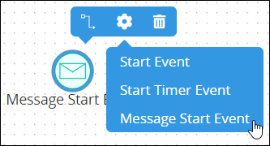
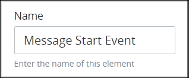
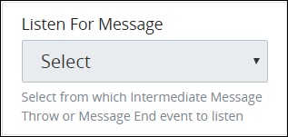
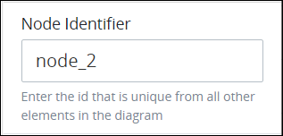

# Add and Configure Message Start Event Elements

## Add a Message Start Event Element


### Don't Know What a Message Start Event Element Is?

See [Process Modeling Element Descriptions](process-modeling-element-descriptions.md) for a description of the [Message Start Event](process-modeling-element-descriptions.md#message-start-event) element.

### Permissions Required

Your ProcessMaker user account or group membership must have the following permissions to add a Start Timer Event element to the Process model unless your user account has the **Make this user a Super Admin** setting selected:

* Processes: View Processes
* Processes: Edit Processes

See the [Process](../../../processmaker-administration/permission-descriptions-for-users-and-groups.md#processes) permissions or ask your ProcessMaker Administrator for assistance.


Follow these steps to add a Message Start Event element to the Process model:

1. [View your Processes](../../viewing-processes/view-the-list-of-processes/view-your-processes.md#view-all-active-processes). The **Processes** page displays.
2. [Create a new Process](../../viewing-processes/view-the-list-of-processes/create-a-process.md) or click the **Open Modeler** iconto edit the selected Process model. Process Modeler displays.
3. Locate the **Start Event** control in the **Controls** palette that is to the left of the Process Modeler canvas. If the **Hide Menus** buttonis enabled, the **Controls** palette displays the **Start Event** control's icon.

   

4. Drag the control into the Process model canvas where you want to place it. If a Pool element is in your Process model, the Start Timer Event element cannot be placed outside of the Pool element.
5. Select the **Message Start Event** option from the **Elements** drop-down menu. The Message Start Event element displays.  

After the element is placed into the Process model, you may move it by dragging it to the new location.


Moving a Message Start Event element has the following limitations in regards to the following Process model elements:

* **Pool element:** If the Message Start Event element is inside of a [Pool](process-modeling-element-descriptions.md#pool) element, it cannot be moved outside of the Pool element. If you attempt to do so, Process Modeler places the Message Start Event element inside the Pool element closest to where you attempted to move it.
* **Lane element:** If the Message Start Event element is inside of a Lane element, it can be moved to another Lane element in the same Pool element. However, the Message Start Event element cannot be moved outside of the Pool element.


## Settings


Your ProcessMaker user account or group membership must have the following permissions to configure a Start Timer Event element unless your user account has the **Make this user a Super Admin** setting selected:

* Processes: View Processes
* Processes: Edit Processes

See the [Process](../../../processmaker-administration/permission-descriptions-for-users-and-groups.md#processes) permissions or ask your ProcessMaker Administrator for assistance.


The Start Timer Event element has the following panels that contain settings:

* **Configuration** panel
  * [Edit the element name](add-and-configure-message-start-event-elements.md#edit-the-element-name)
  * [Select the element from which to listen for a message](add-and-configure-message-start-event-elements.md#select-the-element-from-which-to-listen-for-a-message)
* **Advanced** panel
  * [Edit the element's identifier value](add-and-configure-message-start-event-elements.md#edit-the-elements-identifier-value)

### Configuration Panel Settings

#### Edit the Element Name

An element name is a human-readable reference for a Process element. Process Modeler automatically assigns the name of a Process element with its element type. However, an element's name can be changed.

Follow these steps to edit the name for a Message Start Event element:

1. Ensure that the **Hide Menus** buttonis not enabled. See [Maximize the Process Modeler Canvas View](../navigate-around-your-process-model.md#maximize-the-process-modeler-canvas-view).
2. Select the Message Start Event element from the Process model in which to edit its name. Panels to configure this element display.
3. Expand the **Configuration** panel if it is not presently expanded. The **Name** setting displays.  
4. In the **Name** setting, edit the selected element's name and then press **Enter**.

#### Select the Element from Which to Listen for a Message

An Message Start Event element starts a [Request](../../../using-processmaker/requests/what-is-a-request.md) when that element receives a message from either an [Intermediate Message Throw Event](process-modeling-element-descriptions.md#intermediate-message-throw-event) element or a [Message End Event](process-modeling-element-descriptions.md#message-end-event) element \(but not both\) located in a different [Pool](process-modeling-element-descriptions.md#pool) element than the Message Start Event element receiving the message. After the Message Start Event element receives its message, that element triggers. Select from which element to listen for a message based on the Intermediate Message Throw Event or Message End Event element's **Message Name** setting value.

Follow these steps to select from which element to listen for a message to trigger the Message Start Event element:

1. Ensure that the **Hide Menus** buttonis not enabled. See [Maximize the Process Modeler Canvas View](../navigate-around-your-process-model.md#maximize-the-process-modeler-canvas-view).
2. Select the Message Start Event element from the Process model in which to select the Process model element from which to listen for a message. Panels to configure this element display.
3. Expand the **Configuration** panel if it is not presently expanded and then locate the **Listen For Message** setting.  
4. From the **Listen For Message** drop-down menu, select from which element to listen for a message based on its **Message Name** setting value.

### Advanced Panel Settings

#### Edit the Element's Identifier Value

Process Modeler automatically assigns a unique value to each Process element added to a Process model. However, an element's identifier value can be changed if it is unique to all other elements in the Process model, including the Process model's identifier value.


All identifier values for all elements in the Process model must be unique.


Follow these steps to edit the identifier value for a Message Start Event element:

1. Ensure that the **Hide Menus** buttonis not enabled. See [Maximize the Process Modeler Canvas View](../navigate-around-your-process-model.md#maximize-the-process-modeler-canvas-view).
2. Select the Message Start Event element from the Process model in which to edit its identifier value. Panels to configure this element display.
3. Expand the **Advanced** panel if it is not presently expanded. The **Node Identifier** setting displays. This is a required setting.  
4. In the **Node Identifier** setting, edit the Message Start Event element's identifier to a unique value from all elements in the Process model and then press **Enter**.

## Related Topics













