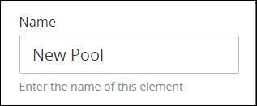
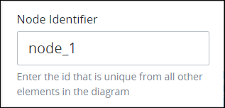
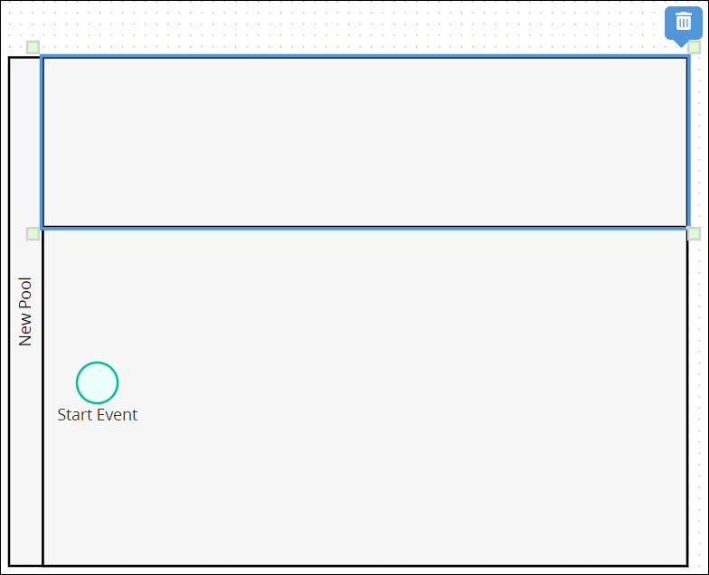
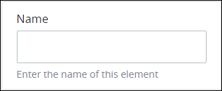
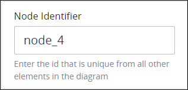

# Add and Configure Pool and Lane Elements

## Add a Pool Element


### Don't Know What a Pool Element Is?

See [Process Modeling Element Descriptions](process-modeling-element-descriptions.md) for a description of the [Pool](process-modeling-element-descriptions.md#pool) element.

### Permissions Required

Your ProcessMaker user account or group membership must have the following permissions to add a Pool element to the Process model unless your user account has the **Make this user a Super Admin** setting selected:

* Processes: View Processes
* Processes: Edit Processes

See the [Process](../../../processmaker-administration/permission-descriptions-for-users-and-groups.md#processes) permissions or ask your ProcessMaker Administrator for assistance.


Follow these steps to add a Pool element to the Process model:

1. [View your Processes](../../viewing-processes/view-the-list-of-processes/view-your-processes.md#view-all-active-processes). The **Processes** page displays.
2. [Create a new Process](../../viewing-processes/view-the-list-of-processes/create-a-process.md) or click the **Open Modeler** iconto edit the selected Process model. Process Modeler displays.
3. Locate the **Pool** control in the **Controls** palette that is to the left of the Process Modeler canvas. If the [**Hide Menus** button](../navigate-around-your-process-model.md#maximize-the-process-modeler-canvas-view)is enabled, the **Controls** palette displays the **Pool** control's icon.  
4. Drag the element into the Process model canvas where you want to place it. If non-Pool/[Lane](process-modeling-element-descriptions.md#lane) elements or [controls](../model-processes-using-connectors/what-is-a-connector.md) are in your Process model when you place the Pool element, those elements are automatically placed into the Pool element. A Pool element cannot be placed into another Pool element, though the most recently placed Pool element can overlap another such that only the recent Pool element and its contents is visible.

After the element is placed into the Process model, you may [resize it](add-and-configure-pool-and-lane-elements.md#resize-a-pool-element) or move it by dragging it to the new location. Any elements within the Pool element move as well.


### Elements Placed Into a Pool Element Cannot Be Moved Out of It

If a non-Pool element is placed into a Pool element, that element cannot be moved outside of the Pool element. If you attempt to do so, Process Modeler places that element inside the Pool element closest to where you attempted to move it.

### Deleting a Pool Element Also Deletes All Elements Within It

When a Pool element is [deleted](../remove-process-model-elements.md#delete-a-pool-element), all elements within it are also deleted. If you want to keep the elements within a Pool element, you must add those elements outside of the Pool element prior to deleting the Pool element.

If you accidentally delete a Pool element with other elements you want to keep, then click the **Undo** button.


## Resize a Pool Element


Your ProcessMaker user account or group membership must have the following permissions to resize a Pool element to the Process model unless your user account has the **Make this user a Super Admin** setting selected:

* Processes: View Processes
* Processes: Edit Processes

See the [Process](../../../processmaker-administration/permission-descriptions-for-users-and-groups.md#processes) permissions or ask your ProcessMaker Administrator for assistance.


Follow these steps to resize a Pool element:

1. [Add a Pool element to your Process model](add-and-configure-pool-and-lane-elements.md#add-a-pool-element).
2. Select the Pool element from the Process model to resize. Anchors display on each corner of the Pool element.  

   

3. Click one of the anchors on the Pool element, hold your cursor, and then adjust the size of the Pool element on the Process model canvas. If the Pool element contains elements within it prior to resizing, the Pool element only resizes to contain all elements within it. Lane elements automatically adjust to the width of the Pool element, though [Lane elements can be resized](add-and-configure-pool-and-lane-elements.md#resize-a-lane-element) separately.

## Pool Element Settings


Your ProcessMaker user account or group membership must have the following permissions to configure a Pool element unless your user account has the **Make this user a Super Admin** setting selected:

* Processes: View Processes
* Processes: Edit Processes

See the [Process](../../../processmaker-administration/permission-descriptions-for-users-and-groups.md#processes) permissions or ask your ProcessMaker Administrator for assistance.


The Pool element has the following panels that contain settings:

* **Configuration** panel
  * [Edit the element name](add-and-configure-pool-and-lane-elements.md#edit-the-element-name-1)
* **Advanced** panel
  * [Edit the element's identifier value](add-and-configure-pool-and-lane-elements.md#edit-the-elements-identifier-value-1)

### Configuration Panel Settings

#### Edit the Element Name

An element name is a human-readable reference for a Process element. Process Modeler automatically assigns the name of a Process element with its element type. However, an element's name can be changed.

Follow these steps to edit the name for a Pool element:

1. Ensure that the **Hide Menus** buttonis not enabled. See [Maximize the Process Modeler Canvas View](../navigate-around-your-process-model.md#maximize-the-process-modeler-canvas-view).
2. Select the Pool element from the Process model in which to edit its name. Panels to configure this element display.
3. Expand the **Configuration** panel if it is not presently expanded. The **Name** setting displays. 
4. In the **Name** setting, edit the selected element's name and then press **Enter**.

### Advanced Panel Settings

#### Edit the Element's Identifier Value

Process Modeler automatically assigns a unique value to each Process element added to a Process model. However, an element's identifier value can be changed if it is unique to all other elements in the Process model, including the Process model's identifier value.


All identifier values for all elements in the Process model must be unique.


Follow these steps to edit the identifier value for a Pool element:

1. Ensure that the **Hide Menus** buttonis not enabled. See [Maximize the Process Modeler Canvas View](../navigate-around-your-process-model.md#maximize-the-process-modeler-canvas-view).
2. Select the Pool element from the Process model in which to edit its identifier value. Panels to configure this element display.
3. Expand the **Advanced** panel if it is not presently expanded. The **Node Identifier** setting displays. This is a required setting. 
4. In the **Node Identifier** setting, edit the Pool element's identifier to a unique value from all elements in the Process model and then press **Enter**.

## Add a Lane Element to a Pool Element


### Don't Know What a Lane Element Is?

See [Process Modeling Element Descriptions](process-modeling-element-descriptions.md) for a description of the [Lane](process-modeling-element-descriptions.md#lane) element.

### Permissions Required to Do This Task

Your ProcessMaker user account or group membership must have the following permissions to add a Lane element to a Pool element unless your user account has the **Make this user a Super Admin** setting selected:

* Processes: View Processes
* Processes: Edit Processes

See the [Process](../../../processmaker-administration/permission-descriptions-for-users-and-groups.md#processes) permissions or ask your ProcessMaker Administrator for assistance.


Follow these steps to add a Lane element to a Pool element:

1. [View your Processes](../../viewing-processes/view-the-list-of-processes/view-your-processes.md#view-all-active-processes). The **Processes** page displays.
2. Click the **Open Modeler** iconfor edit the selected Process model. Process Modeler displays.
3. Ensure that the **Hide Menus** buttonis not enabled. See [Maximize the Process Modeler Canvas View](../navigate-around-your-process-model.md#maximize-the-process-modeler-canvas-view).
4. Click the Pool element from the Process model into which to add a Lane element. Icons to add a Lane to a Pool element display.  

   

5. Do one of the following:
   * **Add a Lane element above existing Lane elements:** Click the **Lane Above** iconto add a Lane element above all existing Lane elements. If only the Pool element exists, two Lane elements display.
   * **Add a Lane element below existing Lane elements:** Click the **Lane Below** iconto add a Lane element below all existing Lane elements. If only the Pool element exists, two Lane elements display.

## Resize a Lane Element


Your ProcessMaker user account or group membership must have the following permissions to resize a Lane element to the Process model unless your user account has the **Make this user a Super Admin** setting selected:

* Processes: View Processes
* Processes: Edit Processes

See the [Process](../../../processmaker-administration/permission-descriptions-for-users-and-groups.md#processes) permissions or ask your ProcessMaker Administrator for assistance.


Follow these steps to resize a Lane element:

1. [Add a Lane element to a Pool element](add-and-configure-pool-and-lane-elements.md#add-a-lane-element-to-a-pool-element).
2. Select the Lane element from the Pool element to resize. Anchors display on each corner of the Lane element.  

   

3. Click one of the anchors on the Lane element, hold your cursor, and then adjust the size of the Lane element in the Pool element. If the Lane element contains elements within it prior to resizing, the Lane element only resizes to contain all elements within it. The Pool element automatically adjusts to the width of the resized Lane element so far as all elements contained within the Pool element remain contained in it. [Pool elements can be resized](add-and-configure-pool-and-lane-elements.md#resize-a-pool-element) separately.

## Lane Element Settings


Your ProcessMaker user account or group membership must have the following permissions to configure a Lane element unless your user account has the **Make this user a Super Admin** setting selected:

* Processes: View Processes
* Processes: Edit Processes

See the [Process](../../../processmaker-administration/permission-descriptions-for-users-and-groups.md#processes) permissions or ask your ProcessMaker Administrator for assistance.


The Lane element has the following panels that contain settings:

* **Configuration** panel
  * [Edit the element name](add-and-configure-pool-and-lane-elements.md#edit-the-element-name-1)
* **Advanced** panel
  * [Edit the element's identifier value](add-and-configure-pool-and-lane-elements.md#edit-the-elements-identifier-value-1)

### Configuration Panel Settings

#### Edit the Element Name

An element name is a human-readable reference for a Process element. Process Modeler automatically assigns the name of a Process element with its element type. However, an element's name can be changed.

Follow these steps to edit the name for a Lane element:

1. Ensure that the **Hide Menus** buttonis not enabled. See [Maximize the Process Modeler Canvas View](../navigate-around-your-process-model.md#maximize-the-process-modeler-canvas-view).
2. Select the Lane element from the Process model in which to edit its name. Panels to configure this element display.
3. Expand the **Configuration** panel if it is not presently expanded. The **Name** setting displays. 
4. In the **Name** setting, edit the selected element's name and then press **Enter**.

### Advanced Panel Settings

#### Edit the Element's Identifier Value

Process Modeler automatically assigns a unique value to each Process element added to a Process model. However, an element's identifier value can be changed if it is unique.


All identifier values for all elements in the Process model must be unique.


Follow these steps to edit the identifier value for a Lane element:

1. Ensure that the **Hide Menus** buttonis not enabled. See [Maximize the Process Modeler Canvas View](../navigate-around-your-process-model.md#maximize-the-process-modeler-canvas-view).
2. Select the Lane element from the Process model in which to edit its identifier value. Panels to configure this element display.
3. Expand the **Advanced** panel if it is not presently expanded. The **Node Identifier** setting displays. This is a required setting. 
4. In the **Node Identifier** setting, edit the Lane element's identifier to a unique value from all elements in the Process model and then press **Enter**.

## Related Topics











