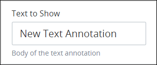
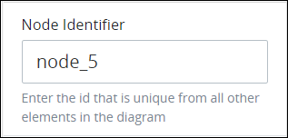
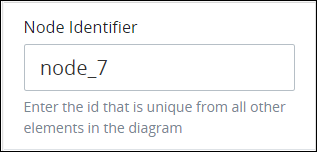
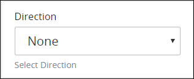
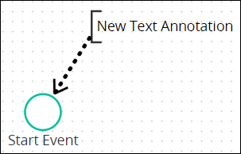
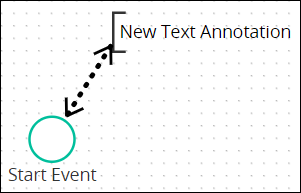

# Add and Configure Text Annotation and Association Elements

## Add a Text Annotation Element


### Don't Know What a Text Annotation Element Is?

See [Process Modeling Element Descriptions](process-modeling-element-descriptions.md) for a description of the [Text Annotation](process-modeling-element-descriptions.md#text-annotation) element.

### Permissions Required

Your ProcessMaker user account or group membership must have the following permissions to add a Text Annotation element to the Process model unless your user account has the **Make this user a Super Admin** setting selected:

* Processes: Edit Processes
* Processes: View Processes

See the [Process](../../../processmaker-administration/permission-descriptions-for-users-and-groups.md#processes) permissions or ask your ProcessMaker Administrator for assistance.


Follow these steps to add a Text Annotation element to the Process model:

1. [View your Processes](../../viewing-processes/view-the-list-of-processes/view-your-processes.md#view-all-active-processes). The **Processes** page displays.
2. [Create a new Process](../../viewing-processes/view-the-list-of-processes/create-a-process.md) or click the **Open Modeler** iconto edit the selected Process model. Process Modeler displays.
3. Locate the **Text Annotation** control in the **Controls** palette that is to the left of the Process Modeler canvas. If the [**Hide Menus** button](../navigate-around-your-process-model.md#maximize-the-process-modeler-canvas-view)is enabled, the **Controls** palette displays the **Text Annotation** control's icon.  
4. Drag the element into the Process model canvas where you want to place it. If a Pool element is in your Process model, the Text Annotation element cannot be placed outside of the Pool element.

After the element is placed into the Process model, you may move it by dragging it to the new location.


Moving a Text Annotation element has the following limitations in regards to the following Process model elements:

* **Pool element:** If the Text Annotation element is inside of a [Pool](process-modeling-element-descriptions.md#pool) element, it cannot be moved outside of the Pool element. If you attempt to do so, Process Modeler places the Text Annotation element inside the Pool element closest to where you attempted to move it.
* **Lane element:** If the Text Annotation element is inside of a Lane element, it can be moved to another Lane element in the same Pool element. However, the Text Annotation element cannot be moved outside of the Pool element.


## Text Annotation Element Settings


Your ProcessMaker user account or group membership must have the following permissions to configure a Text Annotation element unless your user account has the **Make this user a Super Admin** setting selected:

* Processes: Edit Processes
* Processes: View Processes

See the [Process](../../../processmaker-administration/permission-descriptions-for-users-and-groups.md#processes) permissions or ask your ProcessMaker Administrator for assistance.


The Text Annotation element has the following panels that contain settings:

* **Configuration** panel
  * [Edit the element name](add-and-configure-text-annotation-elements.md#edit-the-annotation-description)
* **Advanced** panel
  * [Edit the element's identifier value](add-and-configure-text-annotation-elements.md#edit-the-elements-identifier-value-1)

### Configuration Panel Settings

#### Edit the Annotation Description

Process Modeler automatically assigns a default value to a new Text Annotation element. However, change the annotation description to provide context to your Process model.

Follow these steps to edit the annotation description for a Text Annotation element:

1. Ensure that the **Hide Menus** buttonis not enabled. See [Maximize the Process Modeler Canvas View](../navigate-around-your-process-model.md#maximize-the-process-modeler-canvas-view).
2. Select the Pool element from the Process model in which to edit its name. Panels to configure this element display.
3. Expand the **Configuration** panel if it is not presently expanded. The **Text to Show** setting displays. 
4. In the **Text to Show** setting, edit the selected Text Annotation element's text to display in the Process model and then press **Enter**.

### Advanced Panel Settings

#### Edit the Element's Identifier Value

Process Modeler automatically assigns a unique value to each Process element added to a Process model. However, an element's identifier value can be changed if it is unique to all other elements in the Process model, including the Process model's identifier value.


All identifier values for all elements in the Process model must be unique.


Follow these steps to edit the identifier value for a Text Annotation element:

1. Ensure that the **Hide Menus** buttonis not enabled. See [Maximize the Process Modeler Canvas View](../navigate-around-your-process-model.md#maximize-the-process-modeler-canvas-view).
2. Select the Text Annotation element from the Process model in which to edit its identifier value. Panels to configure this element display.
3. Expand the **Advanced** panel if it is not presently expanded. The **Node Identifier** setting displays. This is a required setting. 
4. In the **Node Identifier** setting, edit the Text Annotation element's identifier to a unique value from all elements in the Process model and then press **Enter**.

## Add an Association Element


### Don't Know What an Association Element Is?

See [Process Modeling Element Descriptions](process-modeling-element-descriptions.md) for a description of the [Association](process-modeling-element-descriptions.md#association) element.

### Permissions Required to Do This Task

Your ProcessMaker user account or group membership must have the following permissions to add an Association element to the Process model unless your user account has the **Make this user a Super Admin** setting selected:

* Processes: Edit Processes
* Processes: View Processes

See the [Process](../../../processmaker-administration/permission-descriptions-for-users-and-groups.md#processes) permissions or ask your ProcessMaker Administrator for assistance.


Follow these steps to add an Association element to the Process model:

1. [View your Processes](../../viewing-processes/view-the-list-of-processes/view-your-processes.md#view-all-active-processes). The **Processes** page displays.
2. [Create a new Process](../../viewing-processes/view-the-list-of-processes/create-a-process.md) or click the **Open Modeler** iconto edit the selected Process model. Process Modeler displays.
3. [Add a Text Annotation element to the Process model](add-and-configure-text-annotation-elements.md#add-a-text-annotation-element).
4. Select the Text Annotation element from which you want to add an Association element. Available options display to the right of the selected element.  

   

5. Click the **Association Flow** icon.
6. Click the Process model element to which the Text Annotation element describes. The Annotation element is placed.  

   

7. Repeat steps 5 and 6 to reference another Process model element that the Text Annotation element describes as necessary.

## Association Element Settings


Your ProcessMaker user account or group membership must have the following permissions to configure an Association element unless your user account has the **Make this user a Super Admin** setting selected:

* Processes: Edit Processes
* Processes: View Processes

See the [Process](../../../processmaker-administration/permission-descriptions-for-users-and-groups.md#processes) permissions or ask your ProcessMaker Administrator for assistance.


The Association element has the following panels that contain settings:

* **Configuration** panel
  * [Edit the element's identifier value](add-and-configure-text-annotation-elements.md#edit-the-elements-identifier-value-1)
  * [Edit the direction of the Text Annotation element's reference](add-and-configure-text-annotation-elements.md#edit-the-direction-of-the-text-annotation-elements-reference)

### Configuration Panel Settings

#### Edit the Element's Identifier Value

Process Modeler automatically assigns a unique value to each Process element added to a Process model. However, an element's identifier value can be changed if it is unique to all other elements in the Process model, including the Process model's identifier value.


All identifier values for all elements in the Process model must be unique.


Follow these steps to edit the identifier value for an Association element:

1. Select the Association element from the Text Annotation element in which to edit its identifier value. The **Configuration** panel displays.
2. Ensure that the **Hide Menus** buttonis not enabled. See [Maximize the Process Modeler Canvas View](../navigate-around-your-process-model.md#maximize-the-process-modeler-canvas-view).
3. Expand the **Configuration** panel if it is not presently expanded. The **Node Identifier** setting displays. This is a required setting.  

   

4. In the **Node Identifier** setting, edit the Text Annotation element's identifier to a unique value from all elements in the Process model and then press **Enter**.

#### Edit the Direction of the Text Annotation Element's Reference

Use the Annotation element to place a directional arrow that points between the Text Annotation element and the element it describes.

Follow these steps to edit the directional arrow that points between the Text Annotation element and the element it describes:

1. Select the Association element from the Text Annotation element in which to edit its annotation description. The **Configuration** setting section displays.
2. Ensure that the **Hide Menus** buttonis not enabled. See [Maximize the Process Modeler Canvas View](../navigate-around-your-process-model.md#maximize-the-process-modeler-canvas-view).
3. Expand the **Configuration** panel if it is not presently expanded, and then locate the **Direction** setting.  

   

4. From the **Direction** drop-down menu, select the direction in which the arrow points between the Text Annotation element and the element it describes. Select one of the following options:
   * **None:** Select the **None** option to not display an arrow that indicates the reference between the Text Annotation element and the element it describes.  

     

   * **One:** Select the **One** option to display an arrow that points from the Text Annotation element to the element it describes. This is the default option.  

     

   * **Both:** Select the **Both** option to display arrows to and from the Text Annotation element's  referencing element.  

     

## Related Topics









