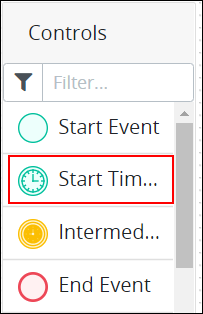
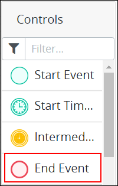
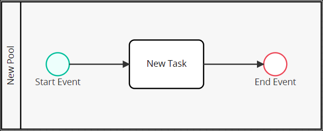
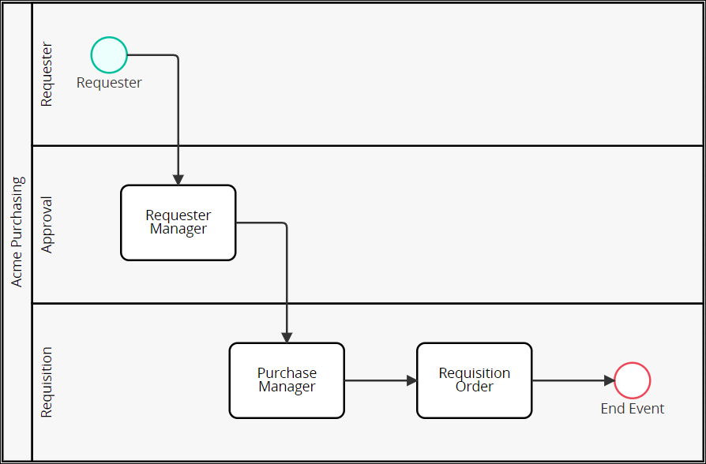

# Process Modeling Element Descriptions

## Overview

The following are brief descriptions about each Process modeling element. See the [BPMN 2.0 specification](https://www.omg.org/spec/BPMN/2.0/About-BPMN/) for more information.

## Events

An Event represents a milestone, time, or time interval in the Process model.

### Start Event

A Start Event element represents where a modeled Process starts. A Start Event element begins the workflow of a [Request](../../../using-processmaker/requests/what-is-a-request.md) for that Process. Therefore, a Start Event element cannot have an incoming [Sequence Flow](process-modeling-element-descriptions.md#sequence-flow). A Process model can have multiple Start Event elements.

In Process Modeler, the Start Event element is labeled as "Start Event" in the **BPMN** panel as highlighted below.

Below is a Start Event element when it has been placed into a Process model.


See [Add and Configure Event Elements](add-and-configure-an-event-element.md#add-a-start-event-element).


### Start Timer Event

A Start Timer Event element represents a time or periodic interval when a modeled Process starts. A Start Timer Event element begins the workflow of a Request for that Process. Therefore, a Start Timer Event element cannot have an incoming [Sequence Flow](process-modeling-element-descriptions.md#sequence-flow). A Process model can have multiple Start Timer Event elements.

In Process Modeler, the Start Timer Event element is labeled as "Start Timer Event" in the **BPMN** panel as highlighted below.

Below is a Start Timer Event element when it has been placed into a Process model.


See [Add and Configure Start Timer Event Elements](add-and-configure-start-timer-event-elements.md).


### Intermediate Timer Event

An Intermediate Timer Event elment represents a delay in a [Request's](../../../using-processmaker/requests/what-is-a-request.md) workflow for that Process either at a specific time or at a periodic interval.

In Process Modeler, the Intermediate Timer Event element is labeled as "Intermediate Timer Event" in the **BPMN** panel as highlighted below.

Below is an Intermediate Timer Event element when it has been placed into a Process model.


See [Add and Configure Intermediate Timer Event Elements](add-and-configure-intermediate-timer-event-elements.md).


### End Event

An End Event element represents where a modeled Process normally ends when abnormal events do not terminate a [Request](../../../using-processmaker/requests/) for that Process \(such as a canceled Request\). An End Event element terminates the workflow of a Request for that Process. Therefore, an End Event element cannot have an outgoing [Sequence Flow](process-modeling-element-descriptions.md#sequence-flow), though it may have an outgoing [Message Flow](process-modeling-element-descriptions.md#message-flow). A Process model can have multiple End Event elements.

In Process Modeler, the End Event element is labeled as "End Event" in the **BPMN** panel as highlighted below.

Below is an End Event element when it has been placed into a Process model.


See [Add and Configure Event Elements](add-and-configure-an-event-element.md#add-an-end-event-element).


## Tasks

A Task represents an activity to be performed either by a [Request](../../../using-processmaker/requests/what-is-a-request.md) participant or a [ProcessMaker Script](../../scripts/).

### Task

A Task element represents an activity to be performed by a person participating in a [Request](../../../using-processmaker/requests/what-is-a-request.md). The Request participant assigned that Task might be determined by the conditions in a Request's workflow.

People perform Task activities through ProcessMaker Screens as digital [forms](../../design-forms/screens-builder/types-for-screens.md#forms) and [displays](../../design-forms/screens-builder/types-for-screens.md#display). ProcessMaker Screens are designed in [Screens Builder](../../design-forms/screens-builder/).

In Process Modeler, the Task element is labeled as "Task" in the **BPMN** panel as highlighted below.

Below is a Task element when it has been placed into a Process model.


See [Add and Configure Task Elements](add-and-configure-task-elements.md).


### Script Task

A Script Task element is an activity to be performed by a ProcessMaker Script.

ProcessMaker Scripts are designed in [Scripts Editor](../../scripts/scripts-editor.md). ProcessMaker Scripts are independent of modeled processes: any ProcessMaker Script can be reused in any modeled process in your organization. This architecture allows Process Owners to focus on process modeling in a no-code environment while ProcessMaker Developers develop reusable ProcessMaker Scripts. ProcessMaker Scripts can leverage Request-level variable data as well as variable data designed in ProcessMaker Screens from [Screens Builder](../../design-forms/screens-builder/).

In Process Modeler, the Script Task element is labeled as "Script Task" in the **BPMN** panel as highlighted below.

Below is a Script Task element when it has been placed into a Process model.


See [Add and Configure Script Task Elements](add-and-configure-script-task-elements.md).


## Gateways

A Gateway controls how and/or when [Sequence Flows](process-modeling-element-descriptions.md#sequence-flow) that interact with other elements in the Process model.

### Exclusive Gateway

An Exclusive Gateway element represents a decision that creates alternative paths within a [Request's](../../../using-processmaker/requests/) workflow. During a Request's workflow for that Process, only one outgoing path from the Exclusive Gateway element can be taken. An Exclusive Gateway element can have two or more outgoing [Sequence Flows](process-modeling-element-descriptions.md#sequence-flow).

In Process Modeler, the Exclusive Gateway element is labeled as "Exclusive Gateway" in the **BPMN** panel as highlighted below.

Below is an Exclusive Gateway element when it has been placed into a Process model.


See the following topics about Exclusive Gateway elements:

* [Add and Configure Exclusive Gateway Elements](add-and-configure-exclusive-gateway-elements.md#add-an-exclusive-gateway-element)
* [Configure a Sequence Flow from an Exclusive Gateway Element](the-quick-toolbar.md#configure-a-sequence-flow-from-an-exclusive-gateway-element)


### Parallel Gateway

A Parallel Gateway element represents the synchronization and/or creation of parallel paths within a [Request's](../../../using-processmaker/requests/) workflow. The Parallel Gateway element has two functions:

* A Parallel Gateway does not trigger until all its incoming [Sequence Flows](process-modeling-element-descriptions.md#sequence-flow) route to it. This is how Parallel Gateways synchronize workflow.
* When a Parallel Gateway triggers, its outgoing Sequence Flows creates parallel paths without any conditions. This function differentiates it from outgoing Sequence Flows for [Exclusive Gateway](process-modeling-element-descriptions.md#exclusive-gateway) elements.

In Process Modeler, the Parallel Gateway element is labeled as "Parallel Gateway" in the **BPMN** panel as highlighted below.

Below is a Parallel Gateway element when it has been placed into a Process model.


See [Add and Configure Parallel Gateway Elements](add-and-configure-parallel-gateway-elements.md).


## Organize Process Participants

BPMN 2.0 provides graphical representations to organize participants in a Process model.

### Pool

A Pool element represents an organization or entity involved in a Process model. The Pool element might apply to a specific role \("Human Resources"\), entity \(such as a company\) or a general relationship \(such as a buyer, seller, or manufacturer\). A Pool element can even reference another Process model.

In Process Modeler, the Pool element is labeled as "Pool" in the **BPMN** panel as highlighted below.

Below is a Pool element when it has been placed into a Process model.


See [Add and Configure Pool and Lane Elements](add-and-configure-pool-and-lane-elements.md).


### Lane

A Lane element represents a partition within a [Pool](process-modeling-element-descriptions.md#pool) element. Each Lane element indicates individual roles and/or participants that perform Tasks within the Pool element. Text within the Lane element indicates the participant in the Process model. Any elements within the Lane element indicate that the participant is the actor or is responsible for performing tasks in the Process. Furthermore, [Sequence Flow](process-modeling-element-descriptions.md#sequence-flow) elements between elements in other Pool or Lane elements indicate with which other Process participants that Lane element interacts.

Below is a Pool element with three Lane elements when it has been placed into a Process model. Each Lane element indicates roles within the overall organization.


See [Add and Configure Pool and Lane Elements](add-and-configure-pool-and-lane-elements.md).


## Flows

Flows represent the order in which workflow and messaging occur in a Process model.

### Sequence Flow

Sequence Flow elements represent the intended workflow routing in a Process model. Process workflow is the order in which elements trigger or activate in a Process model. Sequence Flow elements are not to be confused with [Message Flow](process-modeling-element-descriptions.md#message-flow) elements.

As a best practice indicate a consistent direction of Sequence Flow elements, either left to right or top to bottom, to make modeled Processes easier to understand.

In Process Modeler, Flow indicators display when you click an element in the Process model. The top Flow indicator is for Sequence Flows \(highlighted below\), represented with a solid line. The Message Flow indicator displays below the Sequence Flow indicator, represented by a dotted line.


[Text annotations](process-modeling-element-descriptions.md#text-annotation) and [Pool](process-modeling-element-descriptions.md#pool) elements do not use Sequence Flow elements. Furthermore, Sequence Flow elements cannot connect between Process model elements that are in different Pool elements since Pool elements represent different organizations. However, use Message Flows to infer communication between elements in different Pool elements.

Sequence Flows from Exclusive Gateway elements can be configured to specify under which condition a Request routes through that Sequence Flow. See [Set and Delete Sequence Flow Between Elements](the-quick-toolbar.md#configure-the-sequence-flow-for-exclusive-gateway-elements).

An End Event element terminates the flow of a Request for that Process. Therefore, an End Event element cannot have an outgoing Sequence Flow.


The Sequence Flow element indicates in which order workflow or routing occurs between two connected Process elements. Below are two Process model elements connected in Process Modeler.


See [Set and Delete Sequence Flow Between Elements](the-quick-toolbar.md).


### Message Flow

Message Flow elements represent communication between an element in one Pool element with a separate Pool element in a Process model. Message Flow elements are not to be confused with [Sequence Flow](process-modeling-element-descriptions.md#sequence-flow) elements.

In Process Modeler, Flow indicators display when you click an element in the Process model. The bottom Flow indicator is for Message Flows, represented with a dotted line \(highlighted below\). The Sequence Flow indicator displays above the Message Flow indicator, represented by a solid line.

The Message Flow element indicates communication between the two separate Pool elements. The Message Flow does not indicate whether the communication is physical or digital. Use a [Text Annotation](process-modeling-element-descriptions.md#text-annotation) element to add information about the communication.

Message Flows cannot connect to Process model elements within the same Pool element.


See [Set and Delete Message Flow Between Elements](set-and-delete-message-flow-between-elements.md).


## Text Annotation

Text annotation is human-readable text in a modeled process provides description regarding the Process. Text annotation elements perform no functional role in Process Requests or workflow.

In Process Modeler, the Text Annotation element is labeled as "Text Annotation" in the **BPMN** panel as highlighted below.

Below is a Text Annotation element when it has been placed into a Process model.


See [Add and Configure Text Annotation Elements](add-and-configure-text-annotation-elements.md).


## Related Topics









