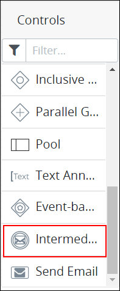
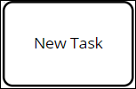
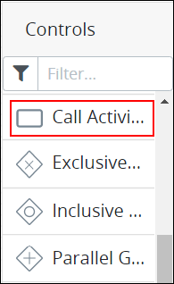
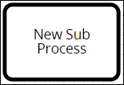
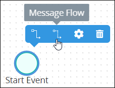

# Process Modeling Element Descriptions

## Overview

The following are brief descriptions about each Process modeling element that ProcessMaker provides. See the [BPMN 2.0 specification](https://www.omg.org/spec/BPMN/2.0/About-BPMN/) for more information.

## Events

Use event-type elements to represent an event, milestone, or delay in the Process. ProcessMaker provides the following event type Process model elements:

* [Start Event](process-modeling-element-descriptions.md#start-event)
* [Start Timer Event](process-modeling-element-descriptions.md#start-timer-event)
* [Intermediate Timer Event](process-modeling-element-descriptions.md#intermediate-timer-event)
* [Intermediate Message Catch Event](process-modeling-element-descriptions.md#intermediate-message-catch-event)
* [End Event](process-modeling-element-descriptions.md#end-event)

### Start Event

A Start Event element represents the start of a [Request](../../../using-processmaker/requests/what-is-a-request.md) for a Process. Therefore, a Start Event element cannot have an incoming [Sequence Flow](process-modeling-element-descriptions.md#sequence-flow) element, though it may have an outgoing [Message Flow](process-modeling-element-descriptions.md#message-flow) element. A Process model can have multiple Start Event elements.

Use a Start Event element to represent how a Request for that Process starts in one of the following ways:

* The Request can be started from an API request to a Webhook URL.
* The Request can be started by an authenticated ProcessMaker [user](../../../processmaker-administration/add-users/what-is-a-user.md) \(Jane Doe\) or any member of a specified [group](../../../processmaker-administration/assign-groups-to-users/what-is-a-group.md) \(Accounting department\).
* The Request can be started by either an anonymous or authenticated ProcessMaker user through a published URL. This allows a ProcessMaker Screen to be available on a public-facing Web site that starts the Request when that Screen is submitted. Note that this feature is only available if the Web Entry package is installed in your ProcessMaker instance. See [Web Entry](../../../package-development-distribution/package-a-connector/web-entry.md).

In Process Modeler, the Start Event element is labeled as "Start Event" in the **Controls** panel as highlighted below.

Below is a Start Event element when it has been placed into a Process model.


See [Add and Configure Event Elements](add-and-configure-an-event-element.md#add-a-start-event-element).


### Start Timer Event

A Start Timer Event element represents a time or periodic interval when a [Request](../../../using-processmaker/requests/what-is-a-request.md) starts for a Process. A Start Timer Event element begins the Process. Therefore, a Start Timer Event element cannot have an incoming [Sequence Flow](process-modeling-element-descriptions.md#sequence-flow) element. A Process model can have multiple Start Timer Event elements. Use this element to indicate that a Request for that Process must begin at a specific date and time, such as on an employee’s employment anniversary to schedule a performance review.

In Process Modeler, the Start Timer Event element is labeled as "Start Timer Event" in the **Controls** panel as highlighted below.

Below is a Start Timer Event element when it has been placed into a Process model.


See [Add and Configure Start Timer Event Elements](add-and-configure-start-timer-event-elements.md).


### Intermediate Timer Event

An Intermediate Timer Event element represents a delay in a Process either at a specific time or at a periodic interval. When the specified time or interval occurs, the Intermediate Timer Event element triggers, thereby resuming workflow for that Process's [Request](../../../using-processmaker/requests/what-is-a-request.md). Use this element to cause a Request to wait until a specific time or periodic interval. For example, use this element to make a Process wait 30 days before checking if you receive an invoice from a customer after services are rendered.

In Process Modeler, the Intermediate Timer Event element is labeled as "Intermediate Timer Event" in the **Controls** panel as highlighted below.

Below is an Intermediate Timer Event element when it has been placed into a Process model.


See [Add and Configure Intermediate Timer Event Elements](add-and-configure-intermediate-timer-event-elements.md).


### Intermediate Message Catch Event

An Intermediate Message Catch Event element represents a delay in a Process until that element receives an external API call. This external API call is represented as an incoming [Message Flow](process-modeling-element-descriptions.md#message-flow) element from another [Pool](process-modeling-element-descriptions.md#pool) element. When the Intermediate Catch Event element receives the API call the element triggers, thereby resuming workflow for that Process's [Request](../../../using-processmaker/requests/what-is-a-request.md).

Use this element to specify attributes of an API call that are required to pass information to the Request and then resume its workflow.

The Intermediate Message Catch Event element can receive the external API call using authorized credentials from any of the following:

* A specified ProcessMaker [user](../../../processmaker-administration/add-users/what-is-a-user.md)
* Any member of a specified ProcessMaker [group](../../../processmaker-administration/assign-groups-to-users/what-is-a-group.md)
* A whitelisted \(allowed\) IP address or domain

In Process Modeler, the Intermediate Message Catch Event element is labeled as "Intermediate Message Catch Event" in the **Controls** panel as highlighted below.

Below is an Intermediate Message Catch Event element when it has been placed into a Process model.


See [Add and Configure Intermediate Timer Event Elements](add-and-configure-intermediate-timer-event-elements.md).


### End Event

An End Event element represents the completion of a [Request](../../../using-processmaker/requests/what-is-a-request.md) for a Process. Therefore, an End Event element cannot have an outgoing [Sequence Flow](process-modeling-element-descriptions.md#sequence-flow) element, though it may have an outgoing [Message Flow](process-modeling-element-descriptions.md#message-flow) element. A Process model can have multiple End Event elements.

In Process Modeler, the End Event element is labeled as "End Event" in the **Controls** panel as highlighted below.

Below is an End Event element when it has been placed into a Process model.


See [Add and Configure Event Elements](add-and-configure-an-event-element.md#add-an-end-event-element).


## Tasks

A Task represents an activity to be performed either by a [Request](../../../using-processmaker/requests/what-is-a-request.md) participant or a [ProcessMaker Script](../../scripts/). ProcessMaker provides the following Task-type Process model elements:

* [Task](process-modeling-element-descriptions.md#task)
* [Script Task](process-modeling-element-descriptions.md#script-task)
* [Manual Task](process-modeling-element-descriptions.md#manual-task)

### Task

A Task element represents an activity to be performed by a person participating in a [Request](../../../using-processmaker/requests/what-is-a-request.md). Assign the [Task](../../../using-processmaker/task-management/what-is-a-task.md) that the Task element represents to any of the following types of Request participants:

* The ProcessMaker user who started the Request, referred to as the Requester
* A specific ProcessMaker user
* Any member of a specified ProcessMaker group
* The previous Task assignee in that Request's workflow

People perform Task activities through ProcessMaker Screens as digital [forms](../../design-forms/screens-builder/types-for-screens.md#forms) and [displays](../../design-forms/screens-builder/types-for-screens.md#display). ProcessMaker Screens are designed in [Screens Builder](../../design-forms/screens-builder/).

In Process Modeler, the Task element is labeled as "Task" in the **BPMN** panel as highlighted below.

Below is a Task element when it has been placed into a Process model.


See [Add and Configure Task Elements](add-and-configure-task-elements.md).


### Script Task

A Script Task element represents an activity to be performed by a ProcessMaker Script. ProcessMaker Scripts support Lua and PHP programming languages. Use ProcessMaker Scripts in the following ways:

* Interact with legacy systems in your organization such as ERPs and CRMs.
* Connect with third-party services like Adobe DocuSign, Short Message Service \(SMS\), or REST APIs.

ProcessMaker Scripts are designed in [Scripts Editor](../../scripts/scripts-editor.md). ProcessMaker Scripts are independent of Process models: any ProcessMaker Script can be reused in any Process model in your organization. This architecture allows Process Owners to focus on Process modeling in a no-code environment while ProcessMaker Developers develop reusable ProcessMaker Scripts. ProcessMaker Scripts can leverage ProcessMaker Screens variable values for in-progress Requests.

In Process Modeler, the Script Task element is labeled as "Script Task" in the **BPMN** panel as highlighted below.

Below is a Script Task element when it has been placed into a Process model.


See [Add and Configure Script Task Elements](add-and-configure-script-task-elements.md).


### Manual Task

## Call Activity

A Call Activity element represents a call to an external sub-Process. Use the Call Activity element to call an external Process, the sub-Process, from another Process.

The external sub-Process that the Call Activity calls must be a ProcessMaker Process that is not archived.

The called sub-Process has its own [Request](../../../using-processmaker/requests/what-is-a-request.md). The Request for the calling Process waits until the sub-Process's Request completes. When the external sub-Process's Request completes, workflow continues for the Call Activity element's Process.

In Process Modeler, the Call Activity element is labeled as "Call Activity" in the **BPMN** panel as highlighted below.

Below is a Call Activity element when it has been placed into a Process model.


See [Add and Configure Call Activity Elements](add-and-configure-call-activity-elements.md).


## Gateways

Gateway elements route Request workflow in the following ways:

* Limit workflow based on conditions or events, such as the [Exclusive Gateway](process-modeling-element-descriptions.md#exclusive-gateway) and [Event-Based Gateway](process-modeling-element-descriptions.md#event-based-gateway) elements do, respectively.
* Synchronize or continue parallel workflows, as the [Parallel Gateway](process-modeling-element-descriptions.md#parallel-gateway) element does.

### Exclusive Gateway

An Exclusive Gateway element represents an evaluation of a [Request's](../../../using-processmaker/requests/what-is-a-request.md) workflow routing conditions for a Process. These routing conditions are configured on each outgoing [Sequence Flow](process-modeling-element-descriptions.md#sequence-flow) element from the Exclusive Gateway element. When a Request is in progress and the Exclusive Gateway element triggers, each of its outgoing Sequence Flow elements' conditions are evaluated to determine how workflow routes for that Request.

Use an Exclusive Gateway element when you must evaluate Request conditions for a Process via that element's outgoing Sequence Flow elements.

In Process Modeler, the Exclusive Gateway element is labeled as "Exclusive Gateway" in the **BPMN** panel as highlighted below.

Below is an Exclusive Gateway element when it has been placed into a Process model.


See the following topics about Exclusive Gateway elements:

* [Add and Configure Exclusive Gateway Elements](add-and-configure-exclusive-gateway-elements.md#add-an-exclusive-gateway-element)
* [Configure a Sequence Flow from an Exclusive Gateway Element](the-quick-toolbar.md#configure-a-sequence-flow-from-an-exclusive-gateway-element)


### Parallel Gateway

A Parallel Gateway element synchronizes workflow within a Process by converging or diverging parallel [Sequence Flow](process-modeling-element-descriptions.md#sequence-flow) elements. The Parallel Gateway element has two separate functions:

* **Converging workflow:** Converging workflow represents two or more incoming Sequence Flow elements to the Parallel Gateway element. All incoming Sequence Flow elements converging to the Parallel Gateway element must trigger before the Parallel Gateway element triggers, thereby synchronizing a [Request's](../../../using-processmaker/requests/what-is-a-request.md) workflow in a Process. Use this coordinate workflow.  

  

* **Diverging workflow:** Diverging workflow represents two or more outgoing Sequence Flow elements from the Parallel Gateway element. When a Parallel Gateway triggers, all outgoing Sequence Flow elements from the gateway element trigger simultaneously without exception. Conditions cannot be placed on any outgoing Sequence Flow elements from the Parallel Gateway element. Use this when multiple actions must occur at the same time.  

  

One Parallel Gateway element can only converge or diverge workflow, but not both. Use two Parallel Gateway elements to synchronize both converging and diverging parallel workflow.  

In Process Modeler, the Parallel Gateway element is labeled as "Parallel Gateway" in the **BPMN** panel as highlighted below.

Below is a Parallel Gateway element when it has been placed into a Process model.


See [Add and Configure Parallel Gateway Elements](add-and-configure-parallel-gateway-elements.md).


### Event-Based Gateway

An Event-Based Gateway element represents an evaluation of a [Request's](../../../using-processmaker/requests/what-is-a-request.md) workflow routing for a Process based on which event occurs immediately after the Event-Based Gateway element. Follow these guidelines to use the Event-Based Gateway element:

* The Event-Based Gateway element requires two or more going outgoing [Sequence Flow](process-modeling-element-descriptions.md#sequence-flow) elements.
* The Event-Based Gateway element can only connect with [Intermediate Timer Event](process-modeling-element-descriptions.md#intermediate-timer-event) or [Intermediate Message Catch Event](process-modeling-element-descriptions.md#intermediate-message-catch-event) elements. This creates the scenario that either a timed event occurs or an Intermediate Message Catch Event element receives a message.

When a Request is in progress and the Event-Based Gateway element triggers, workflow for that Request pauses. ProcessMaker then evaluates the events immediately following the Event-Based Gateway element's and waits until one of those events occur. Request workflow resumes by routing to the event that occurred first.

Consider the following example. Suppose that you have a Process that monitors that you receive package shipments on time. Use an Event-Based Gateway element that monitors which event occurs next. Refer to the Process modeling elements below.

Connect the following process modeling elements from the Event-Based Gateway element:

* **Intermediate Timer Event element:** The first connecting event from the Event-Based Gateway element is an Intermediate Timer Event element that is set to 24 hours. This event represents a 24-hour period in which presumably a notification has not arrived of the package’s shipment within that time period. If the timer set in the Intermediate Timer Event expires, then workflow routes to a Task element in which its assignee telephones the shipping company.
* **Intermediate Message Catch Event element:** The second connecting element is an Intermediate Message Catch Event element that represents a notification of the package’s shipment presumably before the timer set in the Intermediate Timer Event element expires. If the Intermediate Message Catch Event element triggers, then the notification was received before the 24-hour period expired. No further action is required.

In Process Modeler, the Event-Based Gateway element is labeled as "Event-Based Gateway" in the **BPMN** panel as highlighted below.

Below is an Event-Based Gateway element when it has been placed into a Process model.


See [Add and Configure Event-Based Gateway Elements](add-and-configure-event-based-gateway-elements.md).


## Organize Process Participants

BPMN 2.0 provides graphical representations to organize participants in a Process model.

### Pool

A Pool element represents an organization or entity involved in a Process model. The Pool element might represent a specific role \("Human Resources"\), entity \(such as a company\) or a general relationship \(such as a buyer, seller, or manufacturer\).

In Process Modeler, the Pool element is labeled as "Pool" in the **BPMN** panel as highlighted below.

Below is a Pool element when it has been placed into a Process model.


See [Add and Configure Pool and Lane Elements](add-and-configure-pool-and-lane-elements.md).


### Lane

A Lane element represents a partition within a [Pool](process-modeling-element-descriptions.md#pool) element. Each Lane element indicates a role, actor, or participant within the Pool element. Text within the Lane element indicates the participant in the Process model. Any elements within the Lane element indicate that the participant is the actor or is responsible for performing actions in the Process model. Furthermore, [Sequence Flow](process-modeling-element-descriptions.md#sequence-flow) elements between elements in other Pool or Lane elements indicate with which other Process participants that Lane element interacts.

Below is a Pool element with three Lane elements when it has been placed into a Process model. Each Lane element indicates roles within the overall organization.


See [Add and Configure Pool and Lane Elements](add-and-configure-pool-and-lane-elements.md).


## Flow Indicators

Flow indicators represent the order in which workflow routing and messaging occur in a Process model. ProcessMaker provides the following Process model elements that indicate workflow:

* [Sequence Flow](process-modeling-element-descriptions.md#sequence-flow)
* [Message Flow](process-modeling-element-descriptions.md#message-flow)

### Sequence Flow

Sequence Flow elements connect Process model elements to represent the intended workflow routing in a Process model. Process workflow is the order in which elements trigger or activate in a Process model. Sequence Flow elements are not to be confused with [Message Flow](process-modeling-element-descriptions.md#message-flow) elements.

As a best practice indicate a consistent direction of Sequence Flow elements, either left to right or top to bottom, to make Process models easier to understand.

In Process Modeler, Flow indicators display when you click an element in the Process model. The top Flow indicator is for Sequence Flows \(highlighted below\), represented with a solid line.


[Text annotations](process-modeling-element-descriptions.md#text-annotation), [Pool](process-modeling-element-descriptions.md#pool), and [Lane](process-modeling-element-descriptions.md#lane) elements do not use Sequence Flow elements. Furthermore, Sequence Flow elements cannot connect between Process model elements that are in different Pool elements since Pool elements represent different organizations. However, use Message Flow elements to infer communication between elements in different Pool elements.

Sequence Flows from Exclusive Gateway elements can be configured to specify under which condition a Request routes through that Sequence Flow. See [Set and Delete Sequence Flow Between Elements](the-quick-toolbar.md#configure-the-sequence-flow-for-exclusive-gateway-elements).

A Start Event begins the flow of a Request for that Process. Therefore, a Start Event cannot have an incoming Sequence Flow.

An End Event element terminates the flow of a Request for that Process. Therefore, an End Event element cannot have an outgoing Sequence Flow.


The Sequence Flow element indicates in which order workflow or routing occurs between two connected Process elements. Below are two Process model elements connected in Process Modeler.


See [Set and Delete Sequence Flow Between Elements](the-quick-toolbar.md).


### Message Flow

In a Process model, Message Flow elements represent messages between elements in different Pool elements. Message Flow elements are not to be confused with [Sequence Flow](process-modeling-element-descriptions.md#sequence-flow) elements.

In Process Modeler, Flow indicators display when you click an element in the Process model. The bottom Flow indicator is for Message Flows, represented with a dotted line \(highlighted below\).

These messages indicate indirect communication between separate Process participants. The Message Flow does not indicate whether the message is physical or digital. Use a [Text Annotation](process-modeling-element-descriptions.md#text-annotation) element to add information about the communication.

Message Flow elements cannot connect to Process model elements within the same Pool element.


See [Set and Delete Message Flow Between Elements](set-and-delete-message-flow-between-elements.md).


## Text Annotations and Associations

Use [Text Annotation](process-modeling-element-descriptions.md#text-annotation) and [Association](process-modeling-element-descriptions.md#association) elements to add human-readable descriptions about the Process model.

### Text Annotation

A Text Annotation element is human-readable text in a Process model that provides description about the Process. Text Annotation elements perform no functional role in Process Requests or workflow routing.

In Process Modeler, the Text Annotation element is labeled as "Text Annotation" in the **BPMN** panel as highlighted below.

Below is a Text Annotation element when it has been placed into a Process model.


See [Add and Configure Text Annotation and Association Elements](add-and-configure-text-annotation-elements.md).


### Association

An Association element is part of a Text Annotation element that graphically references the Process model element that the Text Annotation element describes. Multiple Association elements can be used from one Text Annotation element. However, a Text Annotation element must be placed into the Process model before an Association element can be.

Each Annotation element can display a directional arrow to and/or from the Text Annotation element.

Below is an Association element when it has been placed into a Process model.


See [Add and Configure Text Annotation and Association Elements](add-and-configure-text-annotation-elements.md#add-an-association-element).


## Related Topics















































