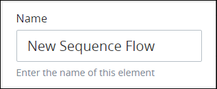
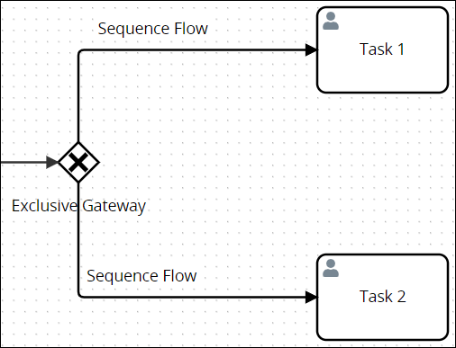
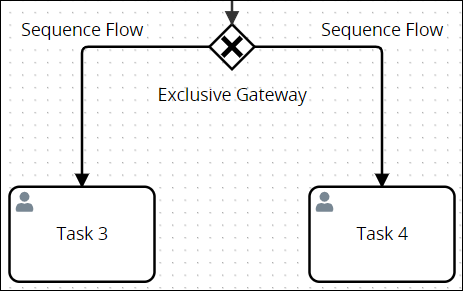

# Set Sequence Flow Elements to Indicate Workflow Routing

## Overview

Use a Sequence Flow element to indicate workflow routing between the connected elements. The direction in which the Sequence Flow points implies how [Request](../../../using-processmaker/requests/what-is-a-request.md) data is conveyed and utilized in the Process model. As a best practice, indicate a consistent direction of Sequence Flow elements: either left to right or top to bottom, to make Process models easier to understand.

Sequence Flow elements are not to be confused with [Message Flow](process-modeling-element-descriptions.md#message-flow) elements.

Sequence Flow elements have the following attributes in regards to specific Process model elements:

* From the context of a Process model element associated with a Sequence Flow element, that Sequence Flow element can be "incoming" or "outgoing." Consider the following Process model example to demonstrate their differences.  

  

  * **Incoming:** An incoming Sequence Flow element comes from its connecting element. In the example, the Sequence Flow element is incoming to the New Task element.  

    

  * **Outgoing:** An outgoing Sequence Flow goes to the connecting element. In the example, the Sequence Flow element is outgoing from the New Task element.  

    

* Text annotation elements and Pool elements do not participate in sequence flow.
* Sequence Flow elements cannot connect workflow between Process model elements within different Pool elements. Use [Message Flow](set-and-delete-message-flow-between-elements.md) elements to infer communication between elements in different Pool elements.
* A Start Event element begins the flow of a Request for that Process. Therefore, a Start Event cannot have an incoming Sequence Flow element.
* An End Event element terminates the flow of a Request for that Process. Therefore, an End Event cannot have an outgoing Sequence Flow element.
* Sequence Flow elements from [Exclusive Gateway](process-modeling-element-descriptions.md#exclusive-gateway) and [Inclusive Gateway](process-modeling-element-descriptions.md#inclusive-gateway) elements can be configured to specify under which condition a Request routes through that Sequence Flow element. See [Configure an Outgoing Sequence Flow Element from an Exclusive Gateway or Inclusive Gateway Element](the-quick-toolbar.md#configure-an-outgoing-sequence-flow-element-from-an-exclusive-gateway-or-inclusive-gateway-element).

## Set the Sequence Flow Element from One Connecting Element to Another


### Looking for Information about Message Flow Elements?

See [Set and Delete Message Flow Between Elements](set-and-delete-message-flow-between-elements.md).

### Permissions Required

Your user account or group membership must have the following permissions to set Sequence Flow elements in the Process model:

* Processes: View Processes
* Processes: Edit Processes

See the [Process](../../../processmaker-administration/permission-descriptions-for-users-and-groups.md#processes) permissions or ask your ProcessMaker Administrator for assistance.


Follow these steps to set the Sequence Flow element from one connecting element to another:

1. ​[View your Processes](../../viewing-processes/view-the-list-of-processes/view-your-processes.md#view-all-processes). The **Processes** page displays.
2. Click the **Open Modeler** iconto edit the selected Process model. Process Modeler displays.
3. Select the Process model element from which you want to set the workflow routing. Available options display to the right of the selected element. The solid-line Flow indicator is for Sequence Flows \(highlighted below\).  

   

4. Click the **Sequence Flow** icon.
5. Click the Process model element in which to set the workflow routing. The Sequence Flow element connects between the two \(2\) elements to indicate workflow routing.  

   

## Configure Sequence Flow Elements


Your user account or group membership must have the following permissions to configure Sequence Flows in the Process model:

* Processes: View Processes
* Processes: Edit Processes

See the [Process](../../../processmaker-administration/permission-descriptions-for-users-and-groups.md#processes) permissions or ask your ProcessMaker Administrator for assistance.


### Configure a Sequence Flow Element


This section discusses how to configure any Sequence Flow element except from an Exclusive Gateway element. See [Configure an Outgoing Sequence Flow Element from an Exclusive Gateway or Inclusive Gateway Element](the-quick-toolbar.md#configure-an-outgoing-sequence-flow-element-from-an-exclusive-gateway-or-inclusive-gateway-element) if looking for information to configure those Sequence Flow elements.


#### Edit the Identifier Value

Process Modeler automatically assigns a unique value to each Process element added to a Process model. However, an element's identifier value can be changed if it is unique to all other elements in the Process model, including the Process model's identifier value.


All identifier values for all elements in the Process model must be unique.


Follow these steps to edit the identifier value for a Sequence Flow element:

1. Select the Sequence Flow element from the Process model in which to edit its identifier value. The **Configuration** setting section displays.
2. Expand the **Configuration** setting section if it is not presently expanded. The **Identifier** field displays. This is a required field.  

   

3. In the **Identifier** field, edit the Sequence Flow element's identifier to a unique value from all elements in the Process model and then press **Enter**. The element's identifier value is changed.

#### Edit the Element Name

An element name is a human-readable reference for a Process element. Process Modeler automatically assigns the name of a Process element with its element type. However, an element's name can be changed.

Follow these steps to edit the name for a Sequence Flow element:

1. Select the Sequence Flow element from the Process model in which to edit its name. The **Configuration** setting section displays.
2. Expand the **Configuration** setting section if it is not presently expanded. The **Name** field displays.  

   

3. In the **Name** field, edit the selected element's name and then press **Enter**. The element's name is changed.

### Configure an Outgoing Sequence Flow Element from an Exclusive Gateway or Inclusive Gateway Element

Outgoing Sequence Flow elements from [Exclusive Gateway](process-modeling-element-descriptions.md#exclusive-gateway) and [Inclusive Gateway](process-modeling-element-descriptions.md#inclusive-gateway) elements have the following settings as do other Sequence Flow elements:

* [Identifier value](the-quick-toolbar.md#edit-the-identifier-value)
* [Element name](the-quick-toolbar.md#edit-the-element-name)

Outgoing Sequence Flow elements from Exclusive Gateway and Inclusive Gateway elements have an additional setting to indicate under which condition\(s\) a Sequence Flow element triggers to route a Request's workflow to its connecting element. If the condition\(s\) set for that Sequence Flow element are met, then that element triggers. ProcessMaker evaluates a Sequence Flow element's condition\(s\) to trigger by reviewing the Request's data to an expression that describes the condition\(s\). Specify this condition using an expression syntax described in [Expression Syntax Components](the-quick-toolbar.md#expression-syntax-components). Each Sequence Flow element can only have one expression, but by using logical operators multiple conditions can be specified in that expression.

ProcessMaker evaluates the condition\(s\) set for each outgoing Sequence Flow element from an Exclusive Gateway or Inclusive Gateway element using the following protocol:

* **The Sequence Flow element does not have an expression:** If an outgoing Sequence Flow element does not have an expression, there are no conditions to evaluate; therefore, that Sequence Flow element always triggers. ProcessMaker routes workflow in the following way:
  * **Outgoing Sequence Flow elements for Exclusive Gateway elements:** If all outgoing Sequence Flow elements have no expressions from which to evaluate conditions, all Sequence Flow elements would trigger. However, Exclusive Gateway elements allow only one Sequence Flow element to trigger, so ProcessMaker triggers the top-most or left-most Sequence Flow element. In the example below, if neither Sequence Flow element has an expression to indicate routing conditions, then workflow routes to the "Task 1" element.  

    Likewise, in the example below, if neither Sequence Flow element has an expression to indicate routing conditions, then workflow routes to the "Task 3" element.  

    Note that Exclusive Gateway elements are designed to use expressions to evaluate Request data and thereby determine workflow routing. Therefore, not using expressions in outgoing Sequence Flow elements for Exclusive Gateway elements is not a best practice.

  * **Outgoing Sequence Flow elements for Inclusive Gateway elements:** Workflow always routes through that Sequence Flow element because conditions are always met. Inclusive Gateway elements allow as many Sequence Flow elements to trigger in which their conditions are met.
* **The Sequence Flow element has an expression:** The condition\(s\) in the Request data evaluate to determine if the condition\(s\) set in that Sequence Flow element is met. If so, that element triggers to route workflow from that outgoing Sequence Flow element to its connecting element. If not, then that Sequence Flow element does not trigger and workflow does not route through that element. ProcessMaker routes workflow in the following way:
  * Outgoing Sequence Flow elements for Exclusive Gateway elements: Exclusive Gateway elements allow only one Sequence Flow to trigger.
  * Outgoing Sequence Flow elements for Inclusive Gateway elements: Inclusive Gateway elements allow as many Sequence Flow elements to trigger in which their conditions are met. Therefore, all Sequence Flow elements in which their conditions are met trigger, thereby causing multiple workflow routes simultaneously for the same Request that stem from the Inclusive Gateway element. 


When designing the condition\(s\) for outgoing Sequence Flow elements from an Exclusive Gateway element, ensure that the condition for one of its outgoing Sequence Flow elements can trigger. Otherwise, it may be possible that no outgoing Sequence Flow elements trigger to continue workflow and a Request error occurs.


Follow these steps to set the condition under which an outgoing Sequence Flow element triggers from an Exclusive Gateway or Inclusive Gateway element:

1. Select the outgoing Sequence Flow element from the Exclusive Gateway or Inclusive Gateway element in which to set its workflow routing condition. The **Configuration** setting section displays.
2. Expand the **Configuration** setting section if it is not presently expanded. The **Expression** field displays.
3. In the **Expression** field, enter or edit the expression for the selected Sequence Flow element using the syntax components described in [Expression Syntax Components](the-quick-toolbar.md#expression-syntax-components), and then press **Enter**.

#### Expression Syntax Components

Use the following expression syntax components to compose the expression that describes under which condition\(s\) an outgoing Sequence Flow element triggers. Reference the ProcessMaker Screen control's **Variable Name** setting value to represent the variable. Example: `FullNameInput == "Louis Canera"`.

Combine expressions using logical operators. Example: `(not approved) or (cost > 500)`.

**Literals**

| Component | Syntax | Example |
| :--- | :--- | :--- |
| string | `"hello world"` or `'hello world'` | `FullNameInput == "Louis Canera"` |
| number | `100` | `cost > 500` |
| array | `[`value1`,` value2`]` | `myFruit not in ["apples", "oranges"]` |
| Boolean | `true` and `false` | `directorSigned` |

**Arithmetic Operations**

| Component | Syntax |
| :--- | :--- |
| addition | `+` |
| subtraction | `-` |
| multiplication | `*` |
| division | `/` |

**Logical Operators**

| Component | Syntax |
| :--- | :--- |
| not | `not` |
| and | `and` |
| or | `or` |

**Comparison Operators**

| Component | Syntax |
| :--- | :--- |
| equal to | `==` |
| not equal to | `!=` |
| less than | `<` |
| greater than | `>` |
| less than or equal to | `<=` |
| greater than or equal to | `>=` |

**String Operator**

| Component | Syntax |
| :--- | :--- |
| concatenate matches | `~` |

**Array Operators**

| Component | Syntax |
| :--- | :--- |
| contains | `in` |
| does not contain | `not in` |

**Ternary**

| Component | Syntax | Example |
| :--- | :--- | :--- |
| ternary | tested value `?` if true then value `:` else then value | `foo ? bar : baz` |

**Range**

| Component | Syntax | Example |
| :--- | :--- | :--- |
| range | `..` | `foo in 1..10` |

## Related Topics











