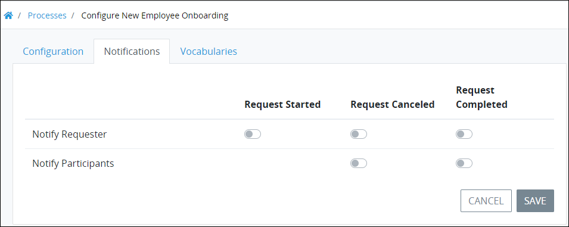

# Configure a Process

## Configure a Process


### Looking for Process Model Editing?

Process configuration is different than Process model editing. See [Model Your Process](../../process-design/model-your-process/) for topics.

### Permissions Required

Your user account or group membership must have the following permissions to configure a Process's configuration:

* Processes: View Processes
* Processes: Edit Processes

See the [Processes](../../../processmaker-administration/permission-descriptions-for-users-and-groups.md#processes) permissions or ask your ProcessMaker Administrator for assistance.


Follow these steps to configure a Process:

1. [View your active Processes.](./#view-your-processes) The **Processes** page displays.
2. Click the **Configure** iconfor your Process. The **Edit** page displays.  

   

3. Edit the following Process configuration as necessary:
   * In the **Name** field, edit the Process name. This is a required field.
   * In the **Description** field, edit the description of the Process. This is a required field.
   * From the **Category** drop-down menu, select to which category to assign the Process. This is a required field. See [Process Categories](../process-categories.md) for more information how this affects new [Requests](../../../using-processmaker/requests/what-is-a-request.md) for the Process.
   * From the **Cancel Request** drop-down, assign which ProcessMaker user\(s\) or group\(s\) have permission to [cancel Requests](../../../using-processmaker/requests/delete-a-request.md) from this Process. If no users or groups are selected, no one can cancel a Request from this Process. Type into the **Cancel Request** field to filter ProcessMaker users and/or groups that display in that field's drop-down menu. To remove a ProcessMaker user or group that is currently selected, click the icon for that selection or press `Enter` when the drop-down is visible.
   * From the **Cancel Screen** drop-down menu, select a ProcessMaker Screen to display when a Request for this Process is canceled.
   * From the **Edit Data** drop-down menu, assign which ProcessMaker user\(s\) or group\(s\) have permission to [edit Request data](../../../using-processmaker/requests/request-details/summary-for-completed-requests.md#editable-request-data) from this Process. To remove a ProcessMaker user or group that is currently selected, click the icon for that selection or press `Enter` when the drop-down is visible.
4. Click **Save**.

## Configure Process Notifications


Your user account or group membership must have the following permissions to configure a Process's notifications:

* Processes: View Processes
* Processes: Edit Processes

See the [Process](../../../processmaker-administration/permission-descriptions-for-users-and-groups.md#processes) permissions or ask your ProcessMaker Administrator for assistance.


Configure Process notifications to notify Process Requesters and/or Request participants when any of the following Request events occur:

* **Request started:** A Request for this Process started.
* **Request canceled:** A Request for this Process was canceled.
* **Request completed:** A Request for this Process completed.

Process notifications can be sent to the following sets of users or group members:

* **Requester:** A Requester is any user or group member who has been granted permission to start a Request for this Process.
* **Request participants:** A Request participant is any user or group member who participates in a specific Request for this Process. A Request participant is an individual who is assigned a Task in the Request.

Follow these steps to configure notifications for a Process:

1. [View your active Processes.](./#view-your-processes) The **Processes** page displays.
2. Select the **Config** iconfor your Process. The **Edit Configuration** page displays.
3. Click the **Notifications** tab.  

   

4. Toggle any of the following settings as necessary:
   * **Request Started:** Toggle the **Request Started** setting to indicate whether Requesters are notified that a Request from this Process started.
   * **Request Canceled:** Toggle the **Request Canceled** setting to indicate whether Requesters and/or Request participants are notified that a Request from this Process was canceled.
   * **Request Completed:** Toggle the **Request Completed** setting to indicate whether Requesters and/or Request participants are notified that a Request from this Process completed.
5. Click **Save**.

## Configure Which Vocabularies Are Available to a Process


### Package Required

Your ProcessMaker environment must have the Vocabularies package to make this Process configuration. See [Vocabularies](../../../package-development-distribution/package-a-connector/vocabularies.md).

### Permissions Required

Your user account or group membership must have the following permissions to configure a Process's available Vocabularies:

* Processes: View Processes
* Processes: Edit Processes

See the [Process](../../../processmaker-administration/permission-descriptions-for-users-and-groups.md#processes) permissions or ask your ProcessMaker Administrator for assistance.


Configure to which Vocabularies Process Owners in your organization have access. Process Owners use these Vocabularies to enforce a uniform JSON scheme for this Process. The Vocabularies package must be installed in your ProcessMaker environment to make this configuration.

Follow these steps to configure which Vocabularies are available to a Package:

1. [View your active Processes.](./#view-your-processes) The **Processes** page displays.
2. Select the **Config** iconfor your Process. The **Edit** page displays.
3. Click the **Vocabularies** tab. If the Vocabularies package is not installed then the **Vocabularies** tab is not visible and this configuration cannot be performed.  

   

4. From the **Select process vocabularies** drop-down, select which Vocabularies are available for this Process. If no Vocabularies are selected, no JSON scheme is enforced for this Process.

   If no Vocabularies are configured in your ProcessMaker environment, then the following message displays: **List is empty.** Create at least one Vocabulary. See ~~SOME TOPIC~~.

   Type into the **Select process vocabularies** field to filter Vocabularies that display in that field's drop-down menu. To remove a Vocabulary that is currently selected, click the icon for that selection or press `Enter` when the drop-down is visible.

5. Click **Save**.

## Related Topics



















