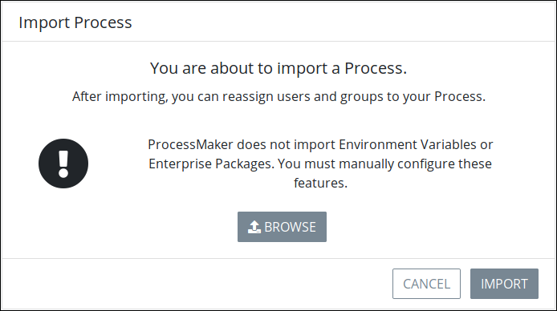
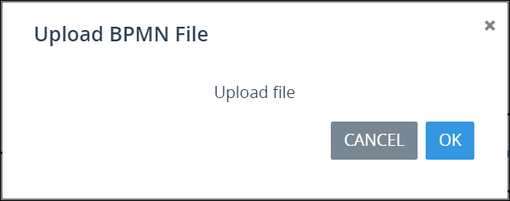

# Import a ProcessMaker Version 4 Process

## Overview

Import Processes into ProcessMaker Spark if the Process to be imported is BPMN 2.0 compliant.

Importing a Process helps you jump-start your own Process design by using someone else’s Process rather than starting from nothing. Suppose that you have a respected colleague that has designed a Process for her organization that you want to use for your team. Starting your Process model from hers gets you started faster.

### Import Validated ProcessMaker Spark Processes

Import validated ProcessMaker Spark Processes that have been [exported](export-a-bpmn-compliant-process.md) from the same [ProcessMaker Spark version](../../../using-processmaker/application-version-details.md#view-processmaker-version-information). A validated ProcessMaker Spark Process is [BPMN 2.0 compliant](https://www.omg.org/spec/BPMN/2.0/About-BPMN/) and has been [validated in Process Modeler](../../process-design/model-your-process/validate-bpmn-2.0-compliance.md) before that Process was exported. The Process can be imported from the same or different ProcessMaker Spark instance. Exported ProcessMaker Spark Processes have the `.spark` file extension.

The following ProcessMaker Spark components are imported from a validated ProcessMaker Spark Process if they are specified in that Process:

* [ProcessMaker Scripts](../../scripts/what-is-a-script.md) configured for [Script Task elements](../../process-design/model-your-process/add-and-configure-script-task-elements.md) as well as their Script configurations
* [ProcessMaker Screens](../../design-forms/what-is-a-form.md) configured for [Task elements](../../process-design/model-your-process/add-and-configure-task-elements.md) as well as routing rule expressions
* [Sequence Flows](../../process-design/model-your-process/the-quick-toolbar.md) and their routing rule expressions
* [ProcessMaker Environment Variables](../../environment-variable-management/what-is-an-environment-variable.md), but not the sensitive data an Environment Variable contained in the original Process

ProcessMaker Spark does not import [users](../../../processmaker-administration/add-users/what-is-a-user.md) or [groups](../../../processmaker-administration/assign-groups-to-users/what-is-a-group.md) associated with the original ProcessMaker Spark Process. Therefore, Task element assignments are not imported and must be configured after importing the Process.

See [Import a Validated ProcessMaker Spark Process](import-a-bpmn-compliant-process.md#import-a-validated-processmaker-spark-process).

### Import BPMN 2.0 Compliant Processes from Third-Party Modeling Applications

ProcessMaker Spark supports importing third-party processes if those processes are compliant to the [BPMN 2.0 specification](https://www.omg.org/spec/BPMN/2.0/About-BPMN/). When importing BPMN 2.0 compliant processes, ProcessMaker Spark imports the Process model that can be opened in [Process Modeler](../../process-design/what-is-process-modeling.md). ProcessMaker Spark ignores any functionality that the third-party tool may support that is not part of the BPMN 2.0 specification.

Despite that the imported Process is BPMN 2.0 compliant, you may need to edit the Process in Process Modeler for ProcessMaker Spark specific functionality.

See [Import a BPMN 2.0 Compliant Process Model from a Third-Party Application](import-a-bpmn-compliant-process.md#import-a-bpmn-2-0-compliant-process-model-from-a-third-party-application).

## Import a Validated ProcessMaker Spark Process


Your user account or group membership must have the following permissions to import a ProcessMaker Spark Process:

* Processes: View Processes
* Processes: Import Processes

See the [Process](../../../processmaker-administration/permission-descriptions-for-users-and-groups.md#processes) permissions or ask your ProcessMaker Administrator for assistance.


Follow these steps to import a validated ProcessMaker Spark Process:

1. [View your active Processes.](./#view-your-processes) The **Processes** page displays.
2. Click the **Import** button. The following message displays: **You are about to import a Process. User assignments and sensitive environment variables will not be imported.**  

   

3. Click **Browse** to locate the ProcessMaker Spark Process to import. ProcessMaker Spark Processes have the `.spark` file extension.
4. Click **Import**. The **Import Process** screen displays to indicate which components of the imported Process import correctly.  

   

5. Click the **List Processes** button. The **Processes** page displays the imported Process with the same name as the original ProcessMaker Spark Process except with a number "2" suffix.  

   


If the original ProcessMaker Spark Process cannot import successfully, the following message displays: **Unable to import the process.** Ensure that the original ProcessMaker Spark Process is BPMN 2.0 compliant.


## Import a BPMN 2.0 Compliant Process Model from a Third-Party Application


Your user account or group membership must have the following permissions to import a third-party BPMN 2.0 compliant process model:

* Processes: View Processes
* Processes: Import Processes

See the [Process](../../../processmaker-administration/permission-descriptions-for-users-and-groups.md#processes) permissions or ask your ProcessMaker Administrator for assistance.


Follow these steps to import a BPMN 2.0 compliant process model from a third-party application:

1. [View your Processes](https://processmaker.gitbook.io/processmaker-4-community/-LPblkrcFWowWJ6HZdhC/~/drafts/-LRhVZm0ddxDcGGdN5ZN/primary/designing-processes/viewing-processes/view-the-list-of-processes/view-your-processes#view-all-processes). The **Processes** page displays.
2. [Create a new Process](create-a-process.md) or click the **Open Modeler** iconin which to import the third-party process model. Process Modeler displays.
3. Click the **Upload BPMN File** icon. The **Upload BPMN File** screen displays.  

   

4. Click **Upload file**, and then browse for the third-party process model in which to import to Process Modeler.
5. Click **OK**. Process Modeler imports the third-party process model if it is BPMN 2.0 compliant.
6. Click the **Save** iconto save the imported process model.

## Related Topics























