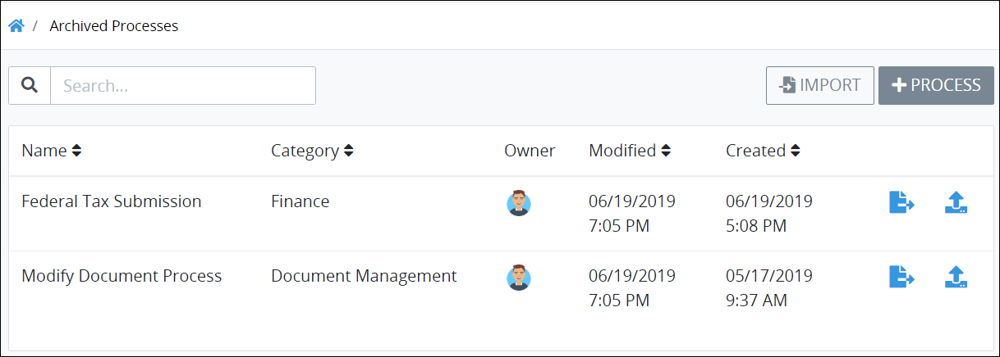

# Archive a Process

## Overview

An archived Process has the following attributes:

* Archived Processes are disabled until they are [restored](restore-a-process.md#restore-a-process).
* All archived Processes in the organization are accessible from the **Process Archive** page. See [View Archived Processes](remove-a-process.md#view-archived-processes).
* A Process with in-progress Requests can be archived. In-progress Requests for a Process that is archived will complete.

## View Archived Processes


Your user account or group membership must have the "Processes: View Processes" permission to view the list of Processes.

See the [Process](../../../processmaker-administration/permission-descriptions-for-users-and-groups.md#processes) permissions or ask your ProcessMaker Administrator for assistance.


Follow these steps to view all archived Processes in your organization:

1. [Log on](../../../using-processmaker/log-in.md#log-in) to ProcessMaker.
2. Click the **Processes** option from the top menu. The **Processes** page displays.
3. Click the **Archived Processes** iconin the left sidebar. The **Archived Processes** page displays all archived Processes in your organization.


Click the **Archived Processes** iconin the left sidebar when you are in other Process-related pages to view the **Process Archive** page.


The **Archived Processes** page displays the following information in tabular format about archived Processes:

* **Name:** The **Name** column displays the Process name.
* **Category:** The **Category** column displays in which Process Category the Process is assigned. See [Process Categories](../process-categories.md).
* **Owner:** The **Owner** column displays the Process Owner who maintains the Process. Hover your cursor over a user's avatar to view that person's full name.
* **Modified:** The **Modified** column displays the date and time the Process was last modified. The time zone setting to display the time is according to the ProcessMaker Spark server unless your [user profile's](../../../using-processmaker/profile-settings.md#change-your-profile-settings) **Time zone** setting is specified.
* **Created:** The **Created** column displays the date and time the Process was created. The time zone setting to display the time is according to the ProcessMaker Spark server unless your [user profile's](../../../using-processmaker/profile-settings.md#change-your-profile-settings) **Time zone** setting is specified.


### Need to Restore an Archived Process?

Click the **Restore** icon. See [Restore a Process](restore-a-process.md#restore-an-archived-process).

### No Archived Processes?

If no archived Processes exist, the following message displays: **No Data Available**.


## Archive a Process


Your user account or group membership must have the following permissions to archive a Process:

* Processes: View Processes
* Processes: Edit Processes

See the [Process](../../../processmaker-administration/permission-descriptions-for-users-and-groups.md#processes) permissions or ask your ProcessMaker Administrator for assistance.


Follow these steps to archive a Process:

1. [View your Processes.](./#view-your-processes) The **Processes** page displays.
2. Select the **Archive** iconfor your Process. The **Caution** screen displays to confirm archiving the Process.  

   

3. Click **Confirm** to archive the Process. The following message displays: **The process was archived.** The Process moves from the **Processes** page to the **Archived Processes** page. See [View Archived Processes](remove-a-process.md#view-archived-processes). Also see [Restore an Archived Process](restore-a-process.md#restore-a-process).

## Related Topics



















