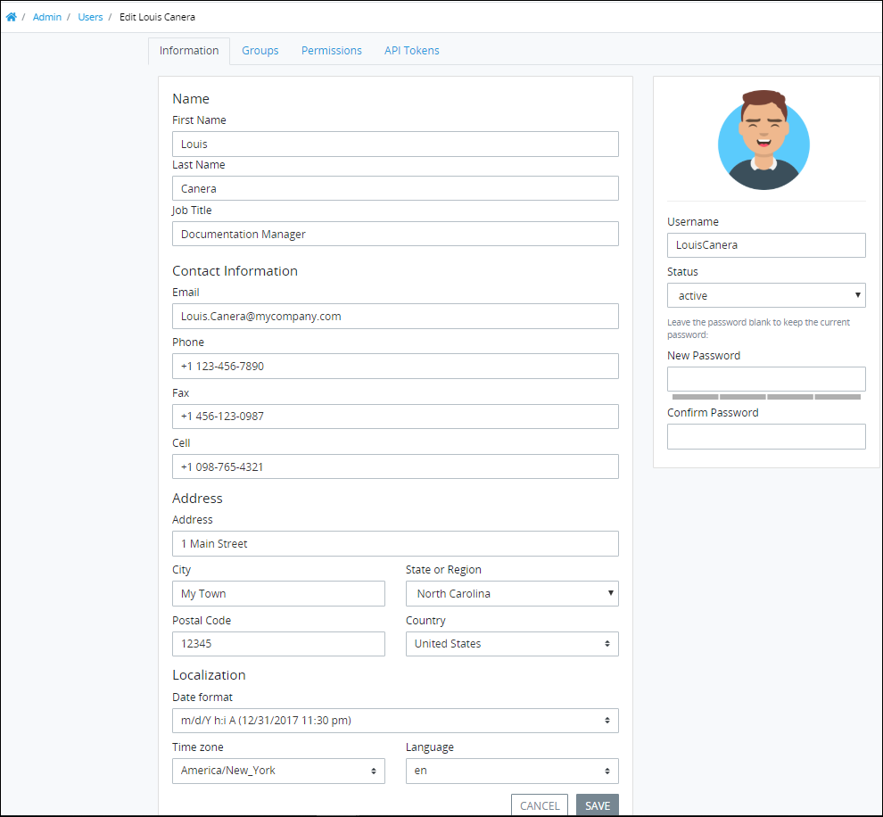
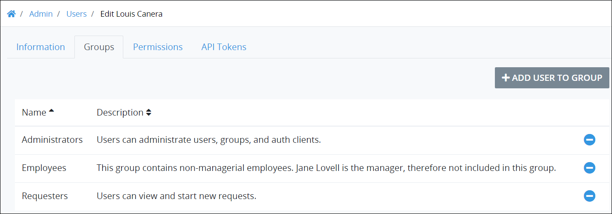
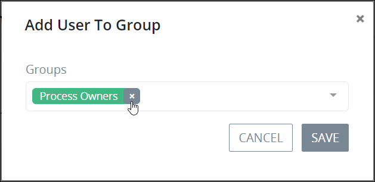
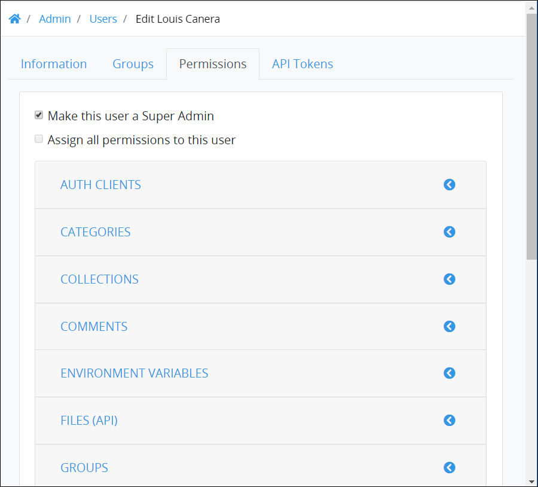
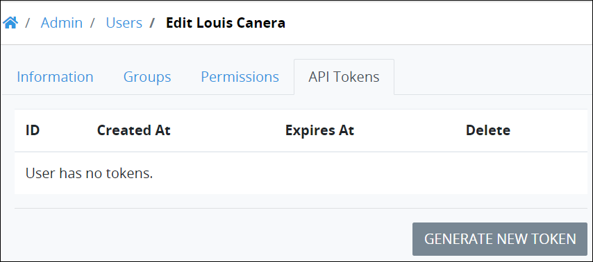
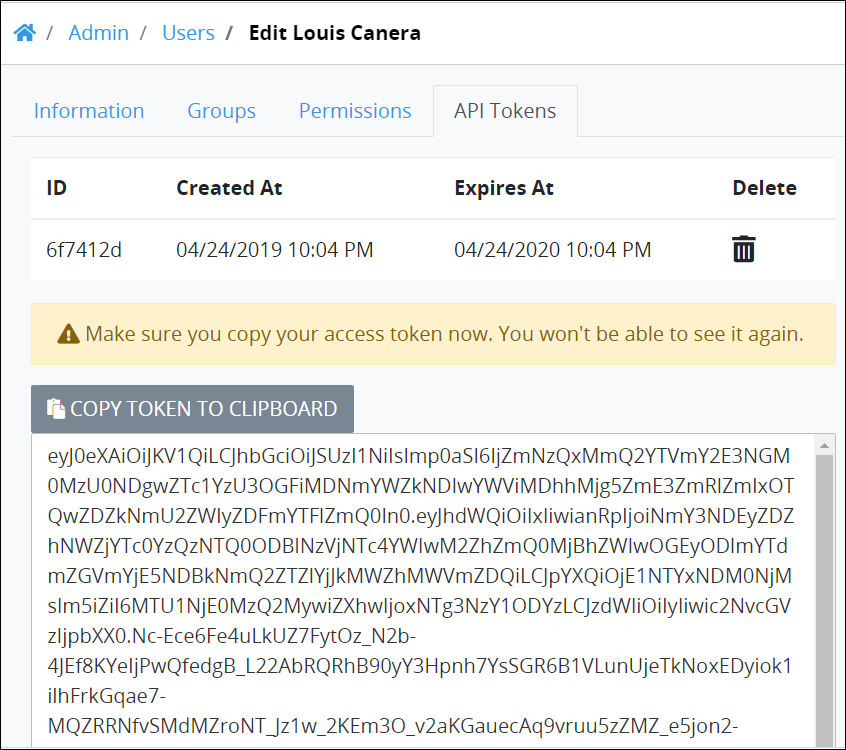
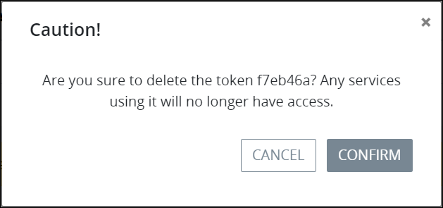

# Edit a User Account

## Edit a ProcessMaker User Account


Your user account or group membership must have the following permissions to edit a ProcessMaker user account:

* Users: View Users
* Users: Edit Users

See the [User](../../permission-descriptions-for-users-and-groups.md#users) permissions or ask your ProcessMaker Administrator for assistance.


Follow these steps to edit a ProcessMaker user account:

1. [View all ProcessMaker user accounts.](view-all-users.md) The **Users** page displays.
2. Click the **Edit** icon for the ProcessMaker user account to edit. The **Information** tab displays for that ProcessMaker user account.  

   

3. Edit the following information in the **Information** tab about the person associated with the ProcessMaker user account as necessary:
   * In the **Name** section, change the following information:
     * In the **First Name** field, edit the person's first name. This is a required field.
     * In the **Last Name** field, edit the person's last name. This is a required field.
     * In the **Job Title** field, edit the person's organizational job title.
   * In the **Contact Information** section, change the following information:
     * In the **Email** field, edit the person's business email address. This is a required field.
     * In the **Phone** field, edit the person's business telephone or cell phone number.
   * In the **Address** section, change the following information:
     * In the **Address** field, edit the person's business address.
     * In the **City** field, edit the city for the person's business address.
     * From the **State or Region** drop-down menu, select the state, region, or province for the person's business address.
     * In the **Postal code** field, edit the person's business postal code.
     * From the **Country** drop-down menu, select the country for the person's business address.
   * In the **Localization** section, change the following information:
     * From the **Date format** drop-down menu, select the format for how dates are displayed for this person from the following options:
       * m/d/Y \(12/31/2017\)
       * m/d/Y h:i A \(12/31/2017 11:30 pm\)
       * m/d/Y H:i \(12/31/2017 23:30\)
       * d/m/Y \(31/12/2017 23:30\)
       * Y/m/d \(2017/12/31\)
       * Y/m/d H:i \(2017/12/31 23:30\)
     * From the **Time zone** drop-down menu, select the time zone in which to display times for this person.
     * From the **Language** drop-down menu, select in which language to display ProcessMaker labels.
   * Select the avatar image to change the avatar for the ProcessMaker user account. If there is no avatar image, the initials for that person's full name display. When the avatar image is selected, the **Upload Avatar** screen displays to select a new avatar image. Click the **Browse** button to locate the new avatar image. After selecting the new image click **Continue** from the **Upload Avatar** screen.  

     

   * In the **Username** field, edit the username for the person's ProcessMaker user account. This is a required field.
   * From the **Status** drop-down menu, select the status of the ProcessMaker user account from the following options:
     * **Active:** An Active ProcessMaker user account is one in which a person can use it to log on to ProcessMaker.
     * **Inactive:** An Inactive ProcessMaker user account is one in which a person cannot use it to log on to ProcessMaker.
   * In the **New Password** field, edit the password to log on with the ProcessMaker user account. Leave the **New Password** field blank to keep the current password. Passwords must be at least eight \(8\) characters long. [Password special characters](https://www.owasp.org/index.php/Password_special_characters) are recommended. Password validation indicates how strong your password is if you enter a new password.
   * In the **Confirm Password** field, confirm that the password matches that entered into the **New Password** field if a new password was entered. If you entered a new password, password validation indicates if the **New Password** and **Confirm Password** values do not match.
4. Click **Save** if you made any changes in the **Information** tab and do not need to make other changes in the ProcessMaker user account. Otherwise, continue.
5. Click the **Groups** tab. The **Groups** tab displays the ProcessMaker [groups](../../assign-groups-to-users/what-is-a-group.md) of which that ProcessMaker user is a member. If no groups have been created, the following message displays: **No Data Available**. See [Create a Group](../../assign-groups-to-users/manage-groups/create-a-group.md#create-a-processmaker-group).  

   

   The **Groups** tab displays the following information:

   * **Group:** The **Group** column displays the name of the group of which the ProcessMaker user is a member.
   * **Description:** The **Description** column displays the description of the group.

6. In the **Groups** tab, change which ProcessMaker group\(s\) to which that ProcessMaker user is a member if necessary:
   * **Follow these steps to add the ProcessMaker user to a ProcessMaker group:**
     1. Click the **+Add User to Group** button. The **Add User To Group** screen displays.
     2. From the **Groups** drop-down menu, select which ProcessMaker group\(s\) to add the ProcessMaker user as a member. Multiple ProcessMaker groups may be added, one at a time, to this field. You may click the Remove icon to remove a ProcessMaker user account from the **Groups** drop-down menu.  

        

     3. Click **Save**. The selected ProcessMaker group\(s\) displays in the **Groups** tab.
   * **Follow these steps to remove the ProcessMaker user from a ProcessMaker group:**
     1. Click the **Remove from Group** iconto remove the ProcessMaker user from the selected ProcessMaker group. A confirmation screen displays to confirm the removal of the ProcessMaker group from the user account.  

        

     2. Click **Confirm**. The ProcessMaker user is no longer a member of that ProcessMaker group.
7. Click the **Permissions** tab. The **Permissions** tab displays permissions assigned to that ProcessMaker user account.  

   

8. In the **Permissions** tab, change which permissions from each permission category to assign that ProcessMaker user account if necessary. Follow these guidelines to change permission assignments:
   * Select the **Make this user a Super Admin** checkbox to grant this user account unrestricted access to the entire ProcessMaker instance. In doing so, ProcessMaker does not check permissions for ProcessMaker users with this setting selected. This allows such users to easily administer the ProcessMaker instance, including installing packages which might otherwise require permissions be granted to a user account to perform.
   * Select the **Assign all permissions to this user** checkbox to assign all permissions to the ProcessMaker user account.
   * Click on a permission category to expand the view of individual permissions within that category. Click on an expanded permission category to collapse that category. If you don't intend to assign this ProcessMaker user account with any group\(s\), then assign permissions to this user account. Note that if this ProcessMaker user account is assigned to any group\(s\), the permissions set in the group\(s\) take apply to those assigned to the user account. See [Permission Descriptions for Users and Groups](../../permission-descriptions-for-users-and-groups.md).
9. Click **Save** if you made any changes in the **Information** or **Permissions** tabs.

## Generate an API Token


Your user account or group membership must have the following permissions to edit a ProcessMaker user account:

* Users: View Users
* Users: Edit Users

See the [User](../../permission-descriptions-for-users-and-groups.md#users) permissions or ask your ProcessMaker Administrator for assistance.


Use an API token with a ProcessMaker user account to successfully make calls to the [ProcessMaker Spark REST API](https://develop-demo.bpm4.qa.processmaker.net/api/documentation) from an external third-party application or a [ProcessMaker Script](../../../designing-processes/scripts/what-is-a-script.md). The API token must not be expired for that API token to work.

A ProcessMaker user must have a valid API token to successfully make calls to the ProcessMaker Spark REST API from an external third-party application.

Follow these steps to generate an API token:

1. [View all ProcessMaker user accounts.](view-all-users.md) The **Users** page displays.
2. Select the **Edit** icon for the ProcessMaker user account to generate an API token to the ProcessMaker Spark REST API. The **Information** tab displays for that ProcessMaker user account.
3. Click the **API Tokens** tab.  

   

4. Click **Generate New Token**. The token displays.
5. Click **Copy Token to Clipboard**.  

   

6. Save the API token in the external third-party application. Alternatively, send the person using the ProcessMaker user account the API token. Make note of when the API token automatically expires.

## Delete an API Token


Your user account or group membership must have the following permissions to edit a ProcessMaker user account:

* Users: View Users
* Users: Edit Users

See the [User](../../permission-descriptions-for-users-and-groups.md#users) permissions or ask your ProcessMaker Administrator for assistance.



Deleting an API token revokes the ProcessMaker user holding the token from using an external third-party application from successfully making calls to the ProcessMaker Spark REST API. Deleting an API token cannot be undone.


Follow these steps to generate an API token:

1. [View all ProcessMaker user accounts.](view-all-users.md) The **Users** page displays.
2. Select the **Edit** icon for the ProcessMaker user account to generate an API token to the ProcessMaker Spark REST API. The **Information** tab displays for that ProcessMaker user account.
3. Click the **API Tokens** tab.
4. Click the **Delete** iconfor the API token to delete. A message displays to confirm deletion of the API token. The API token is referenced by its ID value.  

   

5. Click **Confirm**.

## Related Topics

















