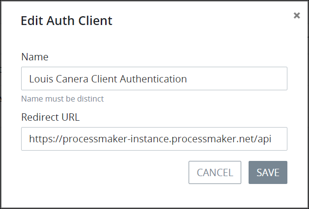

# Edit an Authenticated Client

## Edit an Authenticated Client


Your ProcessMaker user account or group membership must have the following permissions to edit client authentication unless your user account has the **Make this user a Super Admin** setting selected:

* Auth Clients: Edit Auth Clients
* Auth Clients: View Auth Clients

See the [Auth Clients](../../permission-descriptions-for-users-and-groups.md#auth-clients) permissions or ask your ProcessMaker Administrator for assistance.


Follow these steps to edit an authenticated client that allows that ProcessMaker user to access the [ProcessMaker RESTful API](https://staging-pm4.processmaker.net/api/documentation) in your ProcessMaker instance:

1. [View all authenticated clients.](view-all-client-authentication-keys.md#view-all-scripts) The **Auth Clients** page displays.
2. Click the **Edit** icon for the authenticated client to edit. The **Edit Auth Client** screen displays.  

   

3. In the **Name** field, enter to whom the authenticated client is granted. This name must be unique from all other authenticated clients. This is a required field.
4. Select any of the following options as necessary to indicate how the ProcessMaker user being granted access to the ProcessMaker API has that access:
   * **Enable Authorization Code Grant:** Select the **Enable Authorization Code Grant** checkbox to display the **Redirect URL** field in this screen to enter the URL that redirects the authenticated client to your ProcessMaker instance. If this checkbox is not selected, the **Redirect URL** field is hidden and that ProcessMaker user cannot access your ProcessMaker instance via a redirected URL.
   * **Enable Password Grant:** Select the **Enable Password Grant** checkbox to display the **Password** field in this screen to enter the password that the authenticated client uses to access your ProcessMaker instance. If this checkbox is not selected, the **Password** field is hidden and that ProcessMaker user cannot access your ProcessMaker instance via a password.
   * **Enable Personal Access Tokens:** Select the **Enable Personal Access Tokens** checkbox to display the **Access Token** field in this screen to enter the personal access token that the authenticated client uses to access your ProcessMaker instance. If this checkbox is not selected, the **Access Token** field is hidden and that ProcessMaker user cannot access your ProcessMaker instance via a personal access token.
5. Click **Save**.

## Related Topics









