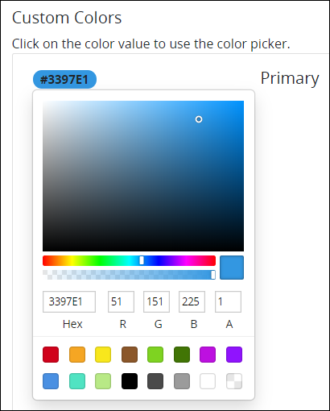

# Customize the ProcessMaker User Interface

## Overview

Customize how your ProcessMaker instance displays to all logged on ProcessMaker [users](add-users/what-is-a-user.md). The following aspects of the ProcessMaker application may be changed:

* **Default logo:** Change the logo that displays in the upper-left of all sidebars when the icon in the left sidebar is clicked. By default the ProcessMaker logo displays.  
* **Default icon:** Change the icon that displays in the upper-left of all sidebars. By default the ProcessMaker icon displays.  
* **Default color scheme:** Change any of the colors that comprise a ProcessMaker application color scheme. Below are the default Hex-formatted color settings for each component of a ProcessMaker application color scheme and how each is used in the color scheme:
  * **Primary:** The Primary color displays in all sidebars. Default hex color: \#3397E1.
  * **Secondary:** The Secondary color displays in all primary action buttons in pages and screens, such as the **Save** and **Cancel** buttons. Default hex color: \#788793.
  * **Success:** The Success color displays in messages that display when an application action is performed successfully. Default hex color: \#00BF9C.
  * **Info:** The Info color displays in messages that display informational content. Default hex color: \#17A2B8.
  * **Warning:** The Warning color displays in messages that display warning content. Default hex color: \#FBBE02.
  * **Danger:** The Danger color displays in messages that display danger content, in that disregarding the message may result in the loss of data. Default hex color: \#ED4757.
  * **Dark:** The Dark color displays ~~when?~~. Default hex color: \#000000.
  * **Light:** The Light color displays ~~when?~~. Default hex color: \#FFFFFF.
* **Default font:** Change the default font that displays in your ProcessMaker instance. The following fonts are available in the order they present in the application:
  * Default Font \(the default font\)
  * Mono Type
  * Arial
  * Arial Black
  * Bookman
  * Comic Sans MS
  * Courier New
  * Garamond
  * Georgia
  * Helvetica
  * Impact
  * Times New Roman
  * Verdana
  * Palatino
  * Trebuchet MS

## Customize the ProcessMaker User Interface


Your user account must have the **Make this user a Super Admin** option selected to customize the ProcessMaker user interface.

See [Edit a User Account](add-users/manage-user-accounts/edit-a-user-account.md#edit-a-processmaker-user-account) or ask your ProcessMaker Administrator for assistance.


Follow these steps to customize the ProcessMaker user interface in your instance:

1. [Log on](../using-processmaker/log-in.md#log-in) to ProcessMaker.
2. Click the **Admin** option from the top menu. The **Users** page displays.
3. Click the **Customize UI** icon. The **Customize UI** page displays.
4. The logo and icon in the ProcessMaker user interface work together: the logo represents the complete name, tagline and any other trademarked assets for the brand; the icon represents the stand-alone icon for the brand. In ProcessMaker, the logo displays when the icon is clicked; the icon displays again when the logo is clicked.

   Follow these guidelines to change the default logo and icon, if necessary:

   1. From the **Custom Logo** field, click the **Upload File** button, and then locate the image to display as the brand's logo. Use a transparent PNG image at 150 by 40 pixels for best results.
   2. From the **Custom Icon** field, click the **Upload File** button, and then locate the image to display as the brand's icon. Use a transparent PNG image at 40 by 40 pixels for best results.

5. Follow these guidelines to change any of the colors that comprise a ProcessMaker application color scheme \(as described in the [Overview](customize-the-processmaker-user-interface.md) section\), if necessary:
   1. Click the hex color value for the color that you want to change. The color picker palette displays.  
   2. Do one of the following:
      * In the **Hex** field, enter the hex color value for your selected color, and then press **Enter**.
      * Enter the RGBA \(red, green, blue and alpha\) color values for your selected color.
      * Click one of the color swatches \(or the transparency swatch\) to select your color.
      * Click inside the color palette to select your color.
6. From the **Custom Font** drop-down menu, optionally select one of the following fonts that displays content in the ProcessMaker application:
   * Default Font \(the default font\)
   * Mono Type
   * Arial
   * Arial Black
   * Bookman
   * Comic Sans MS
   * Courier New
   * Garamond
   * Georgia
   * Helvetica
   * Impact
   * Times New Roman
   * Verdana
   * Palatino
   * Trebuchet MS
7. Click **Save**.

## Related Topics

