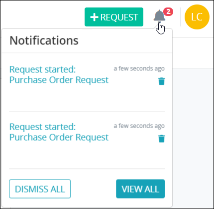
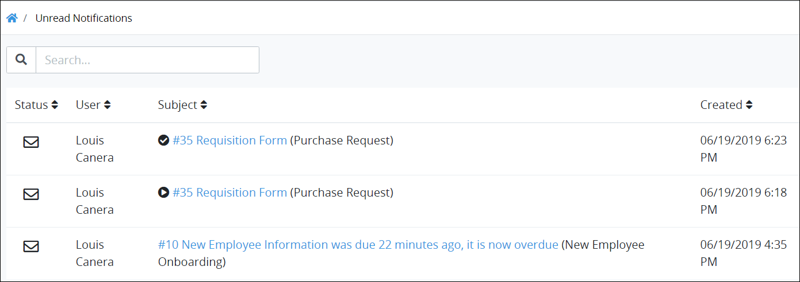
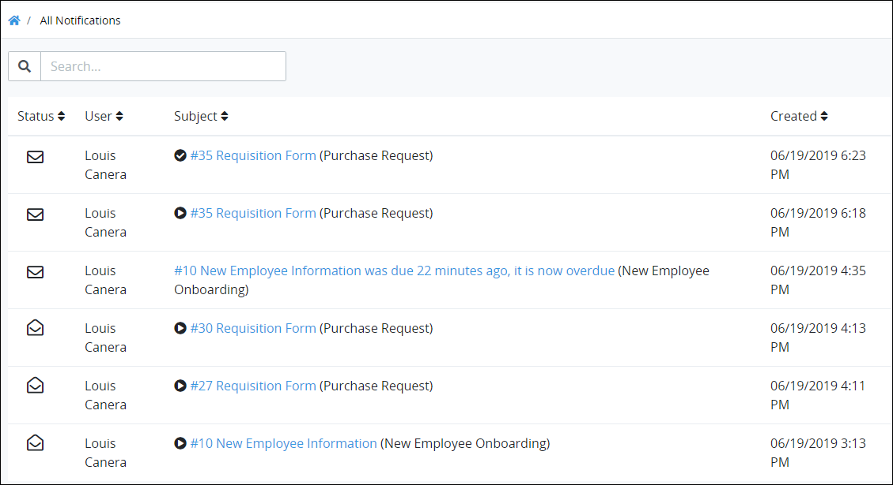

# Notifications

## Notifications to Request Participants

Request participants receive notifications when the following events occur:

* A Request participant is assigned a Task with information about that Task.
* The Requester's Request is completed with information about who completed the Request and when.
* The Requester's Request is canceled with information about who canceled the Request and when.

## View New Notifications

The notifications screen displays your newly assigned Tasks. To view new notifications, click the Notifications iconwhen it indicates you have one or more notifications.

Notifications remain visible until you do one of the following:

* Select an assigned Task represented by the blue-colored text. Doing so opens the Task.
* Click the **Dismiss** button to hide the selected notification.

Each notification displays the following information:

* **Task name:** The name of the assigned Task displays as a hyperlink to that Task.
* **Task assignment date:** To the right of the Task name displays the date and time in which the notification was sent to you. The time zone setting to display the time is according to the ProcessMaker 4 server unless your [user profile's](profile-settings.md#change-your-profile-settings) **Time zone** setting is specified.
* **Request name:** Below the assigned Task displays the name of the Request associated with that Task.
* **Requester:** Below the Request name is the full name of the person who started the Request.
* **Dismiss button:** The **Dismiss** button displays at the bottom-right of the notification.


If you have no notifications when you select the Notifications icon, the following message displays: **No Tasks Found**.


## View Unread Notifications

The **Unread Notifications** page displays all your unread notifications. To view all of your unread notifications, click the Notifications iconand then do one of the following:

* Select **View All Notifications**. This text displays only if you have no new notifications.
* Select **All Unread Notifications**. This text displays only if you have two or more notifications.


Click the **Unread Notifications** iconin the left side bar when you are viewing the **All Notifications** page.


The **Unread Notifications** page displays the following information in tabular format:

* **Status:** The **Status** column displays the unread status iconto indicate the notification is unread.
* **User:** The **User** column displays to whom the notification applies. This user is often you, but it might also include others such as a person who canceled a Request.
* **Subject:** The **Subject** column displays the subject of the notification. If the subject pertains to an assigned Task, the subject includes the following:
  * The name of the Task displays in blue-colored text. Select the Task name to open the Task.
  * The name of the Request associated with the Task displays in parentheses.
* **Date Created:** The **Date Created** column displays when the notification was sent to you. The time zone setting to display the time is according to the ProcessMaker 4 server unless your [user profile's](profile-settings.md#change-your-profile-settings) **Time zone** setting is specified.

### Search for a Notification

Search for any notification displaying in the **Unread Notifications** page.

To search for a notification in the **Unread Notifications** page, select the **Search** field and then enter text to filter notifications using any of the following criteria:

* **Username:** Search for the user associated with the notification.
* **Subject:** Search by the subject of the notification.

## View All Notifications

Follow these steps to view all your notifications:

1. [View your unread notifications.](notifications.md#view-unread-notifications) The **Unread Notifications** page displays.
2. Click the **All Notifications** iconin the left side bar. The **All Notifications** page displays.

The **All Notifications** page displays the following information in tabular format:

* **Status:** The **Status** column displays the status of the notification using one of the following icons:
  * **Unread status****:** The notification is unread.
  * **Read status****:** The notification is either read or dismissed when the notification was viewed.
* **User:** The **User** column displays to whom the notification applies. This user is often you, but it might also include others such as a person who canceled a Request.
* **Subject:** The **Subject** column displays the subject of the notification. If the subject pertains to an assigned Task, the subject includes the following:
  * The name of the Task displays in blue-colored text. Select the Task name to open the Task.
  * The name of the Request associated with the Task displays in parentheses.
* **Date Created:** The **Date Created** column displays when the notification was sent to you. The time zone setting to display the time is according to the ProcessMaker 4 server unless your [user profile's](profile-settings.md#change-your-profile-settings) **Time zone** setting is specified.

### Search for a Notification

Search for any notification displaying in the **All Notifications** page.

To search for a notification in the **All Notifications** page, select the **Search** field and then enter text to filter notifications using any of the following criteria:

* **Username:** Search for the user associated with the notification.
* **Subject:** Search by the subject of the notification.

## Related Topics



