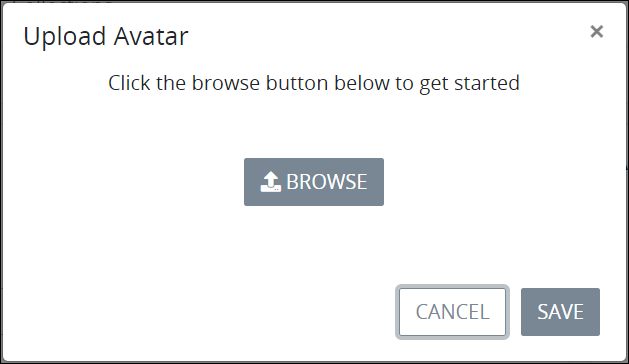
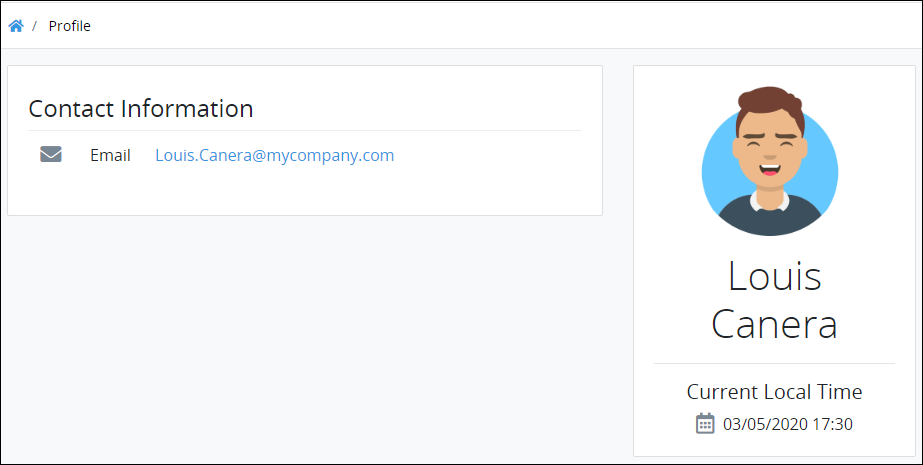

# Profile Settings

## Access Your Profile

Follow these steps to access your profile settings:

1. [Log on](log-in.md#log-in) to ProcessMaker.
2. Click your user avatar, and then select **Profile**.  

   

   The **Profile** page displays. See [Change Your Profile Settings](profile-settings.md#change-your-profile-settings).  

## Change Your Profile Settings


Passwords must adhere to the following protocol:

* Passwords must be at least eight \(8\) characters long.
* [Password special characters](https://www.owasp.org/index.php/Password_special_characters) are recommended.


Follow these steps to change your profile settings:

1. [Access your profile.](profile-settings.md#access-your-profile) The **Profile** page displays.  

   

2. The ProcessMaker Administrator may have entered some profile settings when your [user account was created](../processmaker-administration/add-users/manage-user-accounts/create-a-user-account.md#create-a-processmaker-user-account). Follow these guidelines to change your profile information as necessary:
   * In the **Name** section, change the following information:
     * In the **First Name** field, enter your first name. This is a required field.
     * In the **Last Name** field, enter your last name. This is a required field.
   * In the **Contact Information** section, change the following information:
     * In the **Email** field, enter your business email address. This is a required field.
     * In the **Phone** field, enter your business telephone or cell phone number.
   * In the **Address** section, change the following information:
     * In the **Address** field, enter your business address.
     * In the **City** field, enter the city for your business address.
     * From the **State or Region** drop-down menu, select the state, region, or province for the person's business address.
     * In the **Postal Code** field, enter your business postal code.
     * From the **Country** drop-down menu, select the country for your business address.
   * In the **Localization** section, change the following information:
     * In the **Date Format** drop-down menu, select the format for how dates are displayed from the following options:
       * m/d/Y \(12/31/2017\)
       * m/d/Y h:i A \(12/31/2017 11:30 pm\)
       * m/d/Y H:i \(12/31/2017 23:30\)
       * d/m/Y \(31/12/2017\)
       * d/m/Y \(31/12/2017 23:30\)
       * Y/m/d \(2017/12/31\)
       * Y/m/d H:i \(2017/12/31 23:30\)
     * From the **Time Zone** drop-down menu, select the time zone in which to display times.
     * From the **Language** drop-down menu, select in which language to display ProcessMaker labels. Note that English-language is the default language and the only natural language provided for the ProcessMaker open-source edition. However, if the Translation [package](../package-development-distribution/first-topic.md) is installed to your ProcessMaker instance, you may change the ProcessMaker labels to French, German, or Spanish. Changing this profile setting only affects this ProcessMaker user account. Contact [ProcessMaker Sales](mailto:sales@processmaker.com) or ask your ProcessMaker sales representative how the [Translation package](../package-development-distribution/package-a-connector/non-english-language-packages.md) can be installed in your ProcessMaker instance.

       Optionally, select one of the following non-English languages if the Translation package is installed:

       * **French:** Select the **fr** option.
       * **German:** Select the **de** option.
       * **Spanish:** Select the **es** option.
3. Click the avatar image to change the avatar for the ProcessMaker user account if necessary. If there is no avatar image, the initials of your full name display. When the avatar image is selected, the **Upload Avatar** screen displays to select a new avatar image. Click the **Browse** button to locate the new avatar image. After selecting the new image, adjust its size for display, and then click **Continue** from the **Upload Avatar** screen.  

   

4. In the **Username** field, change your username if necessary. This is a required field.
5. Follow these guidelines to change your password if necessary:
   * In the **New Password** field, enter your new password. Leave the **New Password** field blank to keep the current password. Password validation indicates how strong your password is if you enter a new password.
   * In the **Confirm Password** field, confirm that the password matches that entered into the **New Password** field if a new password is entered. If you entered a new password, password validation indicates if the **New Password** and **Confirm Password** values do not match.
6. Click **Save**. The following message displays: **Your profile was saved**.

## View Another User's Profile Information

To view another user's profile information, click that person's avatar.

After clicking the avatar, that person's profile information displays. Each ProcessMaker user is responsible for profile content.


Hover your cursor over a user's avatar to view that person's full name.


## Related Topics







