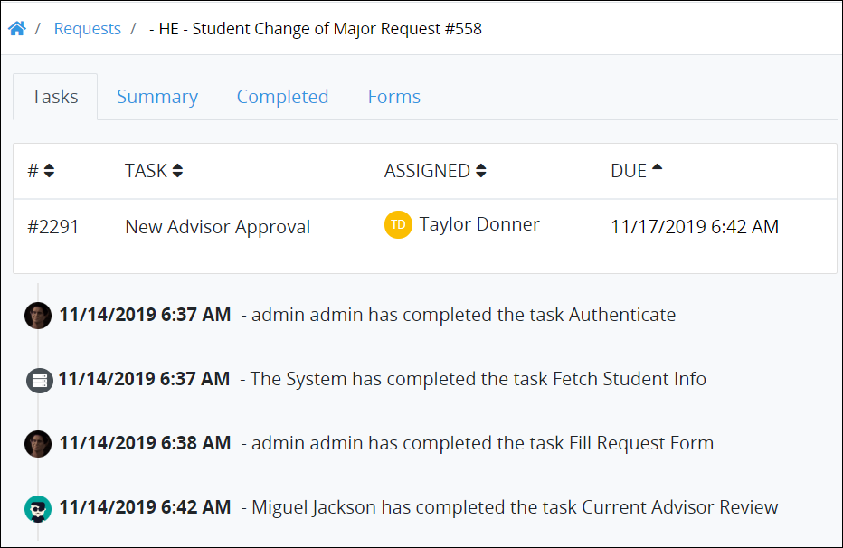
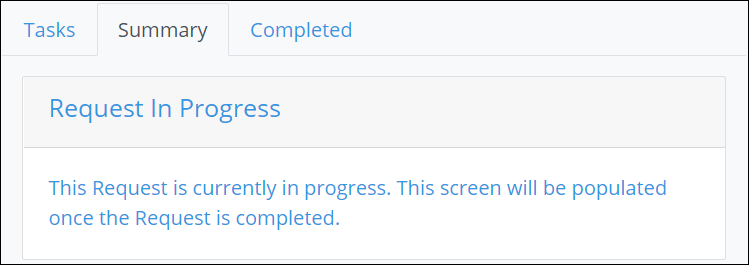
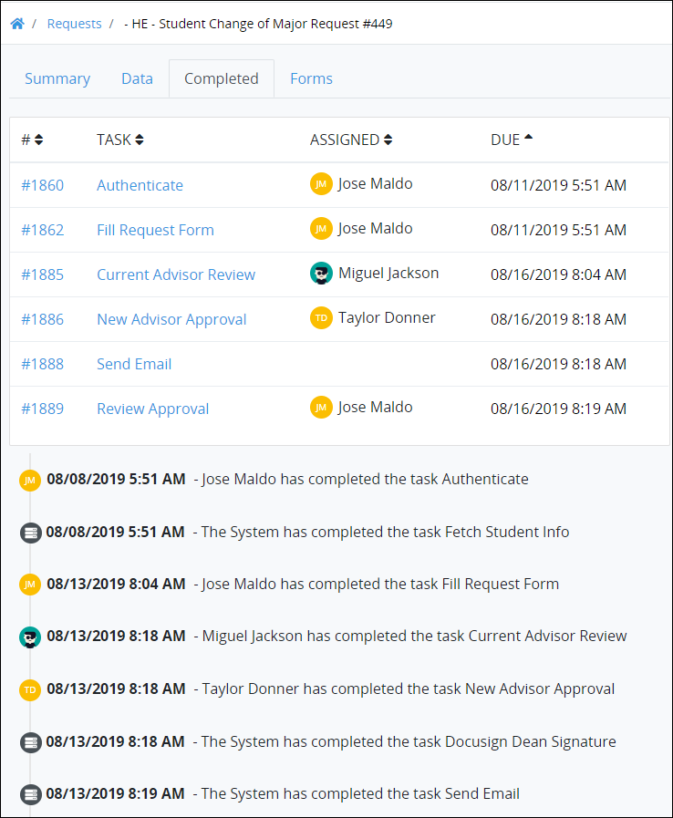

# View Request Information

A ProcessMaker Administrator can create a custom format and style for how Request information displays for your organization. This topic discusses how ProcessMaker 4 displays Request information by default.

To view information about a Request, do one of the following:

* From the **Name** column, click the Process name associated with the Request that you want to view.
* Click the Open Request iconfor the Request in which you want to view information.

## Information for In-Progress Requests

This section discusses how information displays for in-progress Requests.

### Tasks

The **Tasks** tab displays summary information for all upcoming Tasks in the Request.

The **Tasks** tab displays the following information in tabular format:

* **Task:** The **Task** column displays the name of each Task to be completed for the selected Request for all Request participants. If a Task is assigned to you, a hyperlink displays in the Task name.
* **Assigned:** The **Assigned** column displays the avatar for the username to whom the Task is assigned.
* **Due Date:** The **Due Date** column displays the date the Task is due. The time zone setting to display the time is according to the ProcessMaker 4 server unless your [user profile's](../profile-settings.md#change-your-profile-settings) **Time zone** setting is specified.

Below the table, the history of the Request displays all Request actions. [See Request History](request-details.md#request-history).


### No Tasks?

If there are no Tasks for the selected Request, the following message displays: **No Data Available**.

### Display Information the Way You Want It

[Control how tabular information displays](../control-how-requests-display-in-a-tab.md), including how to sort columns or how many items display per page.


### Request Participants

In-progress Requests display information about the participants in a selected Request.

The following information displays about participants in a selected in-progress Request:

* **Requested By:** The **Requested By** field displays the avatar and full name of the person who started the selected Request. The Request may have been started from a person manually interacting with a form or as an authenticated user to the ProcessMaker 4 [REST API](https://develop.bpm4.qa.processmaker.net/api/documentation).
* **Cancel Request:** The **Cancel Request** field allows a Request participant or ProcessMaker Administrator to cancel the Request if that Request participant's user account has the appropriate permission to cancel Requests for that process. If your user account does not have the permission\(s\) to cancel Requests for that process, the **Cancel Request** field does not display. See [Cancel a Request](delete-a-request.md) for more information.
* **Participants:** The **Participants** field displays the avatars of all participants in the selected Request to that time.
* **Request creation date:** The date and time the Request was created displays below the **Participants** field. The time zone setting to display the time is according to the ProcessMaker 4 server unless your [user profile's](../profile-settings.md#change-your-profile-settings) **Time zone** setting is specified.

## Information for Completed Requests

This section discusses how information displays for completed Requests.

### Summary

The **Summary** tab displays a summary of all information entered into the completed Request. Request information may be entered in the following ways:

* Request participants manually enter information into ProcessMaker Screens. ProcessMaker Screens are digital forms.
* Authenticated users submit data through the ProcessMaker 4 [REST API](https://develop.bpm4.qa.processmaker.net/api/documentation).

~~Process Owners can specify how information displays in the **Summary** tab. By default,~~ the **Summary** tab displays the JSON-formatted key/value pairs that represent ProcessMaker Screens. Information is displayed in tabular format:

* **KEY:** The **KEY** column displays the JSON key name that represents the ProcessMaker Screen control name the Request participant entered data or specified through the ProcessMaker 4 [REST API](https://develop.bpm4.qa.processmaker.net/api/documentation). For example, a Text control to enter your name could be named `Full Name` which would be displayed in the **Key** column here.
* **VALUE:** The **VALUE** column displays that key's value as entered by a person manually interacting with a form or specified through the ProcessMaker 4 [REST API](https://develop.bpm4.qa.processmaker.net/api/documentation). For example, a Text control to enter your name could have the value `John Doe` which would be displayed in the **Value** column here.

Below the table, the history of the Request displays all Request actions. [See Request History](request-details.md#request-history).


### Summary Tab Displays Information for Completed Requests

The **Summary** tab only displays information for completed Requests. If you select the **Summary** tab for an in-progress Request, the following message displays: **Request In Progress: This Request is currently in progress. This screen will be populated once the Request is completed.**

### Display Information the Way You Want It

[Control how tabular information displays](../control-how-requests-display-in-a-tab.md), including how to sort columns or how many items display per page.


### Data

The **Data** tab displays the summary of values from a completed Request similarly to the [**Summary**](request-details.md#summary) tab.  However, values in the **Data** tab are editable and be saved to change them from the values submitted in the Request. The **Data** column only displays when that Request is completed.

Follow these steps to revise and save the values in the completed Request from those values that were submitted in the Request:

1. View the **Data** tab. Note that the Data tab does not display until the Request is completed.
2. From the editable fields in the **Values** column, change the values that were submitted during the Request to those that you want.
3. Click **Save**. The following message displays when the Request values are changed: **Request data successfully updated**.

Below the table, the history of the Request displays all Request actions. [See Request History](request-details.md#request-history).

### Summary of Tasks for the Completed Request

The **Completed** tab displays a summary of all tasks for the selected completed Request.

The **Completed** tab displays the following information:

* **Task:** The **Task** column displays the name of each completed Task in the selected Request. 
* **Assigned:** The **Assigned** column displays the avatar for the username to whom the Task was assigned.
* **Due Date:** The **Due Date** column displays the date the Task is due. The time zone setting to display the time is according to the ProcessMaker 4 server unless your [user profile's](../profile-settings.md#change-your-profile-settings) **Time zone** setting is specified.

Below the table, the history of the Request displays all Request actions. [See Request History](request-details.md#request-history).


### Not a Completed Request?

If the selected Request is not completed, the following message displays: **No Data Available**.

### Display Information the Way You Want It

[Control how tabular information displays](../control-how-requests-display-in-a-tab.md), including how to sort columns or how many items display per page.


### Request Participants

Completed Requests display information about the participants for a selected Request.

The following information displays about participants in a selected completed Request:

* **Requested By:** The **Requested By** field displays the avatar and full name of the person who started the selected Request. The Request may have been started from a person manually interacting with a form or as an authenticated user to the ProcessMaker 4 [REST API](https://develop.bpm4.qa.processmaker.net/api/documentation).
* **Participants:** The **Participants** field displays the avatars of all participants in the selected Request.
* **Request completion date:** The date and time the Request was completed displays below the **Participants** field. The time zone setting to display the time is according to the ProcessMaker 4 server unless your [user profile's](../profile-settings.md#change-your-profile-settings) **Time zone** setting is specified.

Below the table, the history of the Request displays all Request actions. [See Request History](request-details.md#request-history).

## Error Information for a Request

### Summary of the Error

The **Errors** tab displays summary information about an error for a selected Request if an error occurred. If a Request error has not occurred, the **Errors** tab does not display.

The **Errors** tab displays the following information:

* **Error:** The **Error** column displays the error description. 
* **Time:** The **Time** column displays how long ago the error occurred.
* **Element:** The **Element** column displays to which element the error occurred within the Process associated with the Request.

Below the table, the history of the Request displays all Request actions. [See Request History](request-details.md#request-history).

### Request Participants

Requests in which an error occurs display information about the participants for that Request.

The following information displays about participants in a selected Request in which an error occurred:

* **Requested By:** The **Requested By** field displays the avatar and full name of the person who started the selected Request. The Request may have been started from a person manually interacting with a form or as an authenticated user to the ProcessMaker 4 [REST API](https://develop.bpm4.qa.processmaker.net/api/documentation).
* **Participants:** The **Participants** field displays the avatars of all participants in the selected Request.
* **Request error date:** The date and time in which the Request error occurred displays below the **Participants** field. The time zone setting to display the time is according to the ProcessMaker 4 server unless your [user profile's](../profile-settings.md#change-your-profile-settings) **Time zone** setting is specified.

## Request History

Below the **Error**/**Task**/**Summary**/**Data**/**Completed** tables, the history of the Request displays all Request actions: what each Request participant and ProcessMaker Script performed for this Request. The oldest Request actions display at the top of the Request history.

The following information displays about each event in the Request history:

## Related Topics

















