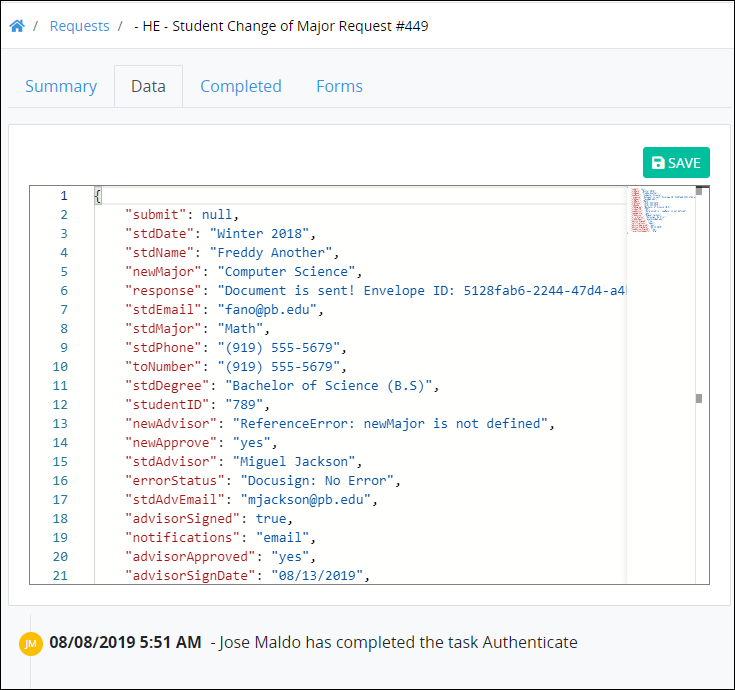
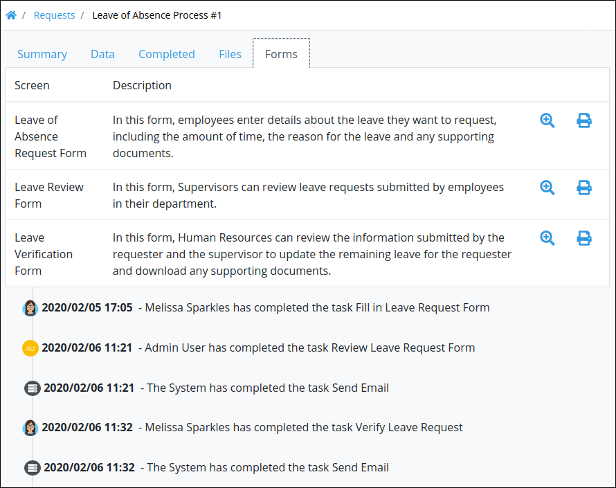

# Summary for Completed Requests

## Overview

Follow these steps to view a summary for a completed [Request](../what-is-a-request.md):

1. Ensure that you are [logged on](../../log-in.md#log-on) to ProcessMaker.
2. View one of the following **Requests** pages:
   * **My Requests** page. See [View Your Requests That You Started](../view-started-requests.md#view-your-requests).
   * **Completed** page. See [View Completed Requests](../view-completed-requests.md#view-completed-requests-in-which-you-participated).
   * **All Requests** page. See [View All Requests](../view-all-requests.md#view-all-requests-in-your-organization). \(Note that your ProcessMaker user account must have the [**Requests: View All Requests** permission](../../../processmaker-administration/permission-descriptions-for-users-and-groups.md#requests) to view the **All Requests** page.\)
3. Do one of the following:
   * From the **\#** column in the Request page, click the Request number associated with the Process that you want to view. That Request's summary displays.
   * Click the **Open Request** iconfor a Request. That Request's summary displays.

## Values in the Request

The **Summary** tab displays the summary of information entered into the completed Request via [ProcessMaker Screens](../../../designing-processes/design-forms/what-is-a-form.md). The **Summary** tab may display values in the Request in the following ways:

* By default, completed Request data displays in JSON format key-value pairs in tabular format that represent ProcessMaker Screen control data.
* Configure a [Display](../../../designing-processes/design-forms/screens-builder/types-for-screens.md#display)-type ProcessMaker Screen that summarizes specific information from the completed Request. See [Configure a Process](../../../designing-processes/viewing-processes/view-the-list-of-processes/edit-the-name-description-category-or-status-of-a-process.md#configure-a-process).

When the **Summary** tab displays the JSON-formatted key-value pairs from the completed Request data, the following information displays:

* **Key:** The **Key** column displays the JSON key name that represents the ProcessMaker Screen control name the Request participant entered data. For example, use a [Rich Text](../../../designing-processes/design-forms/screens-builder/control-descriptions/rich-text-control-settings.md#control-description) control to enter your company's name that has a [**Variable Name**](../../../designing-processes/design-forms/screens-builder/control-descriptions/rich-text-control-settings.md#configuration-panel-settings) setting value of `companyName` which would display in the **Key** column here.
* **Value:** The **Value** column displays that key's value as entered by a person manually interacting with a form. For example, use a Rich Text control to enter your name could have the value `John Doe` which would display in the **Value** column here.

Below the table, the history of the Request displays all Request actions. See [Request History](summary-for-completed-requests.md#request-history).


[Control how tabular information displays](../../control-how-requests-display-in-a-tab.md), including how to sort columns or how many items display per page.


## Editable Request Data


Your user account or group membership must have the "Requests: Edit Request Data" permission to edit Request data unless your user account has the **Make this user a Super Admin** setting selected.

See the [Request](https://processmaker.gitbook.io/processmaker/processmaker-administration/permission-descriptions-for-users-and-groups#requests) permissions or ask your ProcessMaker Administrator for assistance.


The **Data** tab displays the data from a completed Request in JSON format. The **Data** column only displays when that Request is completed.

Follow these steps to edit and save the completed Request data from those values that were submitted in the Request:

1. View the **Data** tab. Note that the **Data** tab does not display until the Request is completed.
2. From the editable JSON setting, change the values that were submitted during the Request to those that you want.
3. Click **Save**. The following message displays when the Request values are changed: **Request data successfully updated**.

Below the editable JSON setting, the history of the Request displays all Request actions. See [Request History](summary-for-completed-requests.md#request-history).

## Completed Tasks Summary

The **Completed** tab displays the summary of all assigned Tasks to Request participants for the selected completed Request.

The **Completed** tab displays the following summary in tabular format about assigned Tasks to Request participants for the completed Requests:

* **\#:** The **\#** column displays the Task ID associated with its [Process](../../../designing-processes/viewing-processes/what-is-a-process.md). Each time that Task is assigned to a Request participant, the ID for that Task increments by one.
* **Task:** The **Task** column displays the name of each completed Task in the selected Request. 
* **Assigned:** The **Assigned** column displays the username's avatar to whom the Task was assigned. Hover your cursor over a user's avatar to view that person's full name.
* **Due:** The **Due** column displays the date the Task was due. The time zone setting to display the time is according to the ProcessMaker instance unless your [user profile's](../../profile-settings.md#change-your-processmaker-settings) **Time zone** setting is specified.

Below the table, the history of the Request displays all Request actions. See [Request History](summary-for-completed-requests.md#request-history).


### Not a Completed Request?

If the selected Request is not completed, the following message displays: **No Data Available**.

### Display Information the Way You Want It

[Control how tabular information displays](../../control-how-requests-display-in-a-tab.md), including how to sort columns or how many items display per page.


## Files Associated with the Request

The **Files** tab displays the summary of all files associated with the Request to that time. The **Files** tab only displays in that Request summary if one of the following occurs:

* At least one file has been uploaded to that Request.
* A [PDF Generator connector](../../../designing-processes/process-design/model-processes-using-connectors/available-connectors-from-processmaker/pdf-generator-connector.md) in that Request has automatically generated a PDF of a [Display](../../../designing-processes/design-forms/screens-builder/types-for-screens.md)-type [ProcessMaker Screen](../../../designing-processes/design-forms/what-is-a-form.md). Note that to use the PDF Generator connector, the [PDF Generator package](../../../package-development-distribution/package-a-connector/pdf-generator-package.md) must be installed in your ProcessMaker instance. The PDF Generator [package](../../../package-development-distribution/first-topic.md) is not available in the ProcessMaker open-source edition. Contact [ProcessMaker Sales](https://www.processmaker.com/contact/) or ask your ProcessMaker sales representative how the PDF Generator package can be installed in your ProcessMaker instance.

The **Files** tab displays the following summary in tabular format about the files associated with the Request:

* **File Name:** The **File Name** column displays the name of each file associated with the selected Request. Click the file name to download it to your local computer or network location. 
* **MIME Type:** The **MIME Type** column displays the MIME type for the associated file.
* **Created At:** The **Created At** column displays the date the file became associated with the selected Request. The file became associated with the Request when the person who attached it submitted the [ProcessMaker Screen](../../../designing-processes/design-forms/what-is-a-form.md) to which the file was uploaded. The time zone setting to display the time is according to the ProcessMaker instance unless your [user profile's](../../profile-settings.md#change-your-processmaker-settings) **Time zone** setting is specified.

Below the table, the history of the Request displays all Request actions. See [Request History](summary-for-completed-requests.md#request-history).

## Forms Associated with the Request

The **Forms** tab displays the ProcessMaker [Screen](../../../designing-processes/design-forms/what-is-a-form.md) associated with each Task that each Request participant submitted in the Request to that time. For example, if a Request participant entered information into a ProcessMaker Screen, all Request participants can view the Request data that the Task assignee entered.

The **Forms** tab displays the following summary in tabular format about submitted ProcessMaker Screens by Request participants to that time in the Request:

* **Screen:** The **Screen** column displays the name of each submitted ProcessMaker Screen in the selected Request.
* **Description:** The **Description** column displays the description of each ProcessMaker Screen.


### View a ProcessMaker Screen and Its Submitted Request Data

To view a ProcessMaker Screen and the Request data submitted by a Request participant, click the **Details** icon. The submitted ProcessMaker Screen displays.  
 

Click the **Details** iconagain to hide the displayed ProcessMaker Screen and its Request data.

### Print the ProcessMaker Screen and its Submitted Request Data

To print a ProcessMaker and its Request data, click the **Print** icon. A print preview displays in a new browser window from which you can select an accessible printer.


Below the table, the history of the Request displays all Request actions. See [Request History](summary-for-in-progress-requests.md#request-history).


### There Are No Forms?

If the selected Request has no ProcessMaker Screens with submitted Request data, the following message displays: **No Data Available**.


## Summary

Each completed Request displays a summary of the Request.

The following summary displays about a completed Request:

* **Requested By:** The **Requested By** field displays the avatar and full name of the person who started the selected Request. Hover your cursor over a user's avatar to view that person's full name.
* **Child Requests:** The **Child Requests** field displays any child Requests associated with this Request, referred to as the parent Request when a child Request exists. A child Request is one from which this Request automatically started as designed in its associated Process. All child Requests have their own statuses since each routes independently of their parent Request. Click the link for any child Request to view the Request summary for that child Request. For example, a child Request represents a [Sub Process](https://processmaker.gitbook.io/processmaker/designing-processes/process-design/model-your-process/add-and-configure-sub-process-elements). If there are no child Requests associated with this Request, the **Child Requests** field does not display. The status icon displays beside each child Request. See [View Your Requests](../view-started-requests.md#view-your-requests) for descriptions of each status icon.
* **Parent Request:** The **Parent Request** field displays the parent Request associated with this Request, referred to as the child Request when a parent Request exists. The parent Request is one that automatically started this Request as designed in its associated Process. The parent Request has its own status since it routes independently of its child Request\(s\). Click the link for the parent Request to view the Request summary for that Request. For example, a parent Request represents the main Process that started a [Sub Process](https://processmaker.gitbook.io/processmaker/designing-processes/process-design/model-your-process/add-and-configure-sub-process-elements) Request. If there is no parent Request associated with this Request, the **Parent Request** field does not display. The status icon displays beside the parent Request. See [View Your Requests](../view-started-requests.md#view-your-requests) for descriptions of each status icon. Below is an example of a Parent Request in a Request summary.  
* **Participants:** The **Participants** field displays each Request participant's avatar in the selected Request. Hover your cursor over a user's avatar to view that person's full name.
* **Request completion date:** The date and time the Request was completed displays below the **Participants** field. The time zone setting to display the time is according to the ProcessMaker instance unless your [user profile's](../../profile-settings.md#change-your-processmaker-settings) **Time zone** setting is specified.

## Request History

Below the tabular information summarizing the Request displays that Request's history: all Request actions to that time. The oldest Request actions display at the top of the Request history.

The following information displays about each event in the Request history:

* **Request participant:** The Request participant who performed the action is represented by his or her avatar. Hover your cursor over a user's avatar to view that person's full name. If the ProcessMaker system performed an action by running a ProcessMaker Script or other automatic function, that action is represented by "S" avatar.
* **Date and time the action occurred:** To the right of the Request participant displays the date and time the Request action occurred. The time zone setting to display the time is according to the ProcessMaker instance unless your [user profile's](../../profile-settings.md#change-your-processmaker-settings) **Time zone** setting is specified.
* **Description of the action:** To the right of when the Request action occurred displays a description of that action. The ProcessMaker system generates this action description.

## Related Topics



















