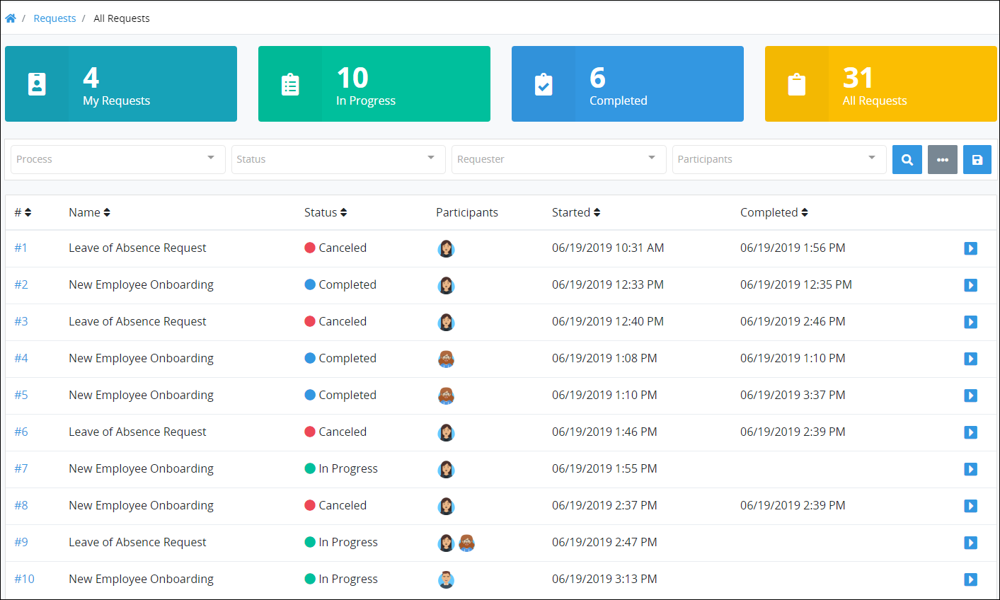

# View All Requests

## View All Requests in Your Organization

The **All Requests** page displays all Requests in your organization regardless of whether you participated in them. Request information displays in tabular format.


Your user account or group membership must have the "Requests: View All Requests" permission to view the list of all Requests.

See the [Request permissions](../../processmaker-administration/permission-descriptions-for-users-and-groups.md#requests) or ask your ProcessMaker Administrator for assistance.


Follow these steps to view all Requests in your organization:

1. Do one of the following:
   * Click the **Requests** option from the top menu if it is not currently displayed. The **My Requests** page displays.
   * Click the Home breadcrumb iconif the **Requests** page is not currently displayed. The **My Requests** page displays.
2. Click the **All Requests** tab or click the **All** iconfrom the left sidebar. The **All Requests** page displays.

The **All Requests** page displays the following information in tabular format about all Requests:

* **\#:** The **\#** column displays the Request number associated with the Process. This number represents the sequential occurrence of that Process.
* **Name:** The **Name** column displays the Process name associated with the Request. Click the Process name to [view the Request summary](request-details/).
* **Status:** The **Status** column displays the status of the Request. The following are possible statuses:
  * **In Progress:** The Request is in-progress and is represented by theicon.
  * **Completed:** The Request is completed and is represented by theicon.
  * **Canceled:** The Request has been canceled and is represented by theicon. See [Cancel a Request](delete-a-request.md).
  * **Error:** An error occurred with the Request and is represented by theicon. [View the Request summary](request-details/#error-information-for-a-request) to see the error.
* **Participants:** The **Participants** column displays each Request participant's avatar. Hover your cursor over a user's avatar to view that person's full name.
* **Started:** The **Started** column displays the date and time you made the Request. The time zone setting to display the time is according to the ProcessMaker 4 server unless your [user profile's](../profile-settings.md#change-your-profile-settings) **Time zone** setting is specified.
* **Completed:** The **Completed** column displays the date and time the Request was completed. If the Request is not completed, this field displays no value for that Request. The time zone setting to display the time is according to the ProcessMaker 4 server unless your [user profile's](../profile-settings.md#change-your-profile-settings) **Time zone** setting is specified.


### View a Request Summary

To [view a Request summary](request-details/), do one of the following:

* From the **\#** column, click the Request number associated with the Process displaying in the **Name** column to view its summary. This number represents the sequential occurrence of that Process.
* Click the **Open Request** iconfor the Request to view its summary.

### Search for a Request

Use Request data to search for Requests on this page based on the following criteria:

* **Process:** Search using one or more Process names associated with a Request.
* **Status:** Search using one or more of the following Request statuses:
  * **In progress:** Include Requests that are in progress as part of your search criteria.
  * **Completed:** Include Requests that are completed as part of your search criteria.
  * **Error:** Include Requests that are in error as part of your search criteria.
  * **Canceled:** Include Requests that have been canceled as part of your search criteria.
* **Requester:** Search using one or more the ProcessMaker users who started a Request.
* **Participants:** Search using one or more ProcessMaker users participating in a Request.

You can do [basic](search-for-a-request.md#do-a-basic-search-for-a-request) and [advanced](search-for-a-request.md#do-an-advanced-search-for-a-request) searches for Requests.

### No Requests?

If there are no Requests in this tab, the following message displays: **No Results**.

### Display Information the Way You Want It

[Control how tabular information displays](../control-how-requests-display-in-a-tab.md), including how to sort columns or how many items display per page.


## Related Topics

















