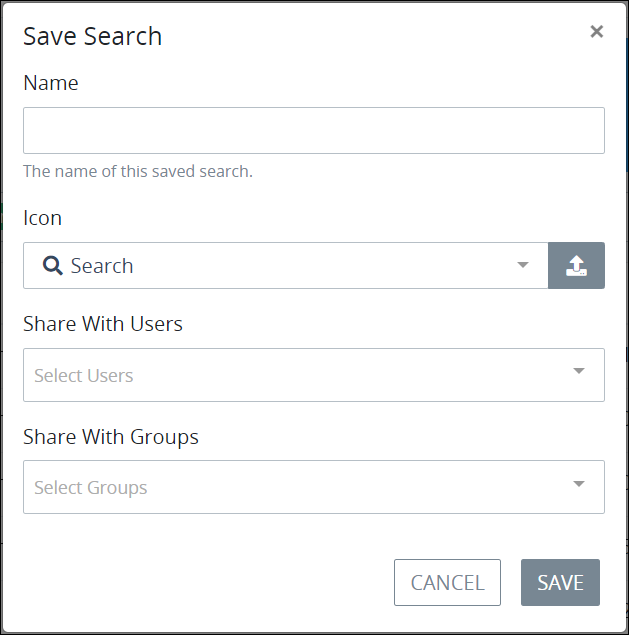

# Create and Share a Saved Search

## Create and Share a Saved Search


### ProcessMaker Package Required

To create and share [Saved Searches](what-is-a-saved-search.md), the [Saved Searches package](../../package-development-distribution/package-a-connector/saved-searches-package.md) must be installed in your ProcessMaker instance. The Saved Searches package is not available in the ProcessMaker open-source edition. Contact [ProcessMaker Sales](mailto:sales@processmaker.com) or ask your ProcessMaker sales representative how the Saved Searches package can be installed in your ProcessMaker instance.

### Optional ProcessMaker Package

You may also create and share Saved Searches when using ProcessMaker [Collections](../../collections/what-is-a-collection.md). Use Saved Searches in ProcessMaker Collections to search for records in a Collection. To use ProcessMaker Collections, the [Collections package](../../package-development-distribution/package-a-connector/collections.md) must be installed in your ProcessMaker instance. The Collections package is not available in the ProcessMaker open-source edition. Contact [ProcessMaker Sales](mailto:sales@processmaker.com) or ask your ProcessMaker sales representative how the Collections package can be installed in your ProcessMaker instance.

### Permissions Required

If you are saving record searches from a ProcessMaker Collection, your ProcessMaker user account or group membership must have the "Collections: View Collections" permission to view the list of ProcessMaker Collections unless your user account has the **Make this user a Super Admin** setting selected. See the ProcessMaker [Collections](../../processmaker-administration/permission-descriptions-for-users-and-groups.md#collections) permissions or ask your ProcessMaker Administrator for assistance.

Furthermore, your ProcessMaker user account or group membership must have the **View** [record permission](../../collections/manage-collections/configure-a-collection.md#configure-record-permissions-for-processmaker-users) from a Collection's configuration to view that Collection's records. See [Configure a Collection](../../collections/manage-collections/configure-a-collection.md#configure-a-processmaker-collection) or ask the manager of that ProcessMaker Collection for assistance.


Follow these steps to create and share a Saved Search:

1. Enter the advanced search criteria using ProcessMaker Query Language \(PMQL\) parameters for your [Request](../requests/what-is-a-request.md), [Task](../task-management/what-is-a-task.md), or ProcessMaker [Collection](../../collections/manage-records-in-a-collection/search-for-a-record-in-a-collection.md#search-records-in-a-processmaker-collection) record search. It is this criteria from which the Saved Search settings are based. See the following topics for how to compose PMQL search parameters in an advanced search:
   * [PMQL Syntax for Requests](../search-processmaker-data-using-pmql.md#pmql-syntax-for-requests)
   * [PMQL Syntax for Tasks](../search-processmaker-data-using-pmql.md#pmql-syntax-for-tasks)
   * [PMQL Syntax for ProcessMaker Collections](../search-processmaker-data-using-pmql.md#pmql-syntax-for-processmaker-collections)
2. Click the **Save Search** button. The **Save Search** screen displays.  
3. In the **Name** setting, enter the name of your Saved Search. Since this name displays in the left sidebar of the **Requests**/**Tasks/Collections** pages, ensure that this is a descriptive name based on the PMQL parameters that compose the search. This name is helpful for yourself and those with whom you share this Saved Search to know for what this Saved Search's results are. The Saved Search name does not need to be unique within your ProcessMaker instance. Therefore, multiple Saved Searches may have the same name when your own Saved Search and one shared with you have the same name. This is a required setting.
4. Follow these guidelines to select an image that represents the Saved Search results. Saved Searches associated with Requests display in the left sidebar of **Requests** pages. Saved Searches associated with Tasks display in the left sidebar of **Tasks** pages. Saved Searches associated with ProcessMaker Collection records display in the left sidebar of **Collections** pages.
   * **Follow these steps to select an image that ProcessMaker provides to represent the Saved Search:**
     1. Click the **Search** drop-down menu.
     2. Select the image to represent your Saved Search.
   * **Follow these steps to select a custom image to represent the Saved Search:**
     1. Click the **Upload Custom Icon** icon.
     2. Locate the icon to represent your Saved Search. The icon must not be larger than 2 kilobytes or the following message displays below the **Search** setting: **The custom icon file is too large. File size must be less than 2KB.**.
5. From the **Share With Users** drop-down menu, select with which ProcessMaker [user\(s\)](../../processmaker-administration/add-users/what-is-a-user.md) to share your Saved Search by selecting the person's full name. Multiple ProcessMaker users may be added, one at a time, to this setting. You may click the Remove iconfor a ProcessMaker user to remove that user from the **Share With Users** drop-down menu. These selected ProcessMaker users will see your Saved Search with the image you selected in the left sidebar for pages associated with its search type.  
6. From the **Share With Groups** drop-down menu, select with which ProcessMaker [group\(s\)](../../processmaker-administration/assign-groups-to-users/what-is-a-group.md) to share your Saved Search by selecting the group. Multiple ProcessMaker groups may be added, one at a time, to this setting. You may click the Remove iconfor a ProcessMaker group to remove that group from the **Share With Groups** drop-down menu. Members of a group added to the **Share With Groups** drop-down menu will see your Saved Search in the left sidebar for pages associated with its search type with the image you selected.  
7. Click the **Save** button.

## Related Topics













