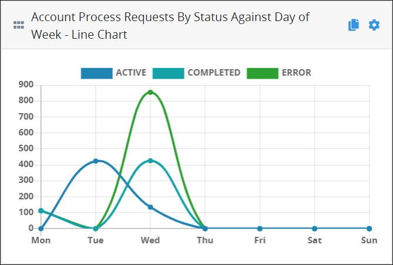
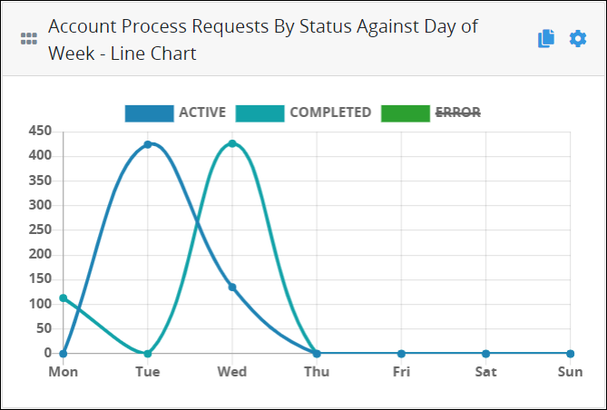
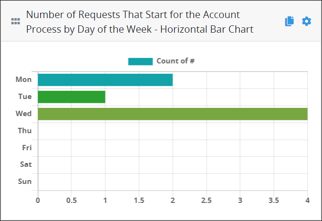

# Overview of Saved Search Charts

## Overview

Charts help visualize your Saved Search results. Though you can customize in tabular format the data details for your Saved Searches, nothing distills that data like a customized chart. Create and configure charts to visualize Saved Search results after selecting a Saved Search. Create customized charts regardless of whether you created the Saved Search or if it was shared with you.

Charts use the data results from the Saved Search to visualize those results in a variety of chart types and styles. Chart data may be filtered by using an optional [ProcessMaker Query Language \(PMQL\)](../../search-processmaker-data-using-pmql.md) query that further filters the data from that Saved Search to visualize minute data.

Customize charts to include the series and/or categories from the both PMQL query parameters and the columns configured in the detailed data view of that Saved Search. For example, if your Saved Search included a custom column called Countries to display how many Requests have started based on a Request variable value called `Countries`, that Request variable may also be used as a series or category in a chart in that Saved Search.

### See What a Data Point or Marker Represents

Hover your cursor over a data point or marker to see what that data represents.

### Filter Data That Displays in a Saved Search Chart

Filter data that displays in a chart by hiding attributes of that data via the chart's legend. Consider the chart below that shows how the number of Requests by Request status type versus the each day of the week to visualize how many Requests exist for the "Account Process". This chart contains three keys in the legend that displays at the top of the chart.

To not display the Requests that have an error, click the **Error** key in the chart's legend. The strike-through text style displays over the **Error** key in the chart legend that indicates this chart attribute is hidden from the chart. The other chart attributes automatically adjust to show their data using the chart's current units of measurement. Click the **Error** key again to show this chart attribute again.

### Types of Saved Search Charts

See the following Saved Search chart types:

* [Bar chart \(horizontal\)](overview-of-saved-search-charts.md#bar-chart-horizontal)
* [Bar chart \(vertical\)](overview-of-saved-search-charts.md#bar-chart-vertical)
* [Line chart](overview-of-saved-search-charts.md#line-chart)
* [Pie chart](overview-of-saved-search-charts.md#pie-chart)
* [Doughnut chart](overview-of-saved-search-charts.md#doughnut-chart)

#### Bar Chart \(Horizontal\)

The following bar chart presenting horizontally shows the number of Requests that start for the Account Process by the day of the week.

#### Bar Chart \(Vertical\)

The following bar chart presenting vertically shows the number of Requests by status per agency. Data points are stacked such that all Requests display on each other for each agency.

#### Line Chart

#### Pie Chart

#### Doughnut Chart

## Related Topics

