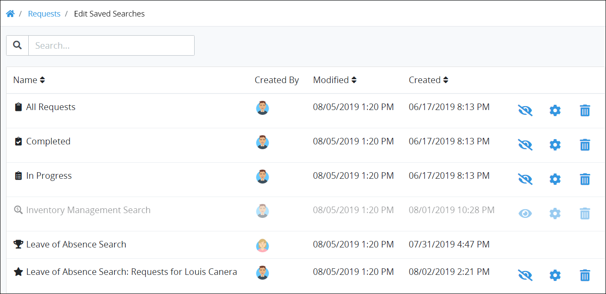

# Manage Your Saved Searches

## Manage Your Saved Searches


To manage Saved Searches, the [Saved Searches](../../package-development-distribution/package-a-connector/saved-searches-package.md) package must be installed in your ProcessMaker instance. The Saved Searches package is not available in the ProcessMaker open-source edition. Contact [ProcessMaker Sales](mailto:sales@processmaker.com) or ask your ProcessMaker sales representative how the Saved Searches package can be installed in your ProcessMaker instance.


Follow these steps to manage your Saved Searches:

1. View any of the following **Requests** pages:

   * **My Requests** page. See [View Your Requests That You Started](../requests/view-started-requests.md#view-your-requests).
   * **In Progress** page. See [View Requests That Are In Progress](../requests/view-in-progress-requests.md#view-in-progress-requests-in-which-you-are-participating).
   * **Completed** page. See [View Completed Requests](../requests/view-completed-requests.md#view-completed-requests-in-which-you-participated).
   * **All Requests** page. See [View All Requests](../requests/view-all-requests.md#view-all-requests-in-your-organization). \(Note that your ProcessMaker user account must have the [**Requests: View All Requests** permission](../../processmaker-administration/permission-descriptions-for-users-and-groups.md#requests) to view the **All Requests** page.\)

   Alternatively, view any of the following Tasks pages:

   * **To Do** page. See [View Tasks You Need to Do](../task-management/view-tasks-you-need-to-do.md).
   * **Completed** page. See [View Completed Tasks](../task-management/view-completed-tasks.md).

2. Click the **My Saved Searches** iconfrom the left sidebar. The **My Saved Searches** page displays.

The **My Saved Searches** page displays the following information in tabular format about your saved searches and those which have been shared with you:

* **Name:** The **Name** column displays the name of the saved search.
* **Type:** The **Type** column displays the type of saved search:
  * **Request:** The saved search is based on [Request search](../requests/search-for-a-request.md#save-and-share-a-search) parameters.
  * **Task:** The saved search is based on Task search parameters.
* **Created By:** The **Created By** column displays the ProcessMaker user's avatar who created the saved search. Hover your cursor over the ProcessMaker user's avatar to view that person's full name.
* **Modified:** The **Modified** column displays the date and time the saved search was last modified by the ProcessMaker user that created the saved search. A saved search can only be modified by the ProcessMaker user that created it. The time zone setting to display the time is according to the ProcessMaker instance unless your [user profile's](../profile-settings.md#change-your-profile-settings) **Time zone** setting is specified.
* **Created:** The **Created** column displays the date and time the saved search was created. The time zone setting to display the time is according to the ProcessMaker instance unless your [user profile's](../profile-settings.md#change-your-profile-settings) **Time zone** setting is specified.


### No Saved Searches?

If there are no saved searches, the following message displays: **No Results**.

### Display Information the Way You Want It

[Control how tabular information displays](../control-how-requests-display-in-a-tab.md), including how to sort columns or how many items display per page.


## Related Topics

